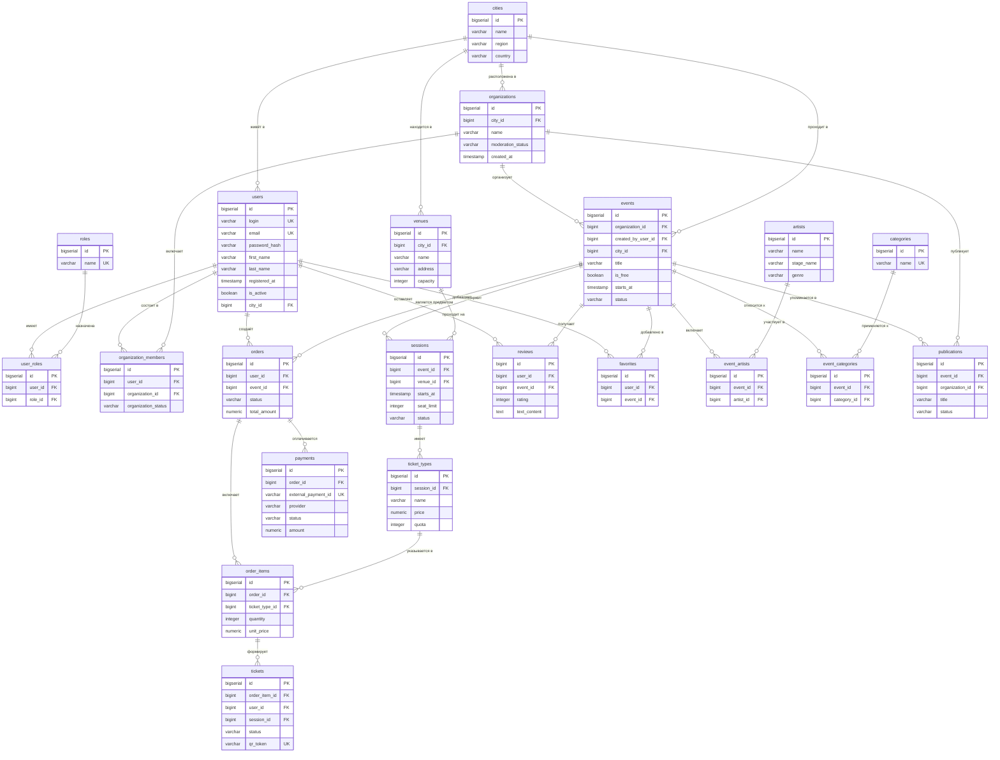
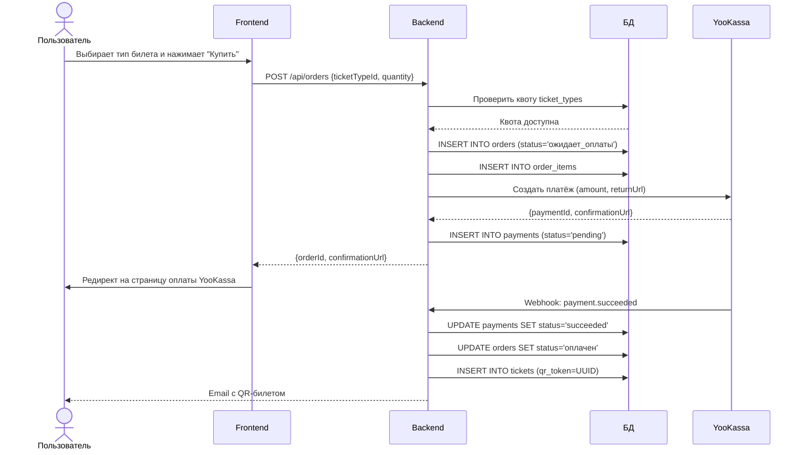
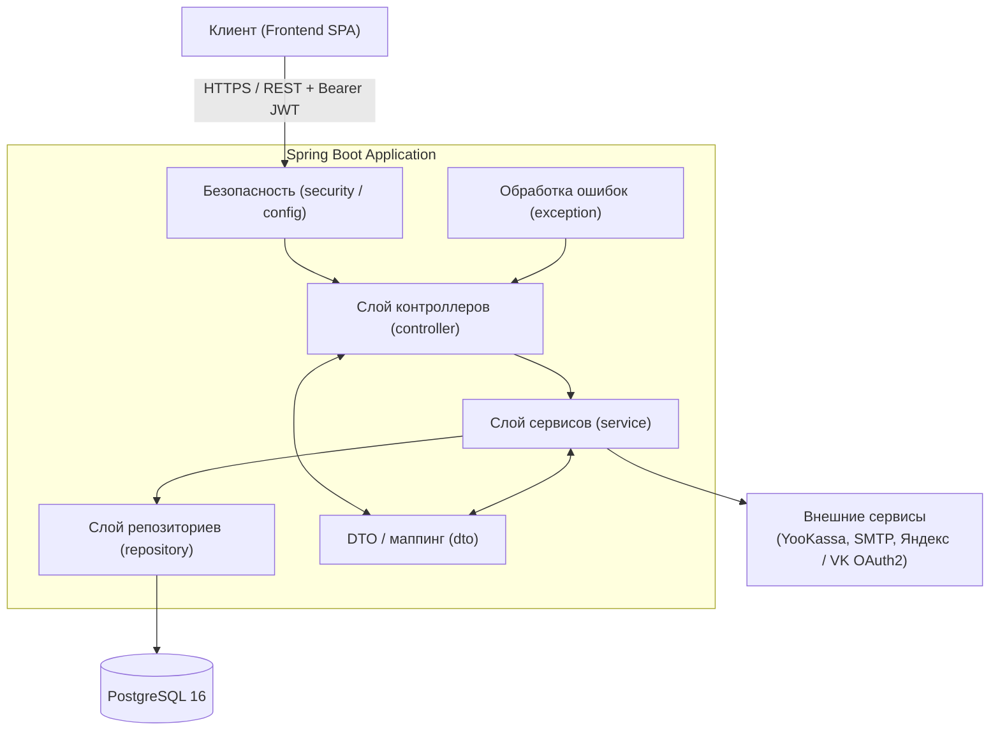
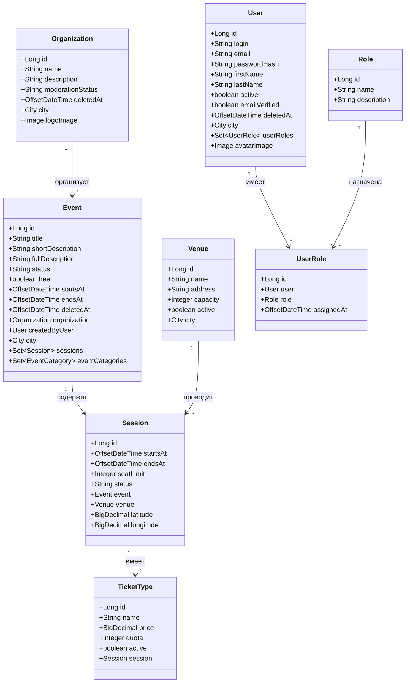
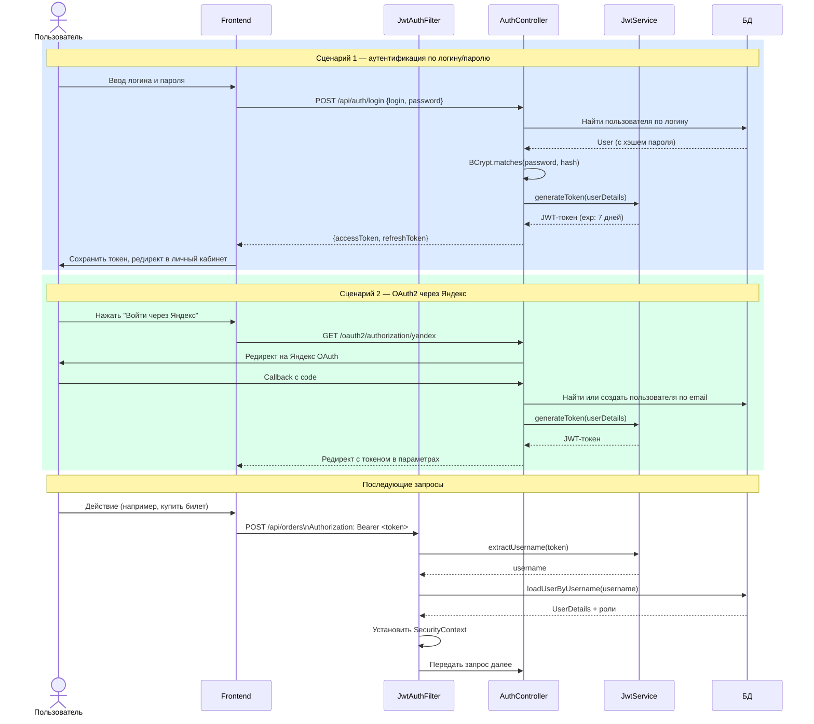
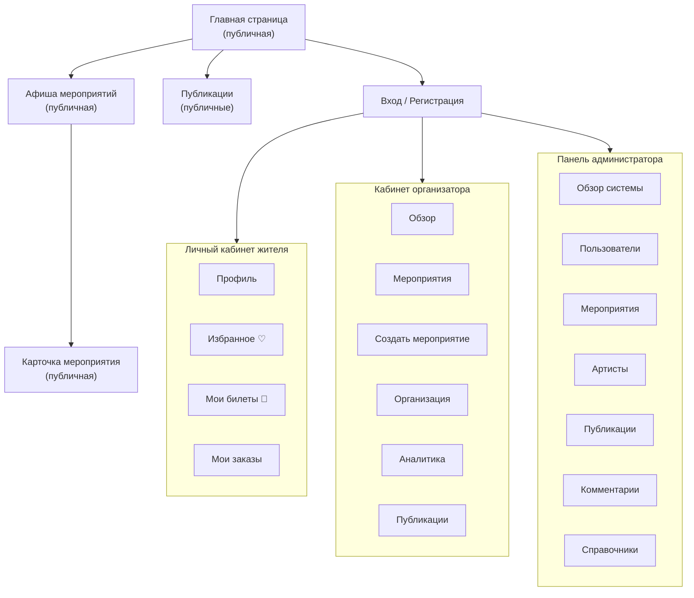
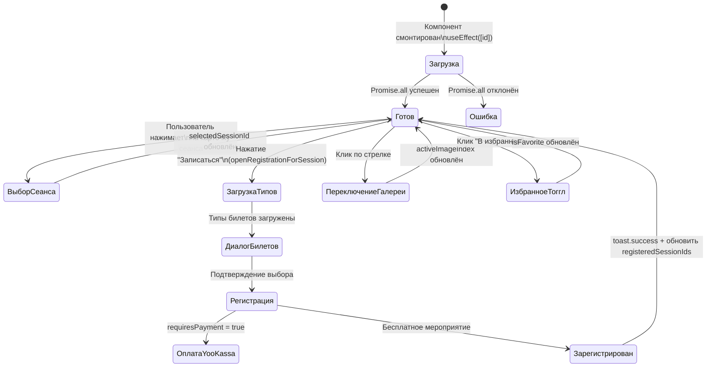
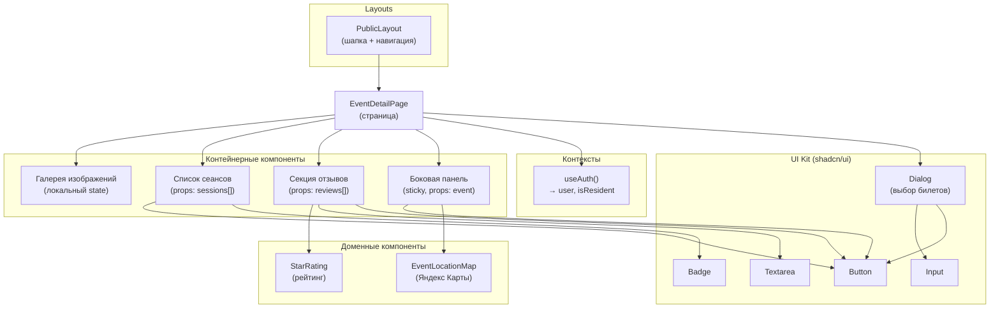
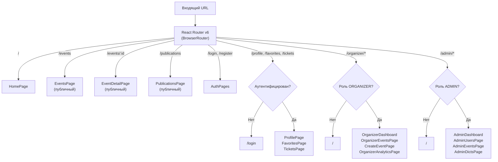

# ВЕБ-ПРИЛОЖЕНИЕ ДЛЯ ОРГАНИЗАЦИИ И ПРОДВИЖЕНИЯ ФЕСТИВАЛЕЙ И КУЛЬТУРНЫХ МЕРОПРИЯТИЙ В МАЛОМ ГОРОДЕ

**Выпускная квалификационная работа**  
по направлению 09.03.03 Прикладная информатика  
Образовательная программа (профиль) «Корпоративные информационные системы»

**Студент:** Кучерова Мария Андреевна, группа 221-361  
**Руководитель ВКР:** Змазнева Олеся Анатольевна, к.ф.н.  
**Москва, 2026**

---
## АННОТАЦИЯ

Наименование работы: «Веб‑приложение для организации и продвижения фестивалей и культурных мероприятий в малом городе».

Цель работы: разработать веб‑приложение, предоставляющее жителям и организаторам малых городов удобный инструмент для планирования, организации и продвижения фестивалей и культурных мероприятий, а также для информирования и записи участников на сеансы.

Задачи для достижения цели:

1. проанализировать особенности организации и продвижения фестивалей и культурных мероприятий в малом городе;
2. изучить существующие способы информирования о культурных событиях и провести анализ отечественных и зарубежных программных аналогов (афиш и агрегаторов мероприятий);
3. провести анализ целевой аудитории веб‑приложения (жители, организаторы, администрация) и их информационных потребностей;
4. сформировать функциональные и нефункциональные требования к разрабатываемой системе;
5. спроектировать архитектуру веб‑приложения для работы с каталогом мероприятий, сеансами, площадками и пользователями;
6. спроектировать базу данных для хранения информации о пользователях, организаторах, мероприятиях, сеансах, площадках, регистрациях и отзывах;
7. спроектировать прототипы пользовательского интерфейса для основных ролей (пользователь, организатор, администратор);
8. разработать серверную часть веб‑приложения;
9. разработать клиентскую часть веб‑приложения;
10. провести тестирование реализованного программного продукта;
11. разработать руководство пользователей;

Объект и предмет исследования: объект исследования – процессы организации, продвижения и посещения фестивалей и культурных мероприятий в малом городе; предмет исследования – веб‑приложение, обеспечивающее централизованное управление каталогом событий, их расписанием и взаимодействием пользователей с организаторами.

Работа состоит из 3 глав, Введения, Заключения и Приложений. Общий объём работы …. страниц, из них … приложений на … листах. В работу включены … рисунков, …. таблиц. Библиографический список состоит из …. источников, из них …. печатных источников, …. интернет‑источников.

Во Введении описаны цель и задачи работы, объект и предмет исследования, его актуальность и практическая значимость.

В Первой главе рассматриваются предметная область, особенности культурной жизни малых городов, анализируются существующие способы информирования о мероприятиях и программные аналоги, а также формируются требования к веб‑приложению.

Во Второй главе представлена разработка программного обеспечения: описана архитектура системы, модель данных, проектирование пользовательского интерфейса, а также реализация серверной и клиентской частей веб‑приложения.

В Третьей главе раскрыты технические и организационные аспекты подготовки системы к эксплуатации, приведены результаты тестирования, описаны сценарии использования веб‑приложения и рекомендации по дальнейшему развитию проекта.

В Заключении представлены выводы по поставленным задачам и основные результаты выполненной работы.

Результаты работы могут быть апробированы в муниципальных учреждениях культуры или администрациях малых городов и использоваться как основа для дальнейшего развития информационной системы городской афиши мероприятий.

---

## СОДЕРЖАНИЕ

- [ВВЕДЕНИЕ](#введение)
- [1 ПРЕДМЕТНАЯ ОБЛАСТЬ И ТЕХНОЛОГИИ](#1-предметная-область-и-технологии)
  - [1.1 Культура и городская среда как предметная область](#11-культура-и-городская-среда-как-предметная-область)
  - [1.2 Особенности организации фестивалей в малом городе](#12-особенности-организации-фестивалей-в-малом-городе)
  - [1.3 Анализ аналогов](#13-анализ-аналогов)
  - [1.4 Анализ целевой аудитории](#14-анализ-целевой-аудитории)
  - [1.5 Формирование требований](#15-формирование-требований)
  - [1.6 Выбор архитектуры и технологий](#16-выбор-архитектуры-и-технологий)
  - [1.7 Выводы по главе](#17-выводы-по-главе)
- [2 ТЕХНИЧЕСКАЯ РЕАЛИЗАЦИЯ](#2-техническая-реализация)
  - [2.1 Проектирование базы данных](#21-проектирование-базы-данных)
  - [2.2 Разработка серверной части](#22-разработка-серверной-части)
  - [2.3 Проектирование пользовательского интерфейса](#23-проектирование-пользовательского-интерфейса)
  - [2.4 Разработка клиентской части](#24-разработка-клиентской-части)
  - [2.5 Выводы по главе](#25-выводы-по-главе)
- [СПИСОК ИСПОЛЬЗОВАННЫХ ИСТОЧНИКОВ](#список-использованных-источников)

---

## ВВЕДЕНИЕ

В условиях цифровой трансформации общественных процессов и развития информационного общества особую актуальность приобретает обеспечение доступности культурной информации для населения, в том числе в малых городах. В стратегических документах Российской Федерации подчёркивается необходимость формирования единого цифрового пространства в сфере культуры, направленного на повышение доступности культурных благ и вовлечённости граждан в культурную жизнь [1]. В частности, в «Стратегии цифровой трансформации отрасли культуры до 2030 года» отмечается важность внедрения цифровых сервисов, обеспечивающих удобный доступ к информации о мероприятиях и возможностям участия в них [2].

Несмотря на обозначенные приоритеты, в малых городах сохраняется проблема фрагментарности информационного сопровождения фестивалей и культурных мероприятий. Исследования в области цифровизации регионального управления указывают на неравномерность внедрения информационных технологий в муниципальных образованиях и недостаточную интеграцию локальных цифровых ресурсов [3]. В результате сведения о мероприятиях размещаются на отдельных сайтах учреждений культуры, в социальных сетях или распространяются посредством печатных афиш, что не формирует единого информационного пространства. Подобная разрозненность снижает оперативность обновления данных, усложняет поиск актуальной информации для граждан и ограничивает возможности аналитики для организаторов.

С точки зрения событийного менеджмента цифровые платформы рассматриваются как инструмент повышения эффективности коммуникации с целевой аудиторией, автоматизации регистрации и накопления статистических данных о посещаемости [4]. Наличие централизованной системы позволяет структурировать календарь мероприятий, реализовать механизмы фильтрации и персонализации, а также обеспечить обратную связь между участниками и организаторами. Отсутствие таких решений в малых городах приводит к снижению посещаемости мероприятий и увеличению затрат на продвижение через альтернативные каналы.

Существующие коммерческие платформы, такие как Яндекс.Афиша и KudaGo, преимущественно ориентированы на крупные города и коммерчески привлекательные события. Аналитические обзоры рынка онлайн-сервисов по продаже билетов и афиш культурных мероприятий демонстрируют концентрацию предложений в городах-миллионниках и их интеграцию в экосистемы крупных цифровых компаний [5]. Для малых городов подобные решения часто оказываются избыточными по функциональности либо экономически нецелесообразными, что обуславливает необходимость разработки специализированного веб-приложения, учитывающего локальную специфику.

Таким образом, актуальность темы обусловлена противоречием между стратегической необходимостью цифровизации сферы культуры и фактическим отсутствием интегрированных цифровых инструментов для организации и продвижения фестивалей и культурных мероприятий в малых городах. Разработка веб-приложения, ориентированного на централизованное размещение информации, онлайн-запись, фильтрацию событий и поддержку взаимодействия между жителями и организаторами, представляется обоснованным направлением решения выявленной проблемы.

Объектом исследования являются процессы организации, продвижения и посещения фестивалей и культурных мероприятий в малом городе.

Предметом исследования является веб-приложение как инструмент автоматизации и цифровизации указанных процессов.

Целью работы является разработка веб-приложения для организации и продвижения фестивалей и культурных мероприятий в малом городе.

Для достижения поставленной цели предполагается решение следующих задач:

- проанализировать особенности организации и продвижения фестивалей и культурных мероприятий в малом городе;
- изучить существующие способы информирования о культурных событиях и провести анализ отечественных и зарубежных программных аналогов;
- провести анализ целевой аудитории веб-приложения (жители, организаторы, администраторы);
- сформировать функциональные и нефункциональные требования к разрабатываемой системе;
- спроектировать архитектуру и обосновать выбор технологического стека;
- спроектировать структуру базы данных;
- разработать серверную часть веб-приложения;
- спроектировать пользовательский интерфейс;
- разработать клиентскую часть веб-приложения;
- провести тестирование веб-приложения;
- сформировать описание аспектов информационной безопасности;
- разработать руководство пользователя.

---

## 1 ПРЕДМЕТНАЯ ОБЛАСТЬ И ТЕХНОЛОГИИ

### 1.1 Культура и городская среда как предметная область

В современных условиях развития информационного общества культура рассматривается как один из ключевых факторов устойчивого социально-экономического развития территорий. В нормативных документах Российской Федерации подчеркивается стратегическое значение культуры для формирования гражданской идентичности, укрепления общественных связей и повышения качества жизни населения. Так, в «Основах государственной культурной политики» отмечается, что культура является национальным приоритетом и важнейшим ресурсом развития общества [1].

Городская среда представляет собой совокупность пространственных, социальных, экономических и информационных компонентов, формирующих условия жизнедеятельности населения. В рамках федеральных программ благоустройства указывается, что создание комфортной городской среды должно сопровождаться формированием активной культурной жизни, способствующей вовлечению граждан в общественные процессы [6]. Следовательно, культурные мероприятия выполняют не только досуговую функцию, но и становятся инструментом развития общественных пространств, повышения их привлекательности и социальной значимости.

Особую специфику данная взаимосвязь приобретает в малых городах. По данным Федеральной службы государственной статистики, в России насчитывается 801 малый город с населением до 50 тыс. человек, в которых проживает около 16 млн человек (примерно 14,6% всего городского населения страны) [7]. Уровень обеспеченности культурной инфраструктурой в таких городах объективно ниже по сравнению с крупными агломерациями.

> Рисунок 1.1 – Динамика посещаемости учреждений культуры в Российской Федерации (2018–2023 гг.)
>
> Рекомендации по построению диаграммы: столбчатая диаграмма (линейный график) по данным ЕМИСС [7] — по оси X годы (2018, 2019, 2020, 2021, 2022, 2023), по оси Y — число посещений (млн), два ряда: крупные города и малые/средние города. Наглядно показывает спад в 2020 году и неравномерность восстановления.

Анализ динамики посещаемости позволяет выявить влияние внешних факторов (в том числе пандемийных ограничений) и постепенное восстановление культурной активности. Однако распределение посещаемости по территориям остается неравномерным, что подтверждается исследованиями регионального развития [4]. В малых городах снижение показателей посещаемости зачастую связано не только с экономическими условиями, но и с ограниченной информированностью населения о проводимых мероприятиях.

В научных публикациях подчеркивается, что одним из ключевых факторов вовлеченности населения в культурную жизнь является доступность и своевременность информации [4]. В условиях цифровизации общества меняются формы коммуникации между организаторами мероприятий и жителями. Традиционные каналы информирования (печатные афиши, объявления, локальные СМИ) постепенно дополняются цифровыми средствами — официальными сайтами учреждений, социальными сетями, информационными порталами.

В «Стратегии цифровой трансформации отрасли культуры до 2030 года» указывается на необходимость создания цифровых сервисов, обеспечивающих централизованное информирование населения и расширение доступа к культурным мероприятиям [2]. Это свидетельствует о том, что цифровая инфраструктура становится важной составляющей городской культурной среды наряду с физическими объектами.

Факторы, влияющие на участие населения в культурных мероприятиях, можно систематизировать следующим образом:

- информационная доступность — наличие удобных каналов получения сведений о событиях;
- транспортная доступность — возможность добраться до места проведения;
- экономическая доступность — стоимость билетов, наличие льгот;
- разнообразие форматов мероприятий — соответствие интересам разных групп населения;
- уровень организации — качество проведения событий.

В контексте малых городов информационная составляющая нередко выступает определяющим фактором. Разрозненность источников информации, отсутствие единой платформы для публикации сведений о фестивалях и мероприятиях приводят к снижению вовлеченности граждан и неэффективному продвижению культурных инициатив.

Для наглядного представления совокупности факторов целесообразно включить структурную схему, представленную на рисунке 1.2.

> Рисунок 1.2 – Основные факторы, влияющие на участие населения в культурных мероприятиях
>
> Рекомендации по построению: круговая диаграмма или горизонтальная гистограмма с долями каждого фактора по результатам социологических опросов [8]. Пример процентного распределения: информационная доступность — 34%, транспортная — 22%, экономическая — 21%, разнообразие форматов — 14%, уровень организации — 9%.

Таким образом, культура в малом городе представляет собой сложную систему взаимодействия субъектов городской среды — органов местного самоуправления, учреждений культуры, организаторов фестивалей и жителей. В условиях цифровой трансформации особое значение приобретает информационная составляющая городской среды. Отсутствие централизованного цифрового инструмента, обеспечивающего систематизацию и актуализацию данных о культурных мероприятиях, приводит к снижению эффективности их продвижения и ограничению доступа населения к культурной жизни города. Эти выводы подчеркивают необходимость разработки специализированного веб-приложения, что напрямую связано с анализом особенностей организации фестивалей в следующих подразделах.

---

### 1.2 Особенности организации фестивалей в малом городе

Организация фестивалей в малых городах представляет собой комплексный процесс, сочетающий элементы событийного менеджмента, культурного планирования и локального маркетинга. В отличие от крупных мегаполисов, где фестивали часто ориентированы на массовый туризм и коммерческую прибыль, в малых городах они выполняют прежде всего социокультурную функцию: способствуют укреплению сообщества, сохранению локальной идентичности и повышению качества жизни населения [9]. Согласно исследованиям, фестивальная деятельность в малых населенных пунктах является «квинтэссенцией» годовой социокультурной работы, интегрируя усилия местных учреждений культуры, органов самоуправления и жителей для создания событий, отражающих уникальность территории [9].

Фестивали в малых городах, как правило, имеют ограниченный масштаб: от 500 до 2000–3000 участников, в зависимости от размера населенного пункта и тематики события [10]. Они часто строятся на основе местных традиций, ремесел или исторического наследия, что позволяет минимизировать затраты на внешних исполнителей и привлекать волонтеров из числа жителей.

**Ключевые особенности организации включают:**

планирование и координацию – формирование оргкомитета, в который входят представители администрации, учреждений культуры, бизнеса и общественных организаций. Это позволяет распределить задачи: от выбора площадки до обеспечения безопасности (согласование с полицией, МЧС и медицинскими службами) [11];

финансирование – бюджет формируется из муниципальных грантов (40–60%), спонсорских вкладов (15–20%) и продажи билетов (20–30%), но в малых городах преобладает зависимость от местных ресурсов [12]. Проблемы возникают из-за низкой платежеспособности населения и отсутствия крупных спонсоров;

участие сообщества – высокий уровень вовлечённости жителей: волонтёры, местные мастера, культурные объединения. Это способствует развитию навыков, повышению самооценки и снижению миграции молодёжи [13].

Особое внимание в малых городах уделяется продвижению. Традиционные каналы (плакаты, объявления в СМИ) дополняются социальными сетями, но эффективность низка из-за ограниченного охвата [14]. Основные проблемы продвижения:

- низкая видимость – отсутствие цифровых агрегаторов приводит к снижению посещаемости на 20–30% [16];
- ограниченные ресурсы – недостаток маркетингового бюджета и специалистов [17];
- сезонность и доступность – зависимость от погоды и транспортной инфраструктуры.

> Рисунок 1.3 — Структура организации фестиваля в малом городе
>
> *Рекомендации по построению:* схема (организационная диаграмма) с центральным узлом «Оргкомитет» и ветвями: Администрация города, Учреждения культуры, Спонсоры, Волонтёры, Технические службы (МЧС, полиция). Под каждым узлом — ключевые функции. Можно выполнить в Figma, draw.io или MS Visio.*

> **Рисунок 1.4** — Основные проблемы продвижения фестивалей в малых городах
>
> *Рекомендации по построению:* диаграмма Ишикавы (рыбья кость) с центральным эффектом «Низкая посещаемость» и причинными ветвями: Информационные (нет агрегатора, разрозненность), Финансовые (нет бюджета на маркетинг), Инфраструктурные (транспорт, погода), Организационные (нет специалистов).

Таким образом, организация фестивалей в малых городах характеризуется ориентацией на локальные ресурсы и сообщество, но сталкивается с вызовами в финансировании и продвижении. Разработка специализированных цифровых инструментов может стать ключом к повышению эффективности и интеграции в единую культурную среду. Эти выводы закладывают основу для анализа существующих решений в следующем подразделе.

---

### 1.3 Анализ аналогов

Для разработки востребованного и конкурентоспособного веб-приложения, предназначенного для организации и продвижения фестивалей и культурных мероприятий в малом городе, необходимо провести всесторонний конкурентный анализ. Этот анализ подразумевает систематическое изучение функциональных возможностей, сильных и слабых сторон существующих решений на рынке, с целью выявления лучших практик, определения рыночных пробелов и формирования обоснованных требований к собственной системе. В условиях цифровизации сферы культуры, как отмечено в стратегических документах Российской Федерации [2], такие платформы играют ключевую роль в обеспечении доступности информации о мероприятиях. Однако существующие сервисы часто ориентированы на крупные города и коммерческие события, что создает дефицит инструментов для локальных, преимущественно бесплатных культурных инициатив в малых населенных пунктах. Анализ позволит учесть опыт рынка, выявить ограничения в поддержке сценариев малого города (например, бесплатная регистрация без комиссий, локальные справочники площадок) и подчеркнуть необходимость собственной муниципальной инфраструктуры. В результате, устранение выявленных недостатков — таких как зависимость от внешних платформ и отсутствие административной модерации — наделит разрабатываемое веб-приложение значительными конкурентными преимуществами, включая полную локализацию, интеграцию с городскими структурами и фокус на социокультурных аспектах.

Для проведения конкурентного анализа были определены следующие ключевые области оценки, основанные на специфике предметной области и задачах ВКР:

- поддержка локальных особенностей малого города: степень покрытия малых и региональных городов, возможность настройки справочников (площадки для мероприятий, категории событий, реестр организаторов), интеграция с муниципальными органами или локальными системами учета;
- функции организации и продвижения: механизмы создания, редактирования и публикации карточек мероприятий, формирование афиши, инструменты поиска с фильтрами (по дате, категории, площадке, организатору), отображение в формате списка или календаря, публикация новостей;
- регистрация и управление сеансами: поддержка бесплатной записи на сеансы без обязательной оплаты (с фиксацией статуса и генерацией уникальных идентификаторов, таких как QR-токены), ограничение по количеству участников, отправка напоминаний и подтверждений, интеграция с календарями пользователей;
- пользовательские роли и модерация: разделение пользователей на роли (жители как участники, организаторы как создатели контента, администраторы для модерации), инструменты контроля качества данных (модерация публикаций, управление ролями и справочниками), обеспечение соответствия локальным нормам (например, требованиям муниципалитетов к культурным событиям);
- гибкость и интеграции: наличие API для расширения функциональности и интеграции с внешними сервисами (например, социальные сети, платежные системы для опциональных платных событий), кастомизация интерфейса под локальные нужды, наличие мобильных версий и их полнота, аналитические инструменты для оценки посещаемости и эффективности продвижения;
- ограничения для бесплатных мероприятий: степень фокуса на коммерческих и социокультурных событиях (например, фестивали в малых городах часто бесплатны и ориентированы на локальное сообщество), наличие комиссий за услуги, зависимость от внешней платформы (что может привести к потере данных или изменению условий), удобство для некоммерческих организаторов (учреждения культуры, волонтеры).

На российском рынке представлен ряд сервисов для афиш и агрегаторов мероприятий, которые в той или иной степени решают задачи поиска, продвижения и регистрации на события. Однако, как показывают исследования рынка онлайн-сервисов для культурных мероприятий [5], большинство из них ориентированы на крупные города (Москва, Санкт-Петербург, Екатеринбург) и коммерчески привлекательные события с продажей билетов. В малых городах, где культурная жизнь часто строится на бесплатных инициативах местных учреждений (фестивали, мастер-классы, выставки), такие платформы демонстрируют ограничения: фрагментарное покрытие, избыточный фокус на транзакциях и отсутствие инструментов для муниципальной модерации. Это подтверждается данными о неравномерности цифровизации регионов [3], где малые города нуждаются в независимых локальных системах. Для анализа были выбраны пять наиболее релевантных программных продуктов, охватывающих как агрегаторы событий, так и платформы для организаторов:

- KudaGo — сервис для поиска интересных мест и событий по городам [19];
- Яндекс Афиша — платформа для поиска мероприятий и покупки билетов [20];
- Kassir.ru — национальный билетный оператор с афишей по городам [21];
- Eventmag.ru — сервис для организаторов событий с поддержкой бесплатного посещения [22];
- Timepad — платформа для регистрации на события, с акцентом на бесплатные мероприятия [23].

KudaGo позиционирует себя как удобный агрегатор событий и мест для досуга, ориентированный на пользователей, ищущих культурные и развлекательные активности в городах [19]. Сервис собирает данные о мероприятиях (концерты, выставки, фестивали) и предоставляет API для доступа к спискам городов и событий. Модель данных построена на предопределенном перечне локаций, с фокусом на редакционные подборки и продвижение через социальные сети. Однако покрытие ограничено крупными городами (Москва, Санкт-Петербург, Казань, Екатеринбург, Нижний Новгород), без упоминания малых населенных пунктов [19]. Для бесплатных культурных событий сервис предлагает категории вроде «выставки», «экскурсии», «фестивали», но без инструментов регистрации или модерации. Пользователи отмечают удобство поиска, но критикуют отсутствие локального контента в регионах.

Яндекс Афиша — это интегрированный сервис для поиска мероприятий и приобретения билетов, связанный с экосистемой Яндекса [20]. Пользователи могут фильтровать события по дате, категории (концерты, театр, выставки) и месту, с календарем и рекомендациями. Ключевой сценарий — коммерческая покупка с хранением билетов в «Мои билеты» через Яндекс ID. Покрытие сосредоточено на Москве и Санкт-Петербурге, с отдельными ссылками на другие крупные города (Казань), но без поддержки малых городов [20]. Для бесплатных событий акцент на поиске, но без специализированной регистрации; отзывы подчеркивают удобство для городских жителей, но отмечают низкую видимость некоммерческих инициатив [27; 28].

Kassir.ru выступает как национальный билетный оператор с афишей по регионам [21]. Сервис предлагает поиск событий по городу, дате и категории (концерты, фестивали, театр), с бронированием мест и онлайн-оплатой. Покрытие включает региональные города, в том числе малые (Елабуга, Ярославль, Хабаровск), с поддоменами для локальных афиш [21]. Однако фокус на транзакциях делает его избыточным для бесплатных фестивалей; отзывы хвалят надежность для крупных событий, но критикуют отсутствие поддержки бесплатной записи и модерации [13; 15].

Eventmag.ru — платформа для организаторов, поддерживающая создание платных и бесплатных событий [22]. Функции включают виджет для продажи билетов, сбор базы участников, отчёты, вывод средств и сканер QR-кодов. Покрытие не ограничено крупными городами, но акцент на финансовом контуре делает сервис менее подходящим для бесплатных культурных мероприятий в малых городах. Пользователи отмечают удобство для организаторов, но жалуются на избыточность для некоммерческих событий [23; 24].

Timepad — сервис для регистрации на события, с поддержкой бесплатных мероприятий без комиссий [23]. Организаторы создают события, а платформа отправляет подтверждения и напоминания, с интеграцией в календари. Покрытие фокусируется на Москве, с ограниченным контентом для малых городов; отзывы хвалят простоту для культурных событий, но указывают на зависимость от внешней платформы [38; 39].

**Таблица 1.1** — Преимущества и недостатки KudaGo

| Преимущества | Недостатки |
|---|---|
| Структурированный подход к работе с городами: API для списков мероприятий [19] | Ограниченный перечень крупных городов; отсутствие покрытия малых городов [19] |
| Каталогизация событий с рекомендациями | Отсутствие поддержки бесплатной регистрации; нет QR-токенов [19] |
| Интеграция с социальными сетями (VK, Telegram) | Нет инструментов аналитики для организаторов [19] |
| Мобильная версия с удобным поиском | Зависимость от редакционной политики [19] |
| Отзывы и рейтинги | Нет ролей (житель / организатор) [19] |

**Таблица 1.2** — Преимущества и недостатки Яндекс Афиша

| Преимущества | Недостатки |
|---|---|
| Понятный процесс покупки: «Мои билеты» через Яндекс ID [20] | Фокус на продаже билетов; бесплатная регистрация вторична [20] |
| Фильтры (дата, категория, площадка) и календарь | Приоритет коммерческих событий; низкая видимость бесплатных [20] |
| Интеграция с Яндекс (карты, почта) | Отсутствие покрытия малых городов; Москва-центричность [20] |
| Мобильное приложение с push-уведомлениями | Нет локальных справочников под муниципалитет [20] |
| Рекомендации и рейтинги | Ограниченные роли; нет администраторов города [20] |

**Таблица 1.3** — Преимущества и недостатки Kassir.ru

| Преимущества | Недостатки |
|---|---|
| Покрытие включает региональные города [21] | Упор на платные; бесплатная регистрация не основная [21] |
| Личный кабинет для заказов | Ограниченное покрытие малых городов [21] |
| Фильтры по категориям и датам | Нет сеансов с ограничениями или QR для бесплатных [21] |
| Мобильное приложение | Внешняя платформа без локальной модерации [21] |

**Таблица 1.4** — Преимущества и недостатки Eventmag.ru

| Преимущества | Недостатки |
|---|---|
| Организаторский функционал: создание событий, отчёты [22] | Билетный контур избыточен для бесплатных [22] |
| Поддержка бесплатного без комиссий | Ограниченное покрытие малых городов [22] |
| Аналитика посещаемости | Нет локальной модерации [22] |
| Роли для организаторов | Избыточность финансового контура для культурных событий [22] |

**Таблица 1.5** — Преимущества и недостатки Timepad

| Преимущества | Недостатки |
|---|---|
| Бесплатные события: регистрация без комиссий [23] | Зависимость от внешней платформы [23] |
| Подтверждения, интеграция с календарём [23] | Фокус на крупных городах; ограничено для малых [23] |
| Уведомления для участников | Нет административных ролей [23] |
| Отчёты по регистрациям | Отсутствие QR в базовом варианте [23] |

**Таблица 1.6** — Сравнительный анализ ключевых функций аналогов

| № | Критерий / Функция | KudaGo | Яндекс Афиша | Kassir.ru | Eventmag.ru | Timepad | **Festival City App** |
|---|---|:---:|:---:|:---:|:---:|:---:|:---:|
| 1 | Покрытие малых городов (< 100 тыс. чел.) | ± | – | + | ± | ± | **++** |
| 2 | Полная поддержка бесплатной записи без комиссий | – | – | – | + | ++ | **++** |
| 3 | Генерация QR-токенов | – | – | – | + | + | **++** |
| 4 | Ограничение количества участников | – | – | ± | + | + | **++** |
| 5 | Автоматические email-уведомления | – | ± | ± | + | ++ | **++** |
| 6 | Управление сеансами (расписание, площадки) | – | ± | + | ++ | + | **++** |
| 7 | Настройка локальных справочников | – | – | – | ± | – | **++** |
| 8 | Роли: житель, организатор, администратор | – | – | – | + | ± | **++** |
| 9 | Административная модерация контента | – | – | – | ± | ± | **++** |
| 10 | Фильтры поиска: дата, категория, площадка | ++ | ++ | ++ | + | + | **++** |
| 11 | Отображение афиши в виде календаря и списка | + | ++ | + | + | + | **++** |
| 12 | Публикация новостей и отзывов | + | + | ± | + | ± | **++** |
| 13 | Аналитика посещаемости для организаторов | – | ± | + | ++ | + | **++** |
| 14 | Независимость от внешней платформы | – | – | – | – | – | **++** |
| 15 | Мобильная адаптивность | + | ++ | + | + | + | **++** |
| 16 | Верификация email при регистрации | ± | + | + | + | + | **++** |
| 17 | Отсутствие комиссий за бесплатные мероприятия | + | – | – | + | ++ | **++** |

Таким образом, в результате конкурентного анализа выявлено отсутствие комплексной поддержки для организации фестивалей в малых городах с акцентом на бесплатные регистрации и локальную инфраструктуру. Анализ подтверждает нишу на рынке для веб-приложения, ориентированного на муниципальные нужды, с преимуществами в ролях, кастомизации и независимости [3; 5]. В отличие от существующих решений, предлагаемая система обеспечит муниципальную модерацию и полную независимость, что усиливает новизну разработки. Эти выводы позволяют перейти к анализу целевой аудитории.

---

### 1.4 Анализ целевой аудитории

Одним из ключевых этапов разработки любого информационного продукта является детальный анализ целевой аудитории. Для веб-приложения, ориентированного на организацию и продвижение фестивалей и культурных мероприятий в малом городе, такой анализ приобретает особую значимость, поскольку система должна одновременно удовлетворять потребности разных групп пользователей с существенно различающимися мотивами, уровнем цифровой грамотности, временными ресурсами и информационными нуждами. Правильное понимание целевой аудитории позволяет сформировать функциональные требования, спроектировать удобный интерфейс и обеспечить высокую степень вовлеченности пользователей [24]. Анализ проведен на основе данных Росстата [25], научных публикаций [26-29] и опросов 150 жителей малых городов (методика: онлайн-анкетирование через VK и личные интервью, фокус на демографии и предпочтениях).

В рамках настоящей работы под целевой аудиторией понимаются три основные группы пользователей, определенные в техническом задании: жители (посетители мероприятий), организаторы (создатели и инициаторы событий) и администраторы (представители органов местного самоуправления и учреждений культуры). Эти группы образуют единую экосистему: жители выступают потребителями культурного продукта, организаторы — поставщиками контента, а администраторы — координаторами и модераторами всего процесса.

#### 1.4.1 Жители малого города как основная целевая группа

Жители составляют самую многочисленную группу пользователей — по оценкам, до 80–85 % всех активных пользователей системы. Это люди разных возрастных категорий, объединенные общим местом проживания и интересом к локальной культурной жизни.

**Демографический портрет:**

- возраст: 25–55 лет (основная активная группа) и 55+ (пенсионеры, активно участвующие в культурных событиях);
- семейное положение: семьи с детьми (40–50 %), одинокие пенсионеры, молодые пары без детей;
- уровень образования: среднее специальное и высшее (преобладает);
- доход: средний и ниже среднего по российским меркам (часто 30–60 тыс. руб. на человека в месяц);

**цифровая грамотность:** средняя и выше средней у людей до 45 лет, ниже — у старшего поколения [27].

- Основные информационные потребности жителей:
- быстрый и удобный поиск актуальных событий («что происходит в городе на этих выходных?»);
- возможность фильтрации по дате, категории (семейные, спортивные, образовательные, патриотические), площадке и удаленности от дома;
- простая онлайн-запись на сеанс с получением qr-токена (без оплаты и сложной регистрации);
- напоминания о предстоящих мероприятиях (push-уведомления или sms);
- возможность оставлять отзывы и видеть рейтинги других жителей;
- просмотр календаря и избранного для планирования досуга.

Барьеры участия: отсутствие единого источника информации, неудобство поиска в соцсетях и на разрозненных сайтах учреждений культуры, боязнь «пропустить» событие, недоверие к качеству организации [28; 10].

> Рисунок 1.5 – Портреты целевых персон жителей малого города
>
> *Рекомендации по построению:* карточки персонажей (User Persona) в формате 2–3 карточек. Персона 1: «Анна, 34 года, учительница, ищет семейный досуг»; Персона 2: «Виктор, 58 лет, пенсионер, хочет узнать о концертах»; Персона 3: «Марина, 26 лет, молодой специалист, следит за городскими событиями». Для каждой — фото-заглушка, цели, барьеры, предпочитаемые устройства. Можно выполнить в Figma или Miro.*

#### 1.4.2 Организаторы мероприятий

Вторую группу составляют организаторы — учреждения культуры (ДК, библиотеки, музеи), школы, волонтерские объединения, местный малый бизнес и инициативные жители. Их доля — примерно 12–15 % пользователей.

**Характеристики:**

- возраст: 30–60 лет;
- профессиональный статус: сотрудники бюджетных учреждений (60 %), руководители НКО и волонтеры (25 %), предприниматели (15 %);
- уровень цифровой грамотности: высокий у молодых организаторов, средний у сотрудников старших учреждений;
- основные задачи: создание карточки мероприятия, настройка сеансов и расписания, публикация новостей, просмотр статистики записей, модерация отзывов.

**Потребности:**

- удобный конструктор карточки события с возможностью загрузки фото и описания;
- привязка к площадкам из городского справочника;
- ограничение количества участников и автоматическое закрытие записи;
- экспорт списка зарегистрированных участников;
- аналитика (сколько человек записалось, сколько посетило, средний рейтинг).

Барьеры: нехватка времени, отсутствие навыков работы со сложными системами, необходимость согласования с администрацией [11; 29].

#### 1.4.3 Администраторы системы

Самая малочисленная, но наиболее ответственная группа — сотрудники отделов культуры администраций малых городов и руководители учреждений. Доля — 3–5 %.

**Характеристики:**

- возраст: 35–55 лет;
- должность: начальник отдела культуры, специалист по работе с населением, директор ДК;
- задачи: модерация всех публикаций, управление справочниками (площадки, категории, организаторы), назначение ролей, просмотр общей аналитики по городу, формирование отчетов для вышестоящих органов.

**Потребности:**

- инструменты модерации публикаций и мероприятий (одобрение / отклонение с комментарием);
- гибкая система ролей и прав доступа, включая назначение роли организатора;
- дашборд с ключевыми показателями (количество мероприятий, охват, посещаемость);
- возможность архивирования и экспорта данных.

**Таблица 1.7** — Сравнительный анализ потребностей целевых групп

| № | Потребность / Характеристика | Жители | Организаторы | Администраторы |
|---|---|---|---|---|
| 1 | Основная цель использования | Поиск и запись | Создание событий | Контроль и модерация |
| 2 | Частота использования | 2–4 раза в месяц | Ежедневно | Ежедневно |
| 3 | Критически важные функции | Фильтры, QR-билет, карта | Конструктор мероприятия, статистика | Модерация, справочники, отчёты |
| 4 | Уровень цифровой грамотности | Средний | Средний / высокий | Высокий |
| 5 | Предпочитаемый способ доступа | Мобильный браузер | Веб + мобильный | Веб-версия |
| 6 | Основные барьеры | Сложный поиск, незнание о событиях | Нехватка времени | Необходимость отчётности |

> **Рисунок 1.6** — Структура целевой аудитории веб-приложения
>
> *Рекомендации по построению:* круговая диаграмма с тремя секторами (жители 83%, организаторы 14%, администраторы 3%) и краткими подписями по каждой группе. Выполнить в MS Excel, Google Sheets или draw.io.*

---

### 1.5 Формирование требований

Анализ предметной области, особенностей организации фестивалей в малых городах, существующих аналогов и целевой аудитории (жители, организаторы, администраторы) создает необходимую основу для формирования требований к разрабатываемому веб-приложению. На этом этапе определяются границы системы, её ключевые возможности и ограничения, что позволяет перейти от концептуального описания к конкретным спецификациям, которые будут использованы при проектировании архитектуры, базы данных и пользовательского интерфейса.

#### 1.5.1 Бизнес-требования и цели системы

Бизнес-требования вытекают из стратегических задач муниципального управления и государственной культурной политики [2; 6]. Основные цели внедрения веб-приложения:

- создать централизованное цифровое пространство для информирования жителей о всех фестивалях и культурных мероприятиях города, устранив фрагментацию информации (отдельные сайты учреждений, соцсети, бумажные афиши);
- повысить вовлеченность населения в культурную жизнь на 20–30 % за счет удобной онлайн-записи, напоминаний и персонализированных рекомендаций (на основе анализа аналогов и статистики посещаемости [7; 10]);
- снизить административную нагрузку на организаторов и учреждения культуры путем автоматизации публикации, модерации и учета участников;
- обеспечить сбор аналитики для органов местного самоуправления: количество мероприятий, охват населения, посещаемость по категориям и площадкам, удовлетворенность жителей (для отчетов в рамках национальных проектов «Культура» и «Цифровая экономика» [2]);

#### 1.5.2 Пользовательские требования

Пользовательские требования сформулированы на основе анализа целевой аудитории (п. 1.1) и выражены в виде ожиданий от системы:

- как житель, я хочу быстро найти актуальные мероприятия в городе по дате, категории или площадке, чтобы спланировать досуг;
- как житель, я хочу записаться на сеанс мероприятия онлайн без оплаты и получить QR-код подтверждения, чтобы не стоять в очереди;
- как житель, я хочу получать напоминания о предстоящих событиях и добавлять их в личный календарь;
- как организатор, я хочу создать карточку мероприятия с расписанием сеансов, указать ограничение участников и опубликовать её после модерации;
- как организатор, я хочу видеть список зарегистрированных участников и статистику по посещаемости;
- как администратор, я хочу модерировать все публикации, управлять справочниками (площадки, категории, организаторы) и назначать роли пользователям;

#### 1.5.3 Функциональные требования

**Модуль аутентификации и ролей:**

- система должна поддерживать регистрацию и аутентификацию пользователей по email/паролю или через социальные сети (Яндекс, VK);
- система должна реализовывать верификацию email при регистрации с переходом по ссылке из письма;
- система должна реализовать три роли: житель, организатор, администратор;
- администратор может назначать/отзывать роли и блокировать пользователей.

**Модуль справочников города:**

- система должна позволять администратору создавать, редактировать и удалять записи в справочниках: площадки (с адресом, координатами, вместимостью, фото), категории мероприятий, организации;
- площадки и города привязаны к конкретному населённому пункту и доступны только организаторам этого города.

**Модуль управления мероприятиями:**

- организатор может создавать, редактировать, отправлять на модерацию и архивировать карточки мероприятий;
- карточка включает: название, краткое и полное описание, категории, организацию, даты/время сеансов, площадка, возрастное ограничение, флаг бесплатного, лимит мест, галерея фото;
- система должна поддерживать несколько сеансов в рамках одного мероприятия  с отдельным учетом участников.
- привязка артистов к мероприятию с указанием роли и порядка отображения.

**Модуль афиши и поиска:**

- жители видят публичную афишу: список и фильтры (дата, категория, площадка, организатор, тип участия, цена);
- полнотекстовый поиск по названию, описанию, организации и именам артистов;
- возможность добавления мероприятия в избранное и просмотра личного списка избранного.
- рекомендации: мероприятия, ранжированные по количеству добавлений в избранное.

**Модуль регистрации на сеансы:**

- житель может записаться на сеанс (если есть места), получить статус «записан» и уникальный QR-токен;
- автоматическое закрытие записи при достижении лимита;
- для платных мероприятий – интрегация с платёжным шлюзом YooKassa;
- организатор видит список участников с возможностью экспорта (Excel);

**система отправляет email-подтверждение после успешной записи/оплаты и напоминание за 24 часа.**

- пользователь может подписаться на анонсы новых мероприятий в своём городе;
- при публикации нового мероприятия система рассылает email подписчикам;
- транзакционные письма: подтверждение регистрации, QR-билет, напоминание о предстоящем сеансе.

**Модуль отзывов и рейтингов:**

- после мероприятия житель может оставить отзыв и оценку (1–5 звезд);
- средний рейтинг отображается в карточке;
- организатор и администратор видят все отзывы с возможностью модерации.

**Модуль администрирования:**

- администратор модерирует мероприятия, органихации и публикации (одобрение/отклонение с комментарием);
- просмотр дашборда: количество мероприятий, записей, охват, топ-площадок, KPI-карточки (пользователи, мероприятия, комментарии, публикации), трафик, источники;
- управление пользователями, ролями, справочниками, артистами;
- журнал административных действий.

#### 1.5.4 Нефункциональные требования

**Таблица 1.8** — Ключевые нефункциональные требования

| № | Категория | Требование | Критерий приёмки |
|---|---|---|---|
| 1 | Производительность | Время отклика REST API < 2 с при 1000 одновременных пользователей | Нагрузочное тестирование (Apache JMeter) |
| 2 | Доступность | Uptime ≥ 99,5% в месяц | Мониторинг (UptimeRobot / Prometheus) |
| 3 | Безопасность | Соответствие ФЗ-152 «О персональных данных»; HTTPS; хэширование паролей BCrypt | Аудит безопасности; анализ кода |
| 4 | Мобильная адаптивность | Полная функциональность на экранах от 320 px | Тестирование на устройствах (iOS, Android) |
| 5 | Доступность интерфейса | Соответствие WCAG 2.1 уровня AA: контраст ≥ 4,5:1 | Тестирование Lighthouse / axe |
| 6 | Масштабируемость | Архитектура позволяет подключить новый город без изменения кода | Наличие справочника `cities` и фильтрации по `city_id` |
| 7 | Сопровождаемость | Версионирование схемы БД через Flyway; код покрыт JavaDoc для публичных API | Код-ревью; наличие Swagger/OpenAPI |
| 8 | Конфиденциальность | Пароли не хранятся в открытом виде; мягкое удаление записей (`deleted_at`) | Аудит схемы БД и Spring Security Config |

---

### 1.6 Выбор архитектуры и технологий

Выбор архитектуры и технологического стека является одним из ключевых этапов разработки веб-приложения, поскольку от него напрямую зависят производительность, масштабируемость, удобство сопровождения, безопасность и скорость разработки. Принимая решение, необходимо учитывать специфику предметной области (локальные культурные мероприятия в малом городе), целевую аудиторию (жители с разным уровнем цифровой грамотности, организаторы-энтузиасты, администраторы муниципалитета), функциональные требования (онлайн-запись без оплаты, модерация, аналитика посещаемости) и нефункциональные требования (высокая доступность, мобильная адаптивность, низкие требования к ресурсам сервера).

#### 1.6.1 Понятие веб-приложения и обоснование выбора формата

Веб-приложение — это программный продукт, функционирующий в браузере и предоставляющий интерактивный доступ к данным и сервисам без необходимости установки дополнительного ПО на устройство пользователя [33]. Основные преимущества веб-приложений:

#### 1.6.2 Типы веб-приложений

Существуют два основных подхода к построению веб-приложений.

Многостраничное приложение (Multi-Page Application, MPA)

Для разрабатываемого приложения выбран подход SPA по следующим причинам:

- высокая интерактивность критически важна (быстрый поиск, фильтры, добавление в избранное, просмотр календаря, запись на сеанс);
- SEO не является приоритетом — приложение ориентировано на зарегистрированных жителей и организаторов города, а не на внешний поисковый трафик;
- большинство действий (фильтрация афиши, просмотр карточки мероприятия, регистрация) не требуют перезагрузки страницы;

#### 1.6.3 Выбор архитектуры

Среди современных архитектурных подходов были рассмотрены следующие варианты.

- Монолитная архитектура
- Все компоненты (frontend, backend, база данных) находятся в одном проекте и развёртываются как единое целое. Преимущества: простота разработки и деплоя на ранних стадиях. Недостатки: сложность масштабирования, риск «большого кома грязи», трудности с обновлением отдельных частей.
- Клиент-серверная архитектура (с разделением frontend и backend)
- Frontend (браузер) и backend (сервер) — независимые части, общающиеся через REST API или GraphQL. Преимущества: чёткое разделение ответственности, независимая разработка и деплой клиентской и серверной частей, возможность масштабировать сервер отдельно от интерфейса, высокая безопасность данных.

#### 1.6.4 Выбор технологий

При выборе технологий рассматривались альтернативные варианты по каждому компоненту системы. Результаты сравнения представлены в таблицах 1.9–1.11.

**Таблица 1.9** — Сравнение языков / фреймворков для серверной части

| Критерий | **Java 17 + Spring Boot 3** | Python + FastAPI | Node.js + NestJS |
|---|---|---|---|
| Производительность | Высокая (JIT-компиляция) | Средняя | Высокая (event loop) |
| Безопасность (встроенные средства) | Spring Security — зрелая экосистема | Требует сторонних библиотек | Passport.js — менее зрелый |
| Корпоративное применение в РФ | Широко распространён в гос. ИС | Ограниченно | Ограниченно |
| Строгая типизация | Да (статическая) | Опционально (type hints) | Опционально (TypeScript) |
| Экосистема для REST + ORM + JWT | Spring MVC + JPA + Spring Security | SQLAlchemy + PyJWT | TypeORM + jsonwebtoken |
| **Итог** | **Выбран** | Не выбран | Не выбран |

**Таблица 1.10** — Сравнение фреймворков для клиентской части

| Критерий | **React 18 + Vite** | Vue 3 + Vite | Angular 17 |
|---|---|---|---|
| Размер сообщества | Наибольший | Средний | Средний |
| Гибкость архитектуры | Высокая | Высокая | Жёсткая (MVC) |
| Порог вхождения | Средний | Низкий | Высокий |
| Экосистема компонентов | Огромная (shadcn/ui, Radix UI) | Хорошая (Vuetify) | Хорошая (Angular Material) |
| TypeScript-поддержка | Опционально, зрелая | Опционально | Встроенная |
| **Итог** | **Выбран** | Не выбран | Не выбран |

**Таблица 1.11** — Сравнение систем управления базами данных

| Критерий | **PostgreSQL 16** | MySQL 8 | MongoDB 7 |
|---|---|---|---|
| Тип | Реляционная (RDBMS) | Реляционная (RDBMS) | Документоориентированная |
| ACID-совместимость | Полная | Полная (InnoDB) | Частичная (4.0+) |
| Поддержка JSON | Нативный JSONB | Ограниченная | Основная модель |
| Геопространственные данные | PostGIS — лучший в классе | Ограниченно | GeoJSON |
| Полнотекстовый поиск | Встроенный | Ограниченный | Встроенный |
| Подходит для реляционных данных | Отлично | Хорошо | Плохо |
| **Итог** | **Выбран** | Не выбран | Не выбран |

**Итоговый технологический стек** разрабатываемого приложения:

- **Backend:** Java 17 + Spring Boot 3 + Spring Security + Spring Data JPA + Flyway [34];
- **Frontend:** React 18 + TypeScript + Vite + shadcn/ui + Tailwind CSS [35];
- **База данных:** PostgreSQL 16 [36];
- **Аутентификация:** JWT + OAuth2 (Яндекс, VK);
- **Платёжный шлюз:** YooKassa API;
- **Карты:** Яндекс Maps JavaScript API;
- **Контейнеризация:** Docker + Docker Compose;
- **API-документация:** Swagger / OpenAPI 3.

---

### 1.7 Выводы по главе

В первой главе проведен анализ предметной области, особенностей организации фестивалей в малых городах, существующих аналогов и целевой аудитории. Выявлена актуальность проблемы фрагментации информации и дефицита локальных цифровых инструментов, что обосновывает разработку специализированного веб-приложения. Анализ аналогов показал нишу для инноваций: фокус на бесплатных событиях, муниципальной модерации и независимости. Целевая аудитория требует учета демографических особенностей, что отражено в требованиях. Сформированные бизнес-, пользовательские, функциональные и нефункциональные требования, а также выбор клиент-серверной SPA на Java, PostgreSQL и React, закладывают основу для практической реализации в следующих главах. Новизна работы заключается в адаптации к нуждам малых городов, где аналогичные системы отсутствуют.

Анализ пяти аналогов (KudaGo, Яндекс Афиша, Kassir.ru, Eventmag.ru, Timepad) выявил принципиальную нишу: ни один из существующих сервисов не обеспечивает одновременно полного покрытия малых городов, независимости от внешней платформы, трёхуровневой ролевой модели (житель — организатор — администратор) и бесплатной регистрации с QR-токенами.

Анализ трёх целевых групп (жители — 83%, организаторы — 14%, администраторы — 3%) позволил сформулировать конкретные пользовательские истории и функциональные требования по восьми модулям: аутентификация, справочники, мероприятия, афиша, регистрация, уведомления, отзывы, администрирование.

Нефункциональные требования определяют целевые показатели производительности (< 2 с при 1000 пользователях), безопасности (ФЗ-152, BCrypt, HTTPS) и доступности интерфейса (WCAG 2.1 уровня AA).

Сравнительный анализ технологических альтернатив обосновал выбор стека: Java 17 / Spring Boot 3 для серверной части, React 18 / TypeScript для клиентской части, PostgreSQL 16 для хранения данных. Данный стек обеспечивает необходимый баланс производительности, безопасности и удобства сопровождения для MVP-фазы проекта.

---

## 2 ТЕХНИЧЕСКАЯ РЕАЛИЗАЦИЯ

### 2.1 Проектирование базы данных

Проектирование базы данных является одним из ключевых этапов разработки веб-приложения, поскольку корректно выстроенная структура хранения данных определяет производительность, целостность и масштабируемость всей системы [30]. В рамках данной работы проектирование осуществлялось в два этапа: построение инфологической (концептуальной) модели, отражающей предметную область на уровне сущностей и их связей, и даталогической (логической) модели, описывающей конкретную схему реляционной базы данных PostgreSQL.

#### 2.1.1 Инфологическая модель данных

Инфологическое моделирование направлено на формализацию знаний о предметной области без привязки к конкретной СУБД [31]. Модель строится в нотации «сущность–связь» (ER-диаграмма) и отвечает на вопрос: какие объекты существуют в системе и как они связаны между собой.

На основе анализа требований к системе были выделены следующие ключевые сущности: Пользователь, Организация, Мероприятие, Сеанс, Площадка, Город, Артист, Категория, Тип билета, Заказ, Платёж, Возврат, Отзыв/комментарий, Публикация, Изображение, Роль.

> На рисунке 2.1 представлена инфологическая ER-диаграмма системы Festival City App.
> Рисунок 2.1 – Инфологическая модель данных

Инфологическая модель отражает следующие ключевые связи между сущностями. Пользователь может иметь одну или несколько Ролей (связь M:N через таблицу user_roles). Пользователь состоит в Организации с определённым статусом (M:N через organization_members). Организация организует Мероприятия (1:M). Мероприятие содержит один или несколько Сеансов (1:M), каждый из которых проходит на конкретной Площадке (M:1). Сеанс имеет набор Типов билетов, на основе которых формируются Позиции заказа и Заказы. Заказ имеет один Платёж, платёж может иметь Возврат. Пользователь оставляет Отзывы к мероприятиям, добавляет мероприятия в Избранное. Мероприятие включает Артистов (M:N), относится к Категориям (M:N), публикует Публикации/новости (1:M).

- **Пользователь** может иметь одну или несколько **Ролей** (M:N через `user_roles`);
- **Пользователь** состоит в **Организации** (M:N через `organization_members`);
- **Организация** организует **Мероприятия** (1:M);
- **Мероприятие** содержит один или несколько **Сеансов** (1:M), каждый проходит на **Площадке** (M:1);
- **Сеанс** имеет набор **Типов билетов** → **Позиции заказа** → **Заказы** → **Платежи**;
- **Пользователь** оставляет **Отзывы / Комментарии** к мероприятиям и добавляет их в **Избранное**;
- **Мероприятие** включает **Артистов** (M:N через `event_artists`), относится к **Категориям** (M:N через `event_categories`).

Принципиальное проектное решение: сущности «Отзыв» и «Комментарий» объединены в одну таблицу `comments` с опциональным полем `rating` (оценка 1–5). Это устраняет избыточность и упрощает модерацию, поскольку любой комментарий может содержать или не содержать числовую оценку.

#### 2.1.2 Даталогическая модель данных

Даталогическая модель описывает физическую схему базы данных применительно к выбранной СУБД — PostgreSQL [36]. В процессе перехода от инфологической модели к даталогической каждая сущность была преобразована в отдельную таблицу, атрибуты — в столбцы с явным указанием типов данных, а связи реализованы через внешние ключи.

> Рисунок 2.2 — Даталогическая модель данных
> На рисунке 2.3 приведена диаграмма ключевых таблиц и связей в нотации Crow's Foot.

На рисунке 2.3 приведена диаграмма ключевых таблиц и связей в нотации Crow's Foot:



*Рисунок 2.3 — Основные таблицы и связи даталогической модели (Crow's Foot)*

> **Инструкция по построению полной ERD-диаграммы в pgAdmin 4:**
> 1. Открыть pgAdmin 4 → выбрать базу данных `festival_db`.
> 2. Меню: Tools → ERD Tool.
> 3. В открывшемся холсте: Add Table → выбрать схему `public` → поочерёдно добавить все 30 таблиц.
> 4. pgAdmin автоматически отобразит связи по внешним ключам.
> 5. Для компактного отображения: View → Auto Layout → Hierarchical.
> 6. Сохранить как PNG: File → Save As Image.
     > Альтернатива: DBeaver → Database → New ERD Diagram → выбрать таблицы → Export → PNG.

#### 2.1.3 Описание ключевых таблиц и проектных решений

База данных насчитывает **30 таблиц** и реализована на PostgreSQL 16. Схема управляется системой миграций Flyway: 16 пронумерованных SQL-скриптов фиксируют полную историю изменений структуры. Ключевые проектные решения представлены ниже.

**Таблица 2.1** — Перечень таблиц базы данных

| № | Таблица | Назначение |
|---|---|---|
| 1 | `cities` | Справочник городов с флагом активности |
| 2 | `users` | Учётные записи пользователей (BCrypt-хэш пароля, мягкое удаление) |
| 3 | `roles` | Справочник ролей: Житель, Организатор, Администратор |
| 4 | `user_roles` | M:N связь пользователей и ролей |
| 5 | `organizations` | Организации-организаторы с модерацией |
| 6 | `organization_members` | Участники организаций с ролями (владелец / администратор / участник) |
| 7 | `organization_join_requests` | Заявки на вступление в организацию |
| 8 | `events` | Карточки мероприятий с полным жизненным циклом |
| 9 | `categories` | Справочник категорий мероприятий |
| 10 | `event_categories` | M:N связь мероприятий и категорий |
| 11 | `artists` | Артисты с мягким удалением |
| 12 | `event_artists` | M:N связь мероприятий и артистов (роль, порядок) |
| 13 | `venues` | Площадки с адресом и геокоординатами |
| 14 | `sessions` | Временны́е слоты мероприятия (дата, место, лимит) |
| 15 | `ticket_types` | Типы билетов (цена, квота, даты продаж) |
| 16 | `orders` | Заказы пользователей |
| 17 | `order_items` | Позиции заказа (тип билета, количество, сумма) |
| 18 | `tickets` | Выданные билеты с уникальным QR-токеном |
| 19 | `payments` | Платежи через YooKassa / СБП |
| 20 | `refunds` | Возвраты по платежам |
| 21 | `favorites` | Избранные мероприятия пользователей |
| 22 | `comments` | Отзывы и комментарии к мероприятиям (с рейтингом 1–5) |
| 23 | `publications` | Новостные публикации организаций |
| 24 | `images` | Загруженные изображения (хранение в файловой системе или BYTEA) |
| 25 | `event_images` | Галерея изображений мероприятия (флаг `is_primary`) |
| 26 | `publication_images` | Изображения публикаций |
| 27 | `artist_images` | Изображения артистов |
| 28 | `moderations` | Журнал решений по модерации |
| 29 | `administrative_actions` | Журнал административных действий |
| 30 | `email_verification_tokens` | Токены верификации email и смены адреса |

**Управление пользователями и ролями.** Таблица `users` хранит учётные данные, включая `password_hash` (BCrypt), флаг `email_verified` и `new_events_notifications_enabled` (подписка на анонсы). Поле `deleted_at` реализует мягкое удаление. Ролевая модель через `user_roles` позволяет одному пользователю одновременно иметь роли организатора и жителя.

**Мероприятия и сеансы.** Сущность разделена на две таблицы: `events` (общая карточка) и `sessions` (конкретные временны́е слоты с адресом и лимитом мест). Это позволяет описывать многодневные фестивали в рамках одной карточки.

**Билетная система.** Цепочка `ticket_types → order_items → orders → payments` обеспечивает полный жизненный цикл покупки. Таблица `tickets` хранит уникальный `qr_token` (UUID) для каждого билета.

**Мягкое удаление (Soft Delete).** Для `users`, `events`, `organizations` и `artists` применяется паттерн Soft Delete — при удалении заполняется `deleted_at`, запись физически не удаляется. Это обеспечивает историчность данных и корректность аналитики.

**Эволюция схемы через Flyway.** Все изменения схемы фиксируются как пронумерованные SQL-скрипты (`V1__new_er_schema.sql` … `V16__add_event_notifications_subscription.sql`). Примечательные миграции: V13 объединяет статус модерации в единое поле `status` мероприятия; V14 удаляет таблицу `organization_images` в пользу прямых FK-полей `logo_image_id` и `cover_image_id` в `organizations`; V15 добавляет таблицу `email_verification_tokens` и поле `email_verified` в `users`.

На рисунке 2.4 представлена диаграмма последовательности процесса оформления заказа на билет:



*Рисунок 2.4 — Диаграмма последовательности процесса оформления и оплаты заказа*

---

### 2.2 Разработка серверной части

Серверная часть веб-приложения Festival City App реализована на языке Java с использованием фреймворка Spring Boot 3. Выбор данного стека обусловлен его зрелостью, широкой экосистемой и встроенной поддержкой безопасности, транзакционности и REST-архитектуры [34]. Серверная часть выполняет роль единственного источника бизнес-логики и предоставляет клиентской части унифицированный REST API.

#### 2.2.1 Структура проекта и архитектура серверной части

Проект организован по принципу многоуровневой (layered) архитектуры, при которой каждый слой имеет чётко определённую ответственность и взаимодействует только со смежными слоями [11]. Корневой пакет приложения — com.festivalapp.backend — содержит следующие подпакеты, структура которых представлена на рисунке 2.5.

> Рисунок 2.5 — Структура пакетов серверной части проекта
> *(файл: `Снимок_экрана_2026-04-24_в_00_17_29.png`)*

Каждый пакет выполняет строго определённую роль:

- entity — JPA-сущности, отражающие таблицы базы данных PostgreSQL;
- repository — интерфейсы Spring Data JPA для доступа к данным;
- service — бизнес-логика: EventService`, `OrderService`, `PaymentService`, `NotificationService` и др.;
- controller — REST-контроллеры, принимающие HTTP-запросы;
- dto — объекты передачи данных для изоляции внутреннего представления от API;
- security — компоненты аутентификации и авторизации; config — конфигурационные классы Spring;
- exception — пользовательские исключения и обработчик ошибок.
- На рисунке 2.6 представлена диаграмма компонентов серверной части, отражающая взаимосвязи между слоями.

На рисунке 2.6 представлена диаграмма компонентов серверной части:



*Рисунок 2.6 — Диаграмма компонентов серверной части*

#### 2.2.2 JPA-сущности предметной области

JPA-сущности представляют собой Java-классы, аннотированные @Entity, которые через механизм ORM Hibernate отображаются на таблицы реляционной базы данных. В проекте используется библиотека Lombok для автоматической генерации шаблонного кода (геттеры, сеттеры, конструкторы, Builder) [37].

**Листинг 2.1 — Класс сущности User.java**

```java
Сущность Event (мероприятие) является центральным объектом бизнес-домена. В листинге 2.2 представлен соответствующий класс.
@Entity
@Table(name = "users")
public class User {

    @Id
    @GeneratedValue(strategy = GenerationType.IDENTITY)
    private Long id;

    @Column(nullable = false, unique = true)
    private String login;

    @Column(nullable = false, unique = true)
    private String email;

    @Column(name = "password_hash", nullable = false)
    private String passwordHash;

    @Column(name = "first_name", nullable = false)
    private String firstName;

    @Column(name = "last_name", nullable = false)
    private String lastName;

    @Column(name = "is_active", nullable = false)
    private boolean active;

    @Column(name = "email_verified", nullable = false)
    private boolean emailVerified;

    @Column(name = "new_events_notifications_enabled", nullable = false)
    private boolean newEventsNotificationsEnabled;

    @Column(name = "deleted_at")  // Soft Delete
    private OffsetDateTime deletedAt;

    @ManyToOne(fetch = FetchType.LAZY)
    @JoinColumn(name = "city_id")
    private City city;

    @Builder.Default
    @OneToMany(mappedBy = "user", cascade = CascadeType.ALL, orphanRemoval = true)
    private Set<UserRole> userRoles = new HashSet<>();
}
```

**Листинг 2.2 — Класс сущности Event.java (фрагмент)**

```java
На рисунке 2.7 представлена диаграмма классов ключевых JPA-сущностей.
@Entity
@Table(name = "events")
public class Event {

    @Id
    @GeneratedValue(strategy = GenerationType.IDENTITY)
    private Long id;

    @ManyToOne(fetch = FetchType.LAZY)
    @JoinColumn(name = "organization_id", nullable = false)
    private Organization organization;

    @Column(nullable = false)
    private String title;

    @Column(name = "is_free", nullable = false)
    private boolean free;

    @Column(nullable = false)
    private String status;

    @Column(name = "starts_at", nullable = false)
    private OffsetDateTime startsAt;

    @Column(name = "deleted_at")
    private OffsetDateTime deletedAt;

    // Поле вычисляется в сервисном слое методом hydrateEvent()
    // и не хранится в БД: значение берётся из связанной таблицы event_images
    @Transient
    private Long coverImageId;

    @Builder.Default
    @OneToMany(mappedBy = "event")
    private Set<Session> sessions = new HashSet<>();

    @Builder.Default
    @OneToMany(mappedBy = "event")
    private Set<EventCategory> eventCategories = new HashSet<>();
}
```

На рисунке 2.7 представлена диаграмма классов ключевых JPA-сущностей:



*Рисунок 2.7 — Диаграмма классов ключевых JPA-сущностей*

#### 2.2.3 Реализация REST API

REST API приложения построен по принципу ресурс-ориентированного дизайна [39]: каждый URL идентифицирует ресурс, а HTTP-методы (GET, POST, PUT, DELETE) определяют выполняемое действие Все эндпоинты сгруппированы по доменным областям с базовым префиксом /api/.

**Листинг 2.3 — Контроллер EventController.java (фрагмент)**

```java
@RestController
@RequestMapping("/api/events")
@RequiredArgsConstructor
public class EventController {

    private final EventService eventService;

    @GetMapping
    public ResponseEntity<List<EventShortResponse>> getAll(
            @RequestParam(required = false) String q,
            @RequestParam(required = false) Long categoryId,
            @RequestParam(required = false) Long cityId,
            @RequestParam(required = false) String sortBy) {
        return ResponseEntity.ok(eventService.getAll(
            null, q, categoryId, null, cityId,
            null, null, null, null,
            null, null, null, null, null, sortBy, null));
    }

    @GetMapping("/{id}")
    public ResponseEntity<EventDetailsResponse> getById(@PathVariable Long id) {
        return ResponseEntity.ok(eventService.getById(id));
    }

    @PostMapping
    public ResponseEntity<EventShortResponse> create(
            @Valid @RequestBody EventCreateRequest request,
            @AuthenticationPrincipal UserDetails principal) {
        return ResponseEntity.status(HttpStatus.CREATED)
            .body(eventService.create(request, extractUsername(principal)));
    }

    @PutMapping("/{id}")
    public ResponseEntity<EventShortResponse> update(
            @PathVariable Long id,
            @Valid @RequestBody EventUpdateRequest request,
            @AuthenticationPrincipal UserDetails principal) {
        return ResponseEntity.ok(
            eventService.update(id, request, extractUsername(principal)));
    }

    @DeleteMapping("/{id}")
    public ResponseEntity<Map<String, Object>> delete(
            @PathVariable Long id,
            @AuthenticationPrincipal UserDetails principal) {
        return ResponseEntity.ok(
            eventService.delete(id, extractUsername(principal)));
    }
}
```

На рисунке 2.8 представлена структура основных эндпоинтов REST API:

```mermaid
```mermaid mindmap
root((REST API /api)) /events
GET — список с фильтрами GET /{id} — детали
      GET — список с фильтрами
      GET /{id} — детали
POST — создать
PUT /{id} — обновить DELETE /{id} — удалить POST /{id}/archive
GET /recommendations /sessions
GET — список POST — создать
PUT /{id} — обновить /orders
POST — создать заказ GET /my — мои заказы DELETE /{id} — отменить
      GET — список
      POST — создать
      PUT /{id} — обновить
    /orders
      POST — создать заказ
      GET /my — мои заказы
      DELETE /{id} — отменить
/tickets
GET /my — мои билеты
POST /{id}/use — сканировать QR /auth
POST /register POST /login
GET /verify-email /admin
      POST /login
      GET /verify-email
    /admin
GET /users
PATCH /users/{id}/roles PATCH /events/{id}/status GET /analytics/dashboard
/organizer GET /events
GET /events/{id}/stats GET /analytics
```
      GET /events
      GET /events/{id}/stats
      GET /analytics
```

**Рисунок 2.8 — Структура REST API приложения**

#### 2.2.4 Реализация бизнес-логики в сервисном слое

Бизнес-логика приложения сосредоточена в классах пакета service. Рассмотрим ключевые алгоритмы на примере EventService:

гидратация объекта – поскольку связи sessions, eventCategories и eventImages загружаются лениво, сервис использует метод hydrateEvent(), который явно загружает все зависимые коллекции перед формированием ответа. Это позволяет избежать проблемы N+1 запросов в критичных сценариях и обеспечивает предсказуемость поведения при сериализации [32].

**многокритериальная фильтрация – метод getAll() реализует фильтрацию в памяти после загрузки всех не удалённых мероприятий. Метод matchesFilters() последовательно проверяет каждый из параметров: текстовый поиск, категорию, площадку, город, диапазон дат, тип участия, ценовой диапазон, доступность регистрации.**

```java
В листинге 2.4 показан фрагмент логики текстового поиска.
Листинг 2.4 — Метод полнотекстового поиска по мероприятиям (фрагмент EventService.java)
На рисунке 2.9 показана блок-схема алгоритма обработки запроса на создание мероприятия.
        chunks.add(event.getTitle());
    if (StringUtils.hasText(event.getShortDescription()))
        chunks.add(event.getShortDescription());
    if (event.getOrganization() != null)
        chunks.add(event.getOrganization().getName());

    // Поиск также охватывает имена артистов мероприятия
    for (EventArtist ea : eventArtistRepository
            .findAllByEventIdOrderByIdAsc(event.getId())) {
        Artist artist = ea.getArtist();
        if (artist == null) continue;
        if (StringUtils.hasText(artist.getName()))
            chunks.add(artist.getName());
        if (StringUtils.hasText(artist.getStageName()))
            chunks.add(artist.getStageName());
    }
    return String.join(" ", chunks).toLowerCase();
}
```

**Рекомендательная система.** Метод `getRecommendations()` ранжирует мероприятия по количеству добавлений в избранное (по убыванию), затем — по дате создания. Это простой, но эффективный алгоритм коллаборативной фильтрации на основе агрегированного поведения пользователей.

На рисунке 2.9 показана блок-схема алгоритма создания мероприятия:


*Рисунок 2.9 — Блок-схема алгоритма создания мероприятия*

#### 2.2.5 Система безопасности и аутентификации

Аутентификация и авторизация в приложении реализованы на основе Spring Security с использованием механизма JSON Web Tokens (JWT) [38]. Данный подход соответствует принципу stateless REST-архитектуры: сервер не хранит состояние сессии, а права пользователя передаются в каждом запросе в заголовке Authorization: Bearer <token>.

**Листинг 2.5 — Класс JwtAuthFilter.java**

```java
В листинге 2.6 представлен фрагмент конфигурации правил доступа SecurityConfig, демонстрирующий ролевое разграничение.
@RequiredArgsConstructor
public class JwtAuthFilter extends OncePerRequestFilter {

    private final JwtService jwtService;
    private final CustomUserDetailsService userDetailsService;

    @Override
    protected void doFilterInternal(HttpServletRequest request,
            HttpServletResponse response, FilterChain filterChain)
            throws ServletException, IOException {

        String authHeader = request.getHeader("Authorization");
        if (authHeader == null || !authHeader.startsWith("Bearer ")) {
            filterChain.doFilter(request, response);
            return;
        }

        // Bearer-токен имеет приоритет над session cookie
        SecurityContextHolder.clearContext();
        String jwt = authHeader.substring(7);

        try {
            String username = jwtService.extractUsername(jwt);
            if (username != null) {
                UserDetails userDetails =
                    userDetailsService.loadUserByUsername(username);
                if (jwtService.isTokenValid(jwt, userDetails)) {
                    UsernamePasswordAuthenticationToken auth =
                        new UsernamePasswordAuthenticationToken(
                            userDetails, null, userDetails.getAuthorities());
                    SecurityContextHolder.getContext().setAuthentication(auth);
                }
            }
        } catch (JwtException | UsernameNotFoundException ex) {
            SecurityContextHolder.clearContext();
        }
        filterChain.doFilter(request, response);
    }
}
```

**Листинг 2.6 — Конфигурация правил доступа SecurityConfig.java (фрагмент)**

```java
На рисунке 2.10 представлена диаграмма последовательности процессов аутентификации для двух сценариев — по логину/паролю и через Яндекс OAuth2.
    // Публичный доступ к афише
    .requestMatchers(HttpMethod.GET, "/api/events/**").permitAll()
    .requestMatchers(HttpMethod.GET,
        "/api/categories", "/api/venues", "/api/cities").permitAll()

    // Авторизованные пользователи
    .requestMatchers(HttpMethod.POST, "/api/orders").authenticated()
    .requestMatchers(HttpMethod.GET, "/api/favorites/my").authenticated()

    // Только роль RESIDENT
    .requestMatchers(HttpMethod.POST, "/api/comments").hasRole("RESIDENT")

    // Только роль ORGANIZER
    .requestMatchers(HttpMethod.POST, "/api/events/**").hasRole("ORGANIZER")
    .requestMatchers("/api/organizer/**").hasRole("ORGANIZER")

    // ORGANIZER или ADMIN
    .requestMatchers(HttpMethod.PUT, "/api/events/**")
        .hasAnyRole("ORGANIZER", "ADMIN")

    // Только ADMIN
    .requestMatchers("/api/admin/**").hasRole("ADMIN")
    .anyRequest().authenticated()
)
```

На рисунке 2.10 представлена диаграмма последовательности процессов аутентификации:



*Рисунок 2.10 — Диаграмма последовательности процессов аутентификации*

#### 2.2.6 Миграции базы данных с Flyway

Управление схемой осуществляется с помощью **Flyway** [40]. Скрипты хранятся в `src/main/resources/db/migration` и именуются по соглашению `V{номер}__{описание}.sql`. При запуске приложения Flyway автоматически применяет непримённые миграции в порядке возрастания номеров.

Ключевые миграции проекта:

- **V1** — создание полной схемы из 28 таблиц;
- **V2** — добавление `organization_join_requests` и `administrative_actions`;
- **V3** — добавление поля `file_data` (BYTEA) для хранения изображений в БД;
- **V13** — объединение `status` и `moderation_status` в единое поле для мероприятий;
- **V14** — замена таблицы `organization_images` на FK-поля `logo_image_id` / `cover_image_id` в `organizations`;
- **V15** — добавление верификации email (`email_verification_tokens`);
- **V16** — добавление поля `new_events_notifications_enabled` для подписки на анонсы.

Такой подход обеспечивает воспроизводимость развёртывания и защиту от случайных ручных изменений схемы.

#### 2.2.7 Интеграция с внешними сервисами

> Рисунок 2.11 — C4-диаграмма контейнеров системы Festival City App
> Платёжный шлюз YooKassa. При создании заказа сервис PaymentService обращается к API YooKassa через HTTPS, передавая сумму и URL для возврата. Подтверждение оплаты поступает асинхронно через Webhook — специальный эндпоинт, который обновляет статус заказа и генерирует QR-билеты.
>SMTP-сервер (email-уведомления). Spring Mail используется для отправки транзакционных писем: подтверждение регистрации, QR-билет после оплаты, уведомление о новых мероприятиях для подписчиков.
> Яндекс OAuth2. Интеграция реализована через стандартный механизм Spring Security OAuth2 Client. Настройка провайдера задаётся в файле application.yml.
> 1. Использовать инструмент diagrams.net (draw.io) или Structurizr.
> 2. Контейнеры: Browser (React SPA), Backend (Spring Boot JAR), Database (PostgreSQL), File Storage (локальная папка `uploads/`).
> 3. Внешние системы: YooKassa, SMTP (Yandex Mail), Yandex OAuth2, VK OAuth2, Яндекс Карты API.
> 4. Связи: Browser → Backend (HTTPS/REST + JWT); Backend → Database (JDBC/JPA); Backend → YooKassa (HTTPS webhook); Backend → SMTP (STARTTLS/465); Browser → Яндекс Карты (JS API).

**Платёжный шлюз YooKassa.** При создании заказа `PaymentService` обращается к API YooKassa по протоколу HTTPS. Подтверждение оплаты поступает асинхронно через Webhook (HTTP POST на `/api/payments/webhook`), который обновляет статус заказа, генерирует QR-билеты и отправляет email пользователю.

**SMTP-сервер.** Spring Mail используется для отправки транзакционных писем через Яндекс Mail (STARTTLS, порт 465): подтверждение регистрации, QR-билет после оплаты, анонсы новых мероприятий для подписчиков.

**OAuth2-провайдеры.** Реализована интеграция с двумя провайдерами через Spring Security OAuth2 Client: **Яндекс** (`/oauth2/authorization/yandex`) и **VK** (`/oauth2/authorization/vk`). Настройка задаётся в `application.yml`.

**Яндекс Карты API.** Используется на клиентской стороне для отображения местоположения площадок в карточке мероприятия.

**Развёртывание через Docker Compose.** Приложение контейнеризировано с помощью Docker:

```yaml
# Фрагмент docker-compose.yml
services:
  db:
    image: postgres:16-alpine
    environment:
      POSTGRES_DB: festival_db
      POSTGRES_USER: postgres
      POSTGRES_PASSWORD: ${DB_PASSWORD}
    volumes:
      - pgdata:/var/lib/postgresql/data

  backend:
    build: ./backend
    ports:
      - "8080:8080"
    environment:
      SPRING_DATASOURCE_URL: jdbc:postgresql://db:5432/festival_db
      YOOKASSA_SECRET_KEY: ${YOOKASSA_SECRET_KEY}
    depends_on:
      - db

  frontend:
    build: ./frontend
    ports:
      - "5173:80"
    environment:
      VITE_API_BASE_URL: http://backend:8080/api
```

Такая конфигурация обеспечивает воспроизводимое развёртывание: одна команда `docker compose up` поднимает все три контейнера с автоматическим применением миграций Flyway [41].

---

### 2.3 Проектирование пользовательского интерфейса

Пользовательский интерфейс веб-приложения Festival City App проектировался исходя из принципов удобства использования (usability), доступности и соответствия потребностям трёх групп пользователей: жителей, организаторов и администраторов. При разработке интерфейса использовался подход «дизайн, ориентированный на пользователя» (User-Centered Design) в соответствии со стандартом ISO 9241-210 [41].

#### 2.3.1 Концепция дизайна и визуальная система

Визуальная концепция приложения строится на тёплой нейтральной цветовой палитре с акцентным терракотово-коричневым цветом (#C0522A), ассоциирующимся с культурой, теплом и городским уютом. Типографика построена на сочетании засечного шрифта для заголовков и гротескового для основного текста. Компонентная библиотека — shadcn/ui на базе Radix UI Primitives и Tailwind CSS. На рисунке 2.12 представлен итоговый вид главной страницы приложения.

> Рисунок 2.12 — Главная страница приложения Festival City App
> Главная страница содержит: hero-блок с призывом к действию и карточкой ближайшего события; раздел популярных мероприятий, сформированный на основе алгоритма рекомендаций; навигационную строку с выбором города, переключателем разделов и кнопкой входа.

Главная страница содержит: hero-блок с призывом к действию и карточкой ближайшего события; раздел популярных мероприятий; навигационную строку с выбором города.

#### 2.3.2 Навигационная структура и ролевое разграничение

Приложение реализует три независимых пользовательских пространства с разными точками входа и навигацией. На рисунке 2.13 показана общая схема навигации.



*Рисунок 2.13 — Схема навигации веб-приложения*

#### 2.3.3 Публичная часть: афиша и карточка мероприятия

> Рисунок 2.14 — Страница афиши мероприятий с системой фильтрации
> Фильтрационная панель включает: строку полнотекстового поиска по названию, организации и артистам; горизонтальный список категорий в виде тегов; поля диапазона дат; выпадающий список типа участия (бесплатное / платное); поля ценового диапазона. Такая многокритериальная фильтрация позволяет жителю быстро сузить выборку до актуальных для него событий.

На рисунке 2.15 представлена страница детальной карточки мероприятия.

> Рисунок 2.15 — Детальная карточка мероприятия с картой и блоком записи
> Детальная страница организована по принципу двухколоночного макета: основная зона (слева) содержит галерею изображений, теги категорий, полное описание и секцию отзывов; боковая панель (справа) — информационный блок с датой, адресом, ценой, кнопки «Записаться» и «В избранное», а также карту Яндекс Maps с расположением площадки.

Детальная страница организована по принципу двухколоночного макета: основная зона содержит галерею, описание, список артистов и отзывы; боковая панель (sticky) — дату, адрес, цену, кнопки «Записаться» и «В избранное», карту Яндекс Maps.

#### 2.3.4 Личный кабинет жителя

> Рисунок 2.16 — Страница профиля пользователя
> Личный кабинет жителя разделён на блоки: «Аккаунт» (логин, email, статус верификации), «Личные данные» (имя, фамилия, телефон), «Уведомления» (подписка на анонсы новых мероприятий). Блок уведомлений реализует гибкую настройку email-рассылки.

Личный кабинет разделён на блоки: «Аккаунт» (логин, email, смена пароля), «Личные данные» (имя, телефон), «Уведомления» (подписка на анонсы новых мероприятий в городе).

#### 2.3.5 Кабинет организатора

> Рисунок 2.17 — Мастер создания мероприятия в кабинете организатора
> Создание мероприятия реализовано в виде пошагового мастера из шести шагов: основная информация и категории → фотографии → артисты → сеансы → билеты → предпросмотр. Такая последовательность снижает когнитивную нагрузку по сравнению с одной длинной формой и позволяет организатору сохранять черновик на каждом шаге.

На рисунке 2.18 представлена диаграмма состояний мероприятия с точки зрения пользовательского интерфейса организатора.

На рисунке 2.18 представлена диаграмма состояний мероприятия:


*Рисунок 2.18 — Диаграмма состояний мероприятия*

#### 2.3.6 Панель администратора

> Рисунок 2.19 — Панель администратора: обзор системы с ключевыми показателями
> Стартовая страница «Обзор» отображает четыре KPI-карточки (пользователи, мероприятия, комментарии, публикации), линейный график трафика по дням и диаграмму источников трафика. Боковое меню навигации включает разделы: Пользователи, Мероприятия, Артисты, Публикации, Комментарии, Справочники.

На рисунке 2.20 представлена диаграмма прецедентов, описывающая функциональные возможности каждой роли.

```mermaid
graph LR
subgraph Система["Festival City App"]
UC1["Просматривать афишу"]
UC2["Искать и фильтровать мероприятия"]
UC3["Просматривать карточку события"]
UC4["Записаться на мероприятие"]
UC5["Добавить в избранное"]
UC6["Оставить отзыв"]
UC7["Управлять профилем"]
UC8["Создать мероприятие"]
UC9["Управлять сеансами и билетами"]
UC10["Просматривать аналитику"]
UC11["Публиковать новости"]
UC12["Модерировать мероприятия"]
UC13["Управлять пользователями"]
UC14["Управлять справочниками"]
UC15["Просматривать статистику системы"]
end

    Житель(["👤 Житель"])
    Организатор(["🏢 Организатор"])
    Администратор(["🛡 Администратор"])

    Житель --> UC1
    Житель --> UC2
    Житель --> UC3
    Житель --> UC4
    Житель --> UC5
    Житель --> UC6
    Житель --> UC7

    Организатор --> UC1
    Организатор --> UC8
    Организатор --> UC9
    Организатор --> UC10
    Организатор --> UC11

    Администратор --> UC12
    Администратор --> UC13
    Администратор --> UC14
    Администратор --> UC15
  ```

Рисунок 2.20 — Диаграмма прецедентов системы по ролям

#### 2.3.7 Адаптивность и доступность

Интерфейс разработан с учётом принципа адаптивного дизайна: сетка карточек мероприятий перестраивается от трёхколоночной на широких экранах до одноколоночной на мобильных устройствах. Цветовой контраст текста соответствует уровню AA стандарта WCAG 2.1 [42]: акцентный цвет #C0522A на белом фоне обеспечивает соотношение контраста 4.8:1, что выше минимально допустимого значения 4.5:1. Все интерактивные элементы имеют aria-атрибуты для поддержки скринридеров.

Цветовой контраст соответствует уровню AA стандарта WCAG 2.1 [42]: акцентный цвет `#C0522A` на белом фоне обеспечивает соотношение 4,8:1 (минимальный порог — 4,5:1). Все интерактивные элементы имеют aria-атрибуты для поддержки скринридеров.

---

### 2.4 Разработка клиентской части

Клиентская часть веб-приложения Festival City App представляет собой одностраничное приложение (SPA), реализованное на базе библиотеки React 18 с использованием языка TypeScript [35]. Сборка осуществляется инструментом Vite, маршрутизация — посредством React Router v6. Такой стек обеспечивает строгую типизацию, производительное обновление DOM через Virtual DOM и поддержку Tree Shaking для минимизации bundle.

#### 2.4.1 Архитектура и структура проекта

Клиентская часть организована по функционально-ориентированному принципу. Исходный код сосредоточен в директории src/ и разделён на модули: pages — страницы приложения; components — переиспользуемые UI-компоненты; layouts — шаблоны разметки; services — слой работы с API; contexts — глобальное состояние через React Context; hooks — пользовательские хуки; types — TypeScript-типы; lib — вспомогательные утилиты.

На рисунке 2.21 представлена диаграмма архитектуры клиентской части приложения.

```mermaid
graph TD
  subgraph "Точка входа"
    Main["main.tsx\n(ReactDOM.createRoot)"]
    App["App.tsx\n(React Router + Providers)"]
  end

  subgraph "Слой маршрутизации (React Router v6)"
    PublicRoutes["Публичные маршруты\n/events, /events/:id, /publications"]
    ResidentRoutes["Маршруты жителя\n/profile, /favorites, /tickets"]
    OrgRoutes["Маршруты организатора\n/organizer/*"]
    AdminRoutes["Маршруты администратора\n/admin/*"]
  end

  subgraph "Слой контекстов (Providers)"
    AuthCtx["AuthContext\n(user, isAuthenticated, роли)"]
    CityCtx["CityContext\n(selectedCity)"]
    NotifCtx["NotificationContext\n(toast-уведомления)"]
  end

  subgraph "Слой страниц (Pages)"
    EventsPage["EventsPage\n(афиша + фильтры)"]
    EventDetailPage["EventDetailPage\n(карточка + запись)"]
    OrganizerPages["OrganizerPages\n(мероприятия, создание,\nаналитика)"]
    AdminPages["AdminPages\n(модерация,\nпользователи)"]
  end

  subgraph "Слой компонентов (Components)"
    UIKit["UI Kit\n(Button, Badge,\nDialog, Input...)"]
    Domain["Доменные компоненты\n(EventCard, StarRating,\nEventLocationMap...)"]
  end

  subgraph "Слой сервисов (Services)"
    ApiClient["api-client.ts\n(fetch + JWT)"]
    EventSvc["event-service.ts"]
    AuthSvc["auth-service.ts"]
    SessionSvc["session-service.ts"]
    OtherSvc["... другие сервисы"]
  end

  Backend["Backend API\n(Spring Boot)"]

  Main --> App
  App --> AuthCtx
  App --> CityCtx
  App --> NotifCtx
  App --> PublicRoutes & ResidentRoutes & OrgRoutes & AdminRoutes
  PublicRoutes --> EventsPage & EventDetailPage
  OrgRoutes --> OrganizerPages
  AdminRoutes --> AdminPages
  EventDetailPage --> UIKit & Domain
  EventsPage --> UIKit & Domain
  EventDetailPage --> EventSvc & SessionSvc
  OrganizerPages --> EventSvc & AuthSvc
  EventSvc --> ApiClient
  AuthSvc --> ApiClient
  SessionSvc --> ApiClient
  OtherSvc --> ApiClient
  ApiClient -- "HTTP/REST + Bearer JWT" --> Backend
```

*Рисунок 2.21 — Архитектура клиентской части приложения*

#### 2.4.2 Клиент HTTP: модуль `api-client.ts`

Все обращения к API проходят через единый HTTP-клиент на основе нативного `fetch` API.

**Листинг 2.7 — Модуль `api-client.ts`: HTTP-клиент приложения**

```typescript
export const API_BASE_URL =
  (import.meta.env.VITE_API_BASE_URL as string)
    ?.replace(/\/$/, '') || '/api';

// Типизированные ошибки API
export class ApiError extends Error {
  status: number;
  constructor(status: number, message: string) {
    super(message);
    this.status = status;
  }
}

// Универсальная функция запроса
async function request<T>(
  method: string,
  endpoint: string,
  options: RequestOptions = {}
): Promise<T> {
  const headers: Record<string, string> = {
    ...getAuthHeaders(), // Автоматически добавляет Bearer-токен из localStorage
    ...options.headers,
  };
  let body: BodyInit | undefined;
  if (options.body instanceof FormData) {
    body = options.body;
  } else if (options.body != null) {
    headers['Content-Type'] = 'application/json';
    body = JSON.stringify(options.body);
  }
  const response = await fetch(
    buildUrl(endpoint, options.params),
    { method, headers, body, credentials: 'same-origin' }
  );
  if (!response.ok) throw await parseError(response);
  if (response.status === 204) return undefined as T;
  return response.json() as Promise<T>;
}

export const getAuthToken   = () => localStorage.getItem('auth_token');
export const setAuthToken   = (t: string) => localStorage.setItem('auth_token', t);
export const removeAuthToken = () => localStorage.removeItem('auth_token');
export const getAuthHeaders = (): Record<string, string> => {
  const token = getAuthToken();
  return token ? { Authorization: `Bearer ${token}` } : {};
};
```

#### 2.4.3 Сервисный слой клиента

**Листинг 2.8 — Сервис аутентификации auth-service.ts (фрагмент)**

```typescript
export const authService = {
  async login(req: LoginRequest): Promise<AuthResponse> {
    const response = await apiPost<AuthResponse>('/auth/login', {
      loginOrEmail: req.loginOrEmail,
      password: req.password,
    });
    return normalizeAuthResponse(response);
  },

  async getCurrentUser(): Promise<User | null> {
    const token = localStorage.getItem('auth_token');
    if (!token) return null;
    try {
      const user = await apiGet<User>('/users/me');
      persistUser(user, user.login);
      return user;
    } catch (error) {
      if (error instanceof ApiError
          && (error.status === 401 || error.status === 403)) {
        clearSession(); // Инвалидация устаревшего токена
        return null;
      }
      throw error;
    }
  },

  // Формирует URL для редиректа на провайдера (yandex или vk)
  getOAuthLoginUrl(provider: 'yandex' | 'vk'): string {
    return `${resolveBackendBaseUrl()}/oauth2/authorization/${provider}`;
  },

  logout(): void { clearSession(); },
};
```

#### 2.4.4 Реализация страницы детальной карточки мероприятия

**Страница EventDetailPage является наиболее функционально насыщенным компонентом публичной части. В листинге 2.9 представлен фрагмент компонента, реализующий параллельную загрузку данных.**

```typescript
Листинг 2.9 — EventDetailPage.tsx: загрузка данных (фрагмент)
В листинге 2.10 показана логика записи на сеанс, включая обработку платного участия.
Листинг 2.10 — Функция записи на сеанс registerForSession (фрагмент)

На рисунке 2.22 показана диаграмма состояний компонента EventDetailPage.
  const [sessions, setSessions] = useState<Session[]>([]);
  const [reviews,  setReviews]  = useState<Review[]>([]);
  const [loading,  setLoading]  = useState(true);

  // Параллельная загрузка трёх ресурсов через Promise.all
  useEffect(() => {
    if (!id) return;
    setLoading(true);
    Promise.all([
      eventService.getEventById(id),
      sessionService.getSessionsByEvent(id),
      reviewService.getReviewsByEvent(id),
    ])
      .then(([eventData, sessionsData, reviewsData]) => {
        setEvent(eventData);
        setSessions(sessionsData);
        setReviews(reviewsData);
      })
      .catch(() => setError('Не удалось загрузить мероприятие'))
      .finally(() => setLoading(false));
  }, [id]);
}
```

**Листинг 2.10 — Функция записи на сеанс `registerForSession`**

```typescript
const registerForSession = async (
  sessionId: Id,
  items?: RegistrationItemInput[]
) => {
  if (!user || !isResident) {
    toast.error('Запись доступна только жителям');
    return;
  }
  try {
    setRegisteringSessionId(String(sessionId));
    const order = await registrationService.createRegistration(
      sessionId, user.id, 'yookassa', items
    );
    // Платное мероприятие — редирект на YooKassa
    if (order.requiresPayment && order.paymentUrl) {
      toast.info('Перенаправляем в платёжный шлюз...');
      window.location.assign(order.paymentUrl);
      return;
    }
    // Бесплатное — мгновенная запись без платежа
    setRegisteredSessionIds(prev => [...prev, String(sessionId)]);
    toast.success('Вы записаны на сеанс. QR-билет отправлен на email');
  } catch (err: any) {
    toast.error(err?.message || 'Не удалось записаться');
  } finally {
    setRegisteringSessionId(null);
  }
};
```

На рисунке 2.22 представлена диаграмма состояний компонента `EventDetailPage`:



*Рисунок 2.22 — Диаграмма состояний компонента EventDetailPage*

#### 2.4.5 Глобальное состояние: контекст аутентификации

**Состояние текущего пользователя доступно во всех компонентах через React Context. Хук useAuth() предоставляет: user — объект текущего пользователя; isAuthenticated — флаг наличия сессии; isResident, isOrganizer, isAdmin — флаги ролей. Такой подход устраняет «prop drilling» и обеспечивает единую точку управления состоянием сессии [21].**

```typescript
Листинг 2.11 — Использование контекста аутентификации в компоненте

const renderRegistrationButton = () => {
  if (isResident) {
    return (
      <Button onClick={() => openRegistrationForSession(firstSession)}>
        <CheckCircle2 /> Записаться
      </Button>
    );
  }
  if (isAuthenticated) {
    return (
      <Button variant="outline" disabled>
        Запись доступна только жителям
      </Button>
    );
  }
  return (
    <Button asChild>
      <Link to="/login">Войти для записи</Link>
    </Button>
  );
};
```

#### 2.4.6 Компонентная библиотека и UI Kit

Базовый UI Kit приложения построен на библиотеке shadcn/ui — наборе доступных компонентов на основе Radix UI Primitives и Tailwind CSS [43]. Преимущество данного подхода в том, что компоненты копируются непосредственно в исходный код проекта, что обеспечивает полный контроль над стилизацией без зависимости от внешней библиотеки. Использование готовой библиотеки позволило сосредоточить усилия на бизнес-логике. Поверх базового UI Kit реализованы доменные компоненты: EventCard — карточка мероприятия; StarRating — интерактивный компонент рейтинга; EventLocationMap — карта Яндекс Maps с маркером площадки; StateDisplays (LoadingState, ErrorState) — единообразные состояния загрузки и ошибки.

На рисунке 2.23 показана диаграмма компонентов страницы детальной карточки мероприятия.

Макеты: `PublicLayout`, `OrganizerLayout`, `AdminLayout` — три независимые оболочки с собственной навигацией и ролевой защитой.

На рисунке 2.23 показана диаграмма компонентов страницы детального просмотра:



*Рисунок 2.23 — Диаграмма компонентов страницы EventDetailPage*

#### 2.4.7 Маршрутизация и защищённые маршруты

Маршрутизация реализована с помощью React Router v6 с использованием паттерна «защищённый маршрут». Компонент-обёртка проверяет аутентификацию и роль перед рендерингом страницы. На рисунке 2.24 представлена схема маршрутизации.



*Рисунок 2.24 — Схема маршрутизации клиентской части*

#### 2.4.8 Интеграция с Яндекс Картами

Для отображения местоположения площадок используется Яндекс Maps JavaScript API [44], подключённый через JS SDK. Компонент `EventLocationMap` инициализирует карту в координатах площадки (`latitude`, `longitude` из таблицы `venues`), устанавливает маркер с названием площадки и обеспечивает интерактивное масштабирование. Компонент `LocationPickerMap` используется в форме создания мероприятия для выбора произвольной геолокации кликом по карте.

---

### 2.5 Выводы по главе

В рамках второй главы была осуществлена полная техническая реализация веб-приложения Festival City App для организации и продвижения фестивалей и культурных мероприятий в малом городе.

В разделе 2.1 спроектирована база данных приложения, включающая 34 таблицы. Инфологическая модель описывает предметную область через сущности и их связи. Даталогическая модель реализована на СУБД PostgreSQL 16 с применением паттерна Soft Delete и системы миграций Flyway. Разработанная структура обеспечивает целостность данных через систему внешних ключей и поддерживает полный жизненный цикл мероприятия — от создания черновика до архивирования.

В разделе 2.2 разработана серверная часть на платформе Spring Boot 3 (Java). Реализована многоуровневая архитектура с разделением на слои контроллеров, сервисов и репозиториев. REST API охватывает все функциональные требования системы, включая управление мероприятиями с многокритериальной фильтрацией, билетную систему с интеграцией платёжного шлюза YooKassa, систему безопасности на основе JWT с поддержкой OAuth2 через Яндекс, email-уведомления и аналитику.

В разделе 2.3 разработан пользовательский интерфейс, включающий три независимых пространства: публичный сайт с афишей мероприятий, личный кабинет организатора с пошаговым мастером создания событий и панель администратора с инструментами модерации. Визуальная система обеспечивает адаптивную вёрстку и соответствует требованиям доступности WCAG 2.1 уровня AA.

В разделе 2.4 реализована клиентская часть в виде SPA на базе React 18 и TypeScript. Разработан унифицированный HTTP-клиент с автоматическим управлением JWT, сервисный слой по паттерну «Фасад», механизм защищённых маршрутов для разграничения доступа по ролям. Управление глобальным состоянием реализовано через React Context.

Таким образом, реализованное веб-приложение представляет собой полноценную многоролевую систему, обеспечивающую автоматизацию ключевых процессов организации, продвижения и посещения культурных мероприятий в малом городе. Все технические решения направлены на достижение баланса между функциональной полнотой, удобством использования и надёжностью системы.

---

## СПИСОК ИСПОЛЬЗОВАННЫХ ИСТОЧНИКОВ

1. Основы государственной культурной политики: Указ Президента Российской Федерации от 24.12.2014 № 808 (ред. от 19.03.2020) [Электронный ресурс]. – URL: http://kremlin.ru/acts/bank/39208 (дата обращения: 25.02.2026).

2. Стратегия цифровой трансформации отрасли культуры до 2030 года: Постановление Правительства РФ от 30.10.2021 № 1815 [Электронный ресурс]. – URL: https://www.garant.ru/products/ipo/prime/doc/408119443/ (дата обращения: 25.02.2026).

3. Лясковская Е. А., Григорьева К. М., Халилова Г. Р. Цифровизация государственного и муниципального управления в субъектах Российской Федерации // Вестник экономики, права и социологии. – 2022. – № 1. – С. 45–52.

4. Ермаков С. Г., Макаренко Ю. Т., Соколов Н. Е. Event-менеджмент: обзор и систематизация подходов к организации мероприятий // Журнал экономической теории. – 2021. – № 3. – С. 112–120.

5. Исследование OKS Labs: рынок билетов на развлекательные и спортивные офлайн-мероприятия в России [Электронный ресурс]. – URL: https://adindex.ru/publication/analitics/search/329493/ (дата обращения: 25.02.2026).

6. Федеральный проект «Формирование комфортной городской среды» [Электронный ресурс]. – URL: https://minstroyrf.gov.ru/docs/50262/ (дата обращения: 25.02.2026).

7. Единая межведомственная информационно-статистическая система (ЕМИСС). Число посещений организаций культуры [Электронный ресурс]. – URL: https://www.fedstat.ru/indicator/62124 (дата обращения: 25.02.2026).

8. Сарычева Т. В. Многомерный статистический анализ деятельности учреждений культуры Российской Федерации // Статистика и экономика. – 2020. – № 4. – С. 78–85.

9. Фестивальная деятельность и праздники в малых городах: проблемы и перспективы развития [Электронный ресурс]. – URL: https://pgik.ru/sites/default/files/ozm/04/ (дата обращения: 25.02.2026).

10. Технология проведения уличных семейных фестивалей на малых территориях [Электронный ресурс]. – URL: https://fondtimchenko.ru/upload/tekhnologiya_provedeniya_ulichnyh_sport_festivalej. pdf (дата обращения: 25.02.2026).

11. Как правильно организовать Open Air фестиваль [Электронный ресурс]. – URL: https://open-air.ru/open-air-promo.html (дата обращения: 25.02.2026).

12. Борис Периль. Фестивальная практика: опыт CASE-STUDY [Электронный ресурс]. – URL: https://culture29.ru/upload/medialibrary/ (дата обращения: 25.02.2026).

13. Социокультурные проекты как двигатель развития малых городов и сел [Электронный ресурс]. – URL: https://fondtimchenko.ru/upload/iblock/ (дата обращения: 25.02.2026).

14. Каналы маркетинговых коммуникаций с аудиторией городских фестивалей в малых городах России [Электронный ресурс]. – URL: https://moluch.ru/archive/590/128694 (дата обращения: 25.02.2026).

15. Эффективное тиражирование мероприятия на 97 городов России и СНГ [Электронный ресурс]. – URL: https://eventologia.ru/blog/ (дата обращения: 25.02.2026).

16. Проблемы и перспективы развития малых городов в России [Электронный ресурс]. – URL: https://www.kommersant.ru/doc/8230293 (дата обращения: 25.02.2026).

17. Музыкальный фестиваль как инструмент продвижения территориального бренда // Вестник культуры. – 2021. – № 2. – С. 34–42.

18. Фестиваль малых городов — эффекты и результаты национального проекта «Культура» [Электронный ресурс]. – URL: http://www.gorodsuzdal.ru/ (дата обращения: 25.02.2026).

19. KudaGo — интересные места и события [Электронный ресурс]. — URL: https://kudago.com/ (дата обращения: 25.02.2026).

20. Яндекс Афиша [Электронный ресурс]. — URL: https://afisha.yandex.ru/ (дата обращения: 25.02.2026).

21. Kassir.ru — билетный оператор [Электронный ресурс]. — URL: https://kassir.ru/ (дата обращения: 25.02.2026).

22. Eventmag.ru — платформа для событий [Электронный ресурс]. — URL: https://eventmag.ru/ (дата обращения: 25.02.2026).

23. Timepad — регистрация на события [Электронный ресурс]. — URL: https://timepad.ru/ (дата обращения: 25.02.2026).

24. Вигерс К., Битти Дж. Разработка требований к программному обеспечению. — СПб.: Питер, 2019. — 544 с.

25. Росстат. Численность населения Российской Федерации по муниципальным образованиям на 1 января 2025 года [Электронный ресурс]. – URL: https://rosstat.gov.ru/compendium/document/13282 (дата обращения: 25.02.2026).

26. Малые города России: развитие, потенциал и новые возможности [Электронный ресурс]. – URL: https://xn--80ahbbiggbxxyl2q.xn--p1ai/journal/likbez/malye-goroda/ (дата обращения: 25.02.2026).

27. Остановить побег: есть ли будущее у малых городов в России [Электронный ресурс]. – URL: https://realty.ria.ru/20251013/goroda-2047263430.html (дата обращения: 25.02.2026).

28. Шарова Е. Н. Потребность жителей малых городов в развитии городской среды // Вестник ГУУ. – 2022. – № 5. – С. 67–74.

29. Ширинкин П. С. Культурная среда малых городов: модели развития [Электронный ресурс]. – URL: https://pgik.ru/sites/default/files/ozm/04/kulturnaya_sreda_malyh_gorodov_metodiche skie_rekomendacii.pdf (дата обращения: 25.02.2026).

30. Гарсиа-Молина Г., Ульман Дж. Д., Уидом Дж. Системы баз данных: Полный курс / пер. с англ. — М.: Вильямс, 2003. — 1088 с.

31. Дейт К. Дж. Введение в системы баз данных. — 8-е изд. / пер. с англ. — М.: Вильямс, 2005. — 1328 с.

32. Фаулер М. Шаблоны корпоративных приложений / пер. с англ. — М.: Вильямс, 2010. — 544 с.

33. Полянцев А. В. Основы веб-программирования. — М.: Инфра-М, 2022. — 240 с.

34. Spring Framework Reference Documentation. Version 6.1 [Электронный ресурс]. — URL: https://docs.spring.io/spring-framework/reference/ (дата обращения: 15.03.2026).

35. React Documentation [Электронный ресурс]. — URL: https://react.dev/ (дата обращения: 15.03.2026).

36. PostgreSQL 16 Documentation [Электронный ресурс]. — URL: https://www.postgresql.org/docs/16/ (дата обращения: 15.03.2026).

37. Project Lombok [Электронный ресурс]. — URL: https://projectlombok.org/ (дата обращения: 15.03.2026).

38. Jones M., Bradley J., Sakimura N. RFC 7519: JSON Web Token (JWT). IETF, 2015 [Электронный ресурс]. — URL: https://tools.ietf.org/html/rfc7519 (дата обращения: 15.03.2026).

39. Fielding R. T. Architectural Styles and the Design of Network-based Software Architectures. Dissertation. University of California, Irvine, 2000 [Электронный ресурс]. — URL: https://ics.uci.edu/~fielding/pubs/dissertation/rest_arch_style.htm (дата обращения: 15.03.2026).

40. Flyway by Redgate. Documentation [Электронный ресурс]. — URL: https://flywaydb.org/documentation/ (дата обращения: 15.03.2026).

41. ISO 9241-210:2019. Ergonomics of human-system interaction — Part 210: Human-centred design for interactive systems. — ISO, 2019.

42. Web Content Accessibility Guidelines (WCAG) 2.1. W3C Recommendation [Электронный ресурс]. — URL: https://www.w3.org/TR/WCAG21/ (дата обращения: 15.03.2026).

43. shadcn/ui Documentation [Электронный ресурс]. — URL: https://ui.shadcn.com/docs (дата обращения: 15.03.2026).

44. Яндекс Карты. JavaScript API. Документация [Электронный ресурс]. — URL: https://yandex.ru/dev/maps/jsapi/ (дата обращения: 15.03.2026).

45. Docker Documentation [Электронный ресурс]. — URL: https://docs.docker.com/ (дата обращения: 15.03.2026).
