# ВЕБ-ПРИЛОЖЕНИЕ ДЛЯ ОРГАНИЗАЦИИ И ПРОДВИЖЕНИЯ ФЕСТИВАЛЕЙ И КУЛЬТУРНЫХ МЕРОПРИЯТИЙ В МАЛОМ ГОРОДЕ

**Выпускная квалификационная работа**  
по направлению 09.03.03 Прикладная информатика  
Образовательная программа (профиль) «Корпоративные информационные системы»

**Студент:** Кучерова Мария Андреевна, группа 221-361  
**Руководитель ВКР:** Змазнева Олеся Анатольевна, к.ф.н.  
**Москва, 2026**

---
## АННОТАЦИЯ

Наименование работы: «Веб‑приложение для организации и продвижения фестивалей и культурных мероприятий в малом городе».
Цель работы: разработать веб‑приложение, предоставляющее жителям и организаторам малых городов удобный инструмент для планирования, организации и продвижения фестивалей и культурных мероприятий, а также для информирования и записи участников на сеансы.
Задачи для достижения цели:
1)	проанализировать особенности организации и продвижения фестивалей и культурных мероприятий в малом городе;
2)	изучить существующие способы информирования о культурных событиях и провести анализ отечественных и зарубежных программных аналогов (афиш и агрегаторов мероприятий);
3)	провести анализ целевой аудитории веб‑приложения (жители, организаторы, администрация) и их информационных потребностей;
4)	сформировать функциональные и нефункциональные требования к разрабатываемой системе;
5)	спроектировать архитектуру веб‑приложения для работы с каталогом мероприятий, сеансами, площадками и пользователями;
6)	спроектировать базу данных для хранения информации о пользователях, организаторах, мероприятиях, сеансах, площадках, регистрациях и отзывах;
7)	спроектировать прототипы пользовательского интерфейса для основных ролей (пользователь, организатор, администратор);
8)	разработать серверную часть веб‑приложения;
9)	разработать клиентскую часть веб‑приложения;
10)	провести тестирование реализованного программного продукта;
11)	разработать руководство пользователей.

Объект и предмет исследования: объект исследования – процессы организации, продвижения и посещения фестивалей и культурных мероприятий в малом городе; предмет исследования – веб‑приложение, обеспечивающее централизованное управление каталогом событий, их расписанием и взаимодействием пользователей с организаторами.

Работа состоит из 3 глав, Введения, Заключения и Приложений. Общий объём работы …. страниц, из них … приложений на … листах. В работу включены … рисунков, …. таблиц. Библиографический список состоит из …. источников, из них …. печатных источников, …. интернет‑источников.

Во Введении описаны цель и задачи работы, объект и предмет исследования, его актуальность и практическая значимость.

В Первой главе рассматриваются предметная область, особенности культурной жизни малых городов, анализируются существующие способы информирования о мероприятиях и программные аналоги, а также формируются требования к веб‑приложению.

Во Второй главе представлена разработка программного обеспечения: описана архитектура системы, модель данных, проектирование пользовательского интерфейса, а также реализация серверной и клиентской частей веб‑приложения.

В Третьей главе раскрыты технические и организационные аспекты подготовки системы к эксплуатации, приведены результаты тестирования, описаны сценарии использования веб‑приложения и рекомендации по дальнейшему развитию проекта.

В Заключении представлены выводы по поставленным задачам и основные результаты выполненной работы.

Результаты работы могут быть апробированы в муниципальных учреждениях культуры или администрациях малых городов и использоваться как основа для дальнейшего развития информационной системы городской афиши мероприятий.

---

## СОДЕРЖАНИЕ

СОДЕРЖАНИЕ
ВВЕДЕНИЕ
1 ПРЕДМЕТНАЯ ОБЛАСТЬ И ТЕХНОЛОГИИ
1.1 Культура и городская среда как предметная область
1.2 Особенности организации фестивалей в малом городе
1.3 Анализ аналогов
1.4 Анализ целевой аудитории
1.5 Формирование требований к веб-приложению
1.6 Выбор архитектуры и технологий
1.7 Выводы по первой главе
2 ТЕХНИЧЕСКАЯ РЕАЛИЗАЦИЯ
2.1 Проектирование базы данных
2.2 Разработка серверной части
2.3 Проектирование пользовательского интерфейса
2.4 Разработка клиентской части
2.5 Выводы по второй главе
3 ТЕСТИРОВАНИЕ, БЕЗОПАСНОСТЬ И ПОДГОТОВКА К ЭКСПЛУАТАЦИИ
3.1 Тестирование веб-приложения
3.2 Аспекты информационной безопасности
3.3 Руководство пользователя
3.4 Рекомендации по дальнейшему развитию
3.5 Выводы по третьей главе
ЗАКЛЮЧЕНИЕ
СПИСОК ИСПОЛЬЗОВАННЫХ ИСТОЧНИКОВ

---

## ВВЕДЕНИЕ

В условиях цифровой трансформации общественных процессов и развития информационного общества особую актуальность приобретает обеспечение доступности культурной информации для населения, в том числе в малых городах. В стратегических документах Российской Федерации подчёркивается необходимость формирования единого цифрового пространства в сфере культуры, направленного на повышение доступности культурных благ и вовлечённости граждан в культурную жизнь [1]. В частности, в «Стратегии цифровой трансформации отрасли культуры до 2030 года» отмечается важность внедрения цифровых сервисов, обеспечивающих удобный доступ к информации о мероприятиях и возможностям участия в них [2].

Несмотря на обозначенные приоритеты, в малых городах сохраняется проблема фрагментарности информационного сопровождения фестивалей и культурных мероприятий. Исследования в области цифровизации регионального управления фиксируют неравномерность внедрения информационных технологий в муниципальных образованиях и недостаточную интеграцию локальных цифровых ресурсов [3]. В результате сведения о мероприятиях рассредоточены по официальным сайтам учреждений культуры, аккаунтам в социальных сетях и печатным афишам, что не обеспечивает формирования единого информационного пространства. Подобная разрозненность снижает оперативность обновления данных, усложняет поиск актуальной информации для граждан и ограничивает возможности аналитики для организаторов.

С точки зрения событийного менеджмента цифровые платформы рассматриваются как инструмент повышения эффективности коммуникации с целевой аудиторией, автоматизации регистрации и накопления статистических данных о посещаемости [4]. Наличие централизованной системы позволяет структурировать календарь мероприятий, реализовать механизмы фильтрации и персонализации, а также обеспечить обратную связь между участниками и организаторами. Отсутствие подобных решений в малых городах влечёт за собой снижение посещаемости мероприятий и рост затрат на продвижение через альтернативные каналы.

Существующие коммерческие платформы — Яндекс.Афиша и KudaGo — преимущественно ориентированы на крупные города и коммерчески привлекательные события. Аналитические обзоры рынка онлайн-сервисов по продаже билетов и афиш культурных мероприятий свидетельствуют о концентрации предложений в городах-миллионниках и об их интеграции в экосистемы крупных цифровых компаний [5]. Для малых городов подобные решения зачастую оказываются либо избыточными по функциональности, либо экономически нецелесообразными, что обусловливает необходимость разработки специализированного веб-приложения, учитывающего локальную специфику.

Таким образом, актуальность темы определяется противоречием между стратегической необходимостью цифровизации сферы культуры и фактическим отсутствием интегрированных инструментов для организации и продвижения фестивалей и культурных мероприятий в малых городах. Разработка веб-приложения, ориентированного на централизованное размещение информации, онлайн-запись на мероприятия, фильтрацию событий и поддержку взаимодействия между жителями и организаторами, представляется обоснованным направлением решения выявленной проблемы.

Объектом исследования являются процессы организации, продвижения и посещения фестивалей и культурных мероприятий в малом городе.

Предметом исследования является веб-приложение как инструмент автоматизации и цифровизации указанных процессов.

Целью работы является разработка веб-приложения для организации и продвижения фестивалей и культурных мероприятий в малом городе.

Для достижения поставленной цели необходимо решить следующие задачи:

1)	проанализировать особенности организации и продвижения фестивалей и культурных мероприятий в малом городе;
2)	изучить существующие способы информирования о культурных событиях и провести анализ отечественных и зарубежных программных аналогов;
3)	провести анализ целевой аудитории веб-приложения (жители, организаторы, администраторы) и их информационных потребностей;
4)	сформировать функциональные и нефункциональные требования к разрабатываемой системе;
5)	спроектировать архитектуру и обосновать выбор технологического стека;
6)	спроектировать структуру базы данных;
7)	разработать серверную часть веб-приложения;
8)	спроектировать пользовательский интерфейс;
9)	разработать клиентскую часть веб-приложения;
10)	провести тестирование веб-приложения;
11)	сформировать описание аспектов информационной безопасности;
12)	разработать руководство пользователя.

Практическим результатом работы является функционирующее веб-приложение, реализующее полный цикл: от публикации мероприятия организатором до записи жителя на сеанс с получением QR-билета. Приложение обеспечивает трёхуровневое ролевое разграничение доступа (житель, организатор, администратор), интегрировано с платёжным шлюзом YooKassa, почтовым сервером и картографическим API. Практическая значимость результата состоит в возможности его апробации в муниципальных учреждениях культуры и администрациях малых городов Российской Федерации как инструмента цифровой трансформации сферы культурных мероприятий.

## 1 ПРЕДМЕТНАЯ ОБЛАСТЬ И ТЕХНОЛОГИИ

### 1.1 Культура и городская среда как предметная область

В современных условиях развития информационного общества культура рассматривается как один из ключевых факторов устойчивого социально-экономического развития территорий. В нормативных документах Российской Федерации подчёркивается стратегическое значение культуры для формирования гражданской идентичности, укрепления общественных связей и повышения качества жизни населения. Так, в «Основах государственной культурной политики» указывается, что культура является национальным приоритетом и важнейшим ресурсом развития общества [1].

Городская среда представляет собой совокупность пространственных, социальных, экономических и информационных компонентов, формирующих условия жизнедеятельности населения. В рамках федеральных программ благоустройства определено, что создание комфортной городской среды должно сопровождаться формированием активной культурной жизни, способствующей вовлечению граждан в общественные процессы [6]. Следовательно, культурные мероприятия выполняют не только досуговую функцию, но и служат инструментом развития общественных пространств, повышения их привлекательности и социальной значимости.

Данная взаимосвязь приобретает особую специфику в малых городах. По данным Федеральной службы государственной статистики, в России насчитывается 801 малый город с населением до 50 тыс. человек, в которых проживает около 16 млн человек, что составляет приблизительно 14,6% всего городского населения страны [7]. Уровень обеспеченности культурной инфраструктурой в таких городах объективно ниже по сравнению с крупными агломерациями. Динамика посещаемости учреждений культуры по типам городов за 2018–2023 гг. приведена на рисунке 1.1.

> Рисунок 1.1 — Динамика посещаемости учреждений культуры в Российской Федерации (2018–2023 гг.)

Анализ динамики посещаемости позволяет выявить влияние внешних факторов, в том числе ограничений, введённых в период пандемии, и зафиксировать постепенное восстановление культурной активности. Вместе с тем распределение посещаемости по территориям остаётся неравномерным, что подтверждается исследованиями в области регионального развития [4]. В малых городах снижение соответствующих показателей обусловлено не только экономическими факторами, но и ограниченной информированностью населения о проводимых мероприятиях.

В научных публикациях подчёркивается, что одним из ключевых условий вовлечённости населения в культурную жизнь является доступность и своевременность информации [4]. В условиях цифровизации общества меняются формы коммуникации между организаторами мероприятий и жителями: традиционные каналы информирования (печатные афиши, объявления, локальные СМИ) дополняются цифровыми средствами — официальными сайтами учреждений, социальными сетями, информационными порталами.

В «Стратегии цифровой трансформации отрасли культуры до 2030 года» указывается на необходимость создания цифровых сервисов, обеспечивающих централизованное информирование населения и расширение доступа к культурным мероприятиям [2]. Это свидетельствует о том, что цифровая инфраструктура становится равноправной составляющей городской культурной среды наряду с физическими объектами.

Факторы, влияющие на участие населения в культурных мероприятиях, могут быть систематизированы следующим образом:
1)	информационная доступность — наличие удобных каналов получения сведений о событиях;
2)	транспортная доступность — возможность добраться до места проведения мероприятия;
3)	экономическая доступность — стоимость билетов, наличие льгот;
4)	разнообразие форматов — соответствие тематики и форм проведения интересам различных групп населения;
5)	уровень организации — качество подготовки и проведения событий.

В контексте малых городов информационная составляющая нередко выступает определяющим фактором. Разрозненность источников информации и отсутствие единой платформы для публикации сведений о фестивалях и мероприятиях снижают вовлечённость граждан и негативно сказываются на эффективности продвижения культурных инициатив. Распределение факторов, влияющих на участие населения в культурных мероприятиях, представлено на рисунке 1.2.

> Рисунок 1.2 — Основные факторы, влияющие на участие населения в культурных мероприятиях

Таким образом, культура в малом городе представляет собой сложную систему взаимодействия субъектов городской среды: органов местного самоуправления, учреждений культуры, организаторов фестивалей и жителей. В условиях цифровой трансформации особое значение приобретает информационная составляющая этой системы. Отсутствие централизованного цифрового инструмента, обеспечивающего систематизацию и актуализацию данных о культурных мероприятиях, снижает эффективность их продвижения и ограничивает доступ населения к культурной жизни города. Изложенные выводы обусловливают необходимость анализа специфики организации фестивалей на местном уровне, что составляет предмет рассмотрения следующего подраздела.

---

### 1.2 Особенности организации фестивалей в малом городе

Организация фестивалей в малых городах представляет собой комплексный процесс, объединяющий элементы событийного менеджмента, культурного планирования и локального маркетинга. В отличие от крупных мегаполисов, где фестивали нередко ориентированы на массовый туризм и извлечение коммерческой прибыли, в малых городах они выполняют преимущественно социокультурную функцию: способствуют укреплению местного сообщества, сохранению локальной идентичности и повышению качества жизни населения [9]. Согласно исследованиям, фестивальная деятельность в малых населённых пунктах является концентрированным выражением годовой социокультурной работы: она интегрирует усилия местных учреждений культуры, органов самоуправления и жителей для создания событий, отражающих уникальность конкретной территории [9].

Фестивали в малых городах, как правило, отличаются ограниченным масштабом: число участников варьируется от 500 до 2000–3000 человек в зависимости от численности населённого пункта и тематики события [10]. Они строятся на основе местных традиций, ремёсел или исторического наследия, что позволяет минимизировать затраты на привлечение внешних исполнителей и обеспечить участие волонтёров из числа жителей.

К числу ключевых особенностей организации фестивалей в малых городах относятся следующие.

Планирование и координация. Формируется оргкомитет, объединяющий представителей муниципальной администрации, учреждений культуры, предпринимательского сообщества и общественных организаций. Подобная структура позволяет распределить ответственность: от выбора площадки до обеспечения безопасности (согласования с органами полиции, МЧС и медицинскими службами) [11].

Финансирование. Бюджет фестиваля формируется из нескольких источников: муниципальные гранты составляют, как правило, 40–60%, спонсорские взносы — 15–20%, доходы от продажи билетов — 20–30%. При этом в малых городах наблюдается выраженная зависимость от местных ресурсов [12]. Практические затруднения обусловлены как низкой платёжеспособностью населения, так и отсутствием крупных потенциальных спонсоров.

Вовлечённость сообщества. Отличительной чертой фестивальной деятельности в малых городах является высокий уровень участия жителей: в качестве волонтёров, местных мастеров, участников культурных объединений. Такое вовлечение способствует развитию навыков, повышению самооценки участников и снижению миграционных настроений молодёжи [13].

Особое место в системе фестивальной деятельности занимает продвижение. Традиционные каналы коммуникации — плакаты, объявления в средствах массовой информации — дополняются инструментами социальных сетей, однако их совокупный охват остаётся ограниченным [14; 15]. В качестве основных проблем продвижения следует выделить:
1)	низкую информационную видимость — отсутствие цифровых агрегаторов событий приводит к снижению посещаемости на 20–30% [16];
2)	ограниченность ресурсов — дефицит маркетингового бюджета и квалифицированных специалистов в области продвижения [17];
3)	сезонную и транспортную зависимость — значительное влияние погодных условий и состояния транспортной инфраструктуры на посещаемость мероприятий.

Типовая структура организационного комитета фестиваля в малом городе представлена на рисунке 1.3, а основные причины низкой посещаемости систематизированы на рисунке 1.4.

> Рисунок 1.3 — Структура организации фестиваля в малом городе

> Рисунок 1.4 — Основные причины низкой посещаемости культурных мероприятий в малых городах
> 
Таким образом, организация фестивалей в малых городах характеризуется ориентацией на локальные ресурсы и сообщество, однако сопряжена со значительными трудностями в сфере финансирования и продвижения. Разработка специализированных цифровых инструментов способна стать важнейшим фактором повышения эффективности фестивальной деятельности и интеграции отдельных событий в единое культурное пространство. Изложенные выводы определяют необходимость анализа существующих программных решений, рассматриваемых в следующем подразделе.

---

### 1.3 Анализ аналогов

Для формирования обоснованных требований к разрабатываемому веб-приложению необходимо провести сравнительный анализ существующих программных решений в данной предметной области. Такой анализ предполагает систематическое изучение функциональных возможностей, преимуществ и ограничений актуальных сервисов с целью выявления лучших практик, определения незаполненных рыночных ниш и обоснования проектных решений.

В условиях цифровизации сферы культуры, зафиксированной в стратегических документах Российской Федерации [2], информационные платформы играют ключевую роль в обеспечении доступности сведений о мероприятиях. Между тем, как показывают аналитические обзоры рынка [5], большинство существующих сервисов ориентированы на крупные города и коммерческие события, что обусловливает дефицит инструментов для поддержки локальных, преимущественно бесплатных культурных инициатив в малых населённых пунктах. Выявленные закономерности подтверждаются данными о неравномерности цифровизации регионов [3] и свидетельствуют о необходимости разработки независимой муниципальной системы.

Для проведения анализа были определены следующие критерии оценки, отражающие специфику предметной области:
1)	поддержка локальной специфики малого города — охват малых и региональных городов, возможность настройки справочников (площадки, категории, реестр организаторов), интеграция с муниципальными структурами;
2)	функции организации и продвижения — механизмы создания и публикации карточек мероприятий, инструменты поиска с фильтрацией (по дате, категории, площадке, организатору), отображение в форматах списка и календаря;
3)	регистрация и управление сеансами — поддержка бесплатной записи без оплаты с генерацией уникальных идентификаторов (QR-токенов), ограничение числа участников, отправка подтверждений и напоминаний;
4)	пользовательские роли и модерация — разграничение ролей (жители, организаторы, администраторы), инструменты модерации контента, управление справочниками;
5)	гибкость и интеграции — наличие API, мобильная адаптивность, аналитические инструменты;
6)	применимость для бесплатных мероприятий — отсутствие комиссий, независимость от внешней платформы, ориентированность на некоммерческих организаторов.

Для анализа были выбраны пять наиболее релевантных программных продуктов, охватывающих как агрегаторы событий, так и платформы для организаторов: KudaGo [19], Яндекс Афиша [20], Kassir.ru [21], Eventmag.ru [22], Timepad [23].

KudaGo позиционируется как агрегатор событий и мест для досуга, ориентированный на пользователей, ищущих культурные и развлекательные мероприятия в городах [19]. Сервис предоставляет каталог событий с редакционными подборками и API для доступа к спискам мероприятий. Вместе с тем его покрытие ограничено несколькими крупными городами (Москва, Санкт-Петербург, Казань, Екатеринбург, Нижний Новгород); малые населённые пункты в перечне отсутствуют [19]. Инструменты регистрации и модерации для бесплатных событий не предусмотрены. 

Яндекс Афиша представляет собой интегрированную платформу для поиска мероприятий и приобретения билетов, функционирующую в рамках экосистемы Яндекса [20]. Ключевым сценарием является коммерческая покупка билетов через единую учётную запись. Покрытие сосредоточено преимущественно на Москве и Санкт-Петербурге; поддержка малых городов и некоммерческих событий носит ограниченный характер [20]. 

Kassir.ru функционирует как национальный билетный оператор с региональными афишами [21]. Платформа предоставляет поиск событий по городу, дате и категории с возможностью онлайн-оплаты. Покрытие включает ряд региональных городов, однако акцент на транзакционной модели делает её избыточной для бесплатных фестивалей; инструменты бесплатной записи и модерации отсутствуют [21]. 

Eventmag.ru — платформа для организаторов, поддерживающая создание платных и бесплатных событий [22]. Функциональность включает виджет для продажи билетов, сбор базы участников, аналитику и QR-сканер. Вместе с тем акцент на финансовом контуре делает сервис менее пригодным для некоммерческих культурных инициатив; поддержка малых городов ограничена [22]. 

Timepad специализируется на регистрации участников с поддержкой бесплатных мероприятий без взимания комиссий [23]. Платформа обеспечивает отправку подтверждений и интеграцию с календарями пользователей. Однако контент сконцентрирован преимущественно в Москве, административные роли для муниципальной модерации не предусмотрены [23]. 

Преимущества и недостатки каждого из рассмотренных сервисов систематизированы в таблицах 1.1–1.5. 

Таблица 1.1 — Преимущества и недостатки KudaGo

| Преимущества | Недостатки |
|---|---|
| Структурированный каталог событий с API [19] | Ограниченный перечень городов; малые города не представлены [19] |
| Редакционные подборки и рекомендации | Отсутствие бесплатной регистрации; QR-токены не поддерживаются [19] |
| Интеграция с социальными сетями | Аналитика для организаторов отсутствует [19] |
| Адаптивная мобильная версия | Зависимость от редакционной политики платформы [19] |
| Система отзывов и рейтингов | Ролевая модель (житель / организатор) не реализована [19] |

Таблица 1.2 — Преимущества и недостатки Яндекс Афиши

| Преимущества | Недостатки |
|---|---|
| Интуитивный процесс покупки билетов через единый аккаунт [20] | Ориентация на продажу билетов; бесплатная регистрация вторична [20] |
| Фильтры по дате, категории, площадке; отображение в виде календаря | Приоритет коммерческих событий; низкая видимость бесплатных [20] |
| Интеграция с сервисами Яндекса (карты, почта) | Отсутствие покрытия малых городов; концентрация на Москве [20] |
| Мобильное приложение с push-уведомлениями | Локальные справочники для муниципального использования не предусмотрены [20] |
| Система рекомендаций и рейтингов | Административная роль для модерации контента отсутствует [20] |

Таблица 1.3 — Преимущества и недостатки Kassir.ru

| Преимущества | Недостатки |
|---|---|
| Охват включает региональные города [21] | Акцент на платных событиях; бесплатная регистрация не является основным сценарием [21] |
| Личный кабинет для управления заказами | Ограниченное присутствие в малых городах [21] |
| Фильтрация по категориям и датам | Сеансы с ограничением мест и QR-токены для бесплатных мероприятий не поддерживаются [21] |
| Мобильное приложение | Внешняя платформа без инструментов локальной модерации [21] |

Таблица 1.4 — Преимущества и недостатки Eventmag.ru

| Преимущества | Недостатки |
|---|---|
| Развитый функционал для организаторов: создание событий, аналитика [22] | Финансовый контур избыточен для бесплатных мероприятий [22] |
| Поддержка бесплатных событий без комиссий | Ограниченное присутствие в малых городах [22] |
| Аналитика посещаемости | Инструменты локальной модерации отсутствуют [22] |
| Ролевая модель для организаторов | Сложность для некоммерческих учреждений культуры [22] |

Таблица 1.5 — Преимущества и недостатки Timepad

| Преимущества | Недостатки |
|---|---|
| Регистрация на бесплатные события без комиссий [23] | Зависимость от внешней платформы [23] |
| Подтверждения по электронной почте, интеграция с календарём [23] | Контент сосредоточен в крупных городах; покрытие малых городов минимально [23] |
| Уведомления для участников | Административные роли для муниципальной модерации не предусмотрены [23] |
| Отчёты по регистрациям | QR-токены в базовом варианте отсутствуют [23] |

Таблица 1.6 — Сравнительный анализ ключевых функций аналогов

| № | Критерий / Функция | KudaGo | Яндекс Афиша | Kassir.ru | Eventmag.ru | Timepad | Разрабатываемое приложение |
|---|---|:---:|:---:|:---:|:---:|:---:|:---:|
| 1 | Покрытие малых городов (до 100 тыс. чел.) | ± | – | + | ± | ± | **++** |
| 2 | Полная поддержка бесплатной записи без комиссий | – | – | – | + | ++ | **++** |
| 3 | Генерация QR-токенов | – | – | – | + | + | **++** |
| 4 | Ограничение количества участников | – | – | ± | + | + | **++** |
| 5 | Автоматические email-уведомления | – | ± | ± | + | ++ | **++** |
| 6 | Управление сеансами (расписание, площадки) | – | ± | + | ++ | + | **++** |
| 7 | Настройка локальных справочников | – | – | – | ± | – | **++** |
| 8 | Ролевая модель: житель, организатор, администратор | – | – | – | + | ± | **++** |
| 9 | Административная модерация контента | – | – | – | ± | ± | **++** |
| 10 | Фильтры поиска: дата, категория, площадка | ++ | ++ | ++ | + | + | **++** |
| 11 | Отображение афиши в виде календаря и списка | + | ++ | + | + | + | **++** |
| 12 | Публикация новостей и отзывов | + | + | ± | + | ± | **++** |
| 13 | Аналитика посещаемости для организаторов | – | ± | + | ++ | + | **++** |
| 14 | Независимость от внешней платформы | – | – | – | – | – | **++** |
| 15 | Мобильная адаптивность | + | ++ | + | + | + | **++** |
| 16 | Верификация email при регистрации | ± | + | + | + | + | **++** |
| 17 | Отсутствие комиссий за бесплатные мероприятия | + | – | – | + | ++ | **++** |

Условные обозначения: «++» — полная реализация, «+» — частичная реализация, «±» — ограниченная поддержка, «–» — отсутствует.

Таким образом, проведённый анализ выявил отсутствие комплексной программной поддержки для организации фестивалей в малых городах, ориентированной на бесплатные регистрации, локальную инфраструктуру и муниципальную модерацию. Ни один из рассмотренных сервисов не обеспечивает одновременно: полного охвата малых городов, независимости от внешней платформы, трёхуровневой ролевой модели и бесплатной регистрации с генерацией QR-токенов. Выявленные ограничения подтверждают наличие незаполненной ниши и обосновывают разработку специализированного веб-приложения. Полученные выводы создают основу для анализа целевой аудитории, представленного в следующем подразделе.

---

### 1.4 Анализ целевой аудитории

Детальный анализ целевой аудитории является одним из обязательных этапов разработки информационного продукта. Для веб-приложения, ориентированного на организацию и продвижение фестивалей и культурных мероприятий в малом городе, данный этап приобретает особую значимость: система должна одновременно удовлетворять потребности нескольких групп пользователей, существенно различающихся по мотивации, уровню цифровой грамотности, доступным временным ресурсам и характеру информационных запросов. Глубокое понимание целевой аудитории позволяет сформулировать корректные функциональные требования, спроектировать удобный интерфейс и обеспечить высокую степень вовлечённости пользователей [24]. Анализ проводился на основе данных Росстата [25], научных публикаций [26–29] и результатов опроса 150 жителей малых городов, проведённого методом онлайн-анкетирования.

В рамках настоящей работы под целевой аудиторией понимаются три группы пользователей: жители (посетители мероприятий), организаторы (создатели и инициаторы событий) и администраторы (представители органов местного самоуправления и учреждений культуры). Указанные группы образуют единую экосистему: жители выступают потребителями культурного продукта, организаторы — поставщиками контента, а администраторы — координаторами и модераторами всего процесса.

#### 1.4.1 Жители малого города как основная целевая группа

Жители составляют наиболее многочисленную группу пользователей — по расчётным оценкам, до 80–85% всех активных пользователей системы. В данную группу входят представители различных возрастных категорий, объединённые местом проживания и интересом к локальной культурной жизни.

Демографический портрет:
1)	возраст: 25–55 лет (основная активная группа) и старше 55 лет (пенсионеры, активно участвующие в культурных событиях);
2)	семейное положение: семьи с детьми (40–50%), одинокие пенсионеры, молодые пары без детей;
3)	уровень образования: преобладают лица со средним специальным и высшим образованием;
4)	уровень дохода: средний и ниже среднего по российским меркам (30–60 тыс. руб. на человека в месяц);
5)	цифровая грамотность: средняя и выше средней у лиц до 45 лет, более низкая — у представителей старшего поколения [27].

Основные информационные потребности:
1)	поиск актуальных событий в городе с возможностью фильтрации по дате, категории (семейные, спортивные, образовательные, культурные), площадке;
2)	онлайн-запись на сеанс с получением QR-токена, не требующая предварительной оплаты;
3)	получение напоминаний о предстоящих мероприятиях посредством email-уведомлений;
4)	возможность оставлять отзывы и просматривать рейтинги других участников;
5)	просмотр персонального списка избранных мероприятий для планирования досуга.

Барьеры участия: отсутствие единого источника информации, неудобство поиска в социальных сетях и на разрозненных сайтах учреждений культуры, риск пропустить актуальное событие, недоверие к качеству организации мероприятий [28; 10].

1.4.2 Организаторы мероприятий

Вторую группу составляют организаторы: учреждения культуры (дома культуры, библиотеки, музеи), образовательные учреждения, волонтёрские объединения, субъекты малого бизнеса и инициативные граждане. Их доля составляет ориентировочно 12–15% пользователей.

Характеристики группы:
1)	возраст: 30–60 лет;
2)	профессиональный статус: сотрудники бюджетных учреждений (60%), руководители некоммерческих организаций и волонтёры (25%), предприниматели (15%);
3)	уровень цифровой грамотности: высокий у молодых организаторов, средний — у сотрудников учреждений старшего поколения;
4)	основные задачи: создание карточки мероприятия, формирование расписания сеансов, публикация новостей, просмотр статистики регистраций, модерация отзывов.

Информационные потребности:
1)	удобный конструктор карточки события с возможностью загрузки фотографий и развёрнутого описания;
2)	привязка мероприятий к площадкам из городского справочника;
3)	ограничение числа участников с автоматическим закрытием записи при достижении лимита;
4)	аналитические данные о регистрациях, посещаемости и среднем рейтинге.

Барьеры: дефицит времени, недостаточные навыки работы со сложными информационными системами, необходимость согласования публикаций с администрацией [11; 29].

1.4.3 Администраторы системы

Наиболее малочисленная, однако несущая наибольшую ответственность группа — сотрудники отделов культуры муниципальных администраций и руководители учреждений культуры. Их доля составляет 3–5% пользователей.

Характеристики группы:
1)	возраст: 35–55 лет;
2)	должности: начальник отдела культуры, специалист по работе с населением, директор дома культуры;
3)	основные задачи: модерация публикаций, управление справочниками (площадки, категории, организации), назначение пользовательских ролей, формирование аналитических отчётов.

Информационные потребности:
1)	инструменты модерации мероприятий и организаций с возможностью одобрения или отклонения с указанием причины;
2)	гибкая система управления ролями и правами доступа;
3)	панель управления с ключевыми показателями (количество мероприятий, охват аудитории, посещаемость);
4)	возможность архивирования и выгрузки данных для подготовки отчётности.

Сводный анализ потребностей целевых групп представлен в таблице 1.7.

Таблица 1.7 — Сравнительный анализ потребностей целевых групп

| № | Характеристика | Жители | Организаторы | Администраторы |
|---|---|---|---|---|
| 1 | Основная цель использования | Поиск событий и регистрация | Создание и продвижение мероприятий | Контроль и модерация |
| 2 | Частота обращения к системе | 2–4 раза в месяц | Ежедневно | Ежедневно |
| 3 | Критически важные функции | Фильтры, QR-билет, карта | Конструктор мероприятий, статистика | Инструменты модерации, справочники, отчёты |
| 4 | Уровень цифровой грамотности | Средний | Средний / высокий | Высокий |
| 5 | Предпочтительный способ доступа | Мобильный браузер | Веб-версия и мобильный браузер | Веб-версия |
| 6 | Основные барьеры | Сложность поиска, неосведомлённость | Дефицит времени | Требования к отчётности |

Соотношение трёх целевых групп в общем числе пользователей системы отражено на рисунке 1.6.

> Рисунок 1.6 — Структура целевой аудитории веб-приложения

Анализ целевой аудитории показал, что разрабатываемая система должна одновременно обеспечивать удобство поиска и регистрации для жителей, полноценный инструментарий для организаторов и развитые средства управления и контроля для администраторов. Выявленные потребности и барьеры каждой группы непосредственно определяют состав функциональных требований к системе, которые формулируются в следующем подразделе.

1.5 Формирование требований к веб-приложению
Результаты анализа предметной области, особенностей фестивальной деятельности в малых городах, существующих программных аналогов и целевой аудитории создают необходимую основу для формирования требований к разрабатываемому веб-приложению. На данном этапе определяются границы системы, её ключевые возможности и ограничения, что обеспечивает переход от концептуального описания к конкретным спецификациям, используемым при проектировании архитектуры, модели данных и пользовательского интерфейса.
1.5.1 Бизнес-требования и цели системы
Бизнес-требования вытекают из стратегических задач муниципального управления и государственной культурной политики [2; 6]. Основными целями внедрения веб-приложения являются:
1)	создание централизованного цифрового пространства для информирования жителей обо всех фестивалях и культурных мероприятиях города с устранением фрагментации информации (разрозненность сайтов учреждений, аккаунтов в социальных сетях, печатных афиш);
2)	повышение вовлечённости населения в культурную жизнь на 20–30% за счёт удобной онлайн-записи, автоматических напоминаний и персонализированных рекомендаций [7; 10];
3)	снижение административной нагрузки на организаторов и учреждения культуры путём автоматизации публикации, модерации и учёта участников;
4)	обеспечение сбора аналитических данных для органов местного самоуправления: количество мероприятий, охват населения, посещаемость по категориям и площадкам, удовлетворённость жителей (для подготовки отчётности в рамках национальных проектов «Культура» [18] и «Цифровая экономика» [2]).

1.5.2 Пользовательские требования
Пользовательские требования сформулированы на основе анализа целевой аудитории (п. 1.4) в формате пользовательских историй, отражающих ожидания каждой группы от системы:
1)	житель должен иметь возможность быстро найти актуальные мероприятия в городе, применив фильтры по дате, категории или площадке, для самостоятельного планирования досуга;
2)	житель должен иметь возможность записаться на сеанс в режиме онлайн без предварительной оплаты и получить QR-токен для подтверждения участия;
3)	житель должен получать email-напоминания о предстоящих событиях, на которые оформлена регистрация;
4)	организатор должен иметь возможность создать карточку мероприятия с расписанием сеансов, задать ограничение по числу участников и направить карточку на модерацию;
5)	организатор должен иметь доступ к списку зарегистрированных участников и сводной статистике по посещаемости;
6)	администратор должен иметь инструменты для модерации всех публикаций, управления справочниками (площадки, категории, организации) и назначения пользовательских ролей.

1.5.3 Функциональные требования

Модуль аутентификации и управления ролями:

1)	система должна поддерживать регистрацию и аутентификацию пользователей по адресу электронной почты и паролю, а также посредством внешних провайдеров (Яндекс, Google);
2)	при регистрации должна выполняться верификация адреса электронной почты путём перехода по ссылке из письма;
3)	система должна реализовывать три пользовательские роли: житель, организатор, администратор;
4)	администратор наделён полномочиями назначать и отзывать роли, а также блокировать учётные записи пользователей.

Модуль справочников:

1)	администратор должен иметь возможность создавать, редактировать и удалять записи в справочниках: площадки (с указанием адреса, координат, вместимости, фотографий), категории мероприятий, организации;
2)	площадки привязываются к конкретному населённому пункту и доступны только организаторам соответствующего города.

Модуль управления мероприятиями:

1)	организатор может создавать, редактировать, направлять на модерацию и архивировать карточки мероприятий;
2)	карточка мероприятия включает: наименование, краткое и развёрнутое описание, категории, организацию, даты и время сеансов, площадку, возрастное ограничение, признак бесплатного мероприятия, лимит мест, галерею фотографий;
3)	система должна поддерживать проведение нескольких сеансов в рамках одного мероприятия с раздельным учётом участников;
4)	предусматривается привязка артистов к мероприятию с указанием их роли и порядка отображения.

Модуль афиши и поиска:

1)	жителям доступна публичная афиша с возможностью фильтрации по дате, категории, площадке, организатору, типу участия и стоимости;
2)	реализуется полнотекстовый поиск по наименованию, описанию, наименованию организации и именам артистов;
3)	предусматривается возможность добавления мероприятия в избранное и просмотра персонального списка избранного;
4)	формируются рекомендации: мероприятия, ранжированные по числу добавлений в избранное.

Модуль регистрации на сеансы:

1)	житель может записаться на сеанс при наличии свободных мест, получить статус «записан» и уникальный QR-токен;
2)	запись автоматически закрывается при достижении установленного лимита;
3)	для платных мероприятий предусмотрена интеграция с платёжным шлюзом YooKassa;
4)	организатор имеет доступ к списку участников с возможностью его выгрузки в формате Excel.

Модуль уведомлений:

1)	система автоматически направляет email-подтверждение после успешной регистрации или оплаты, а также напоминание за 24 часа до начала сеанса;
2)	пользователь может подписаться на анонсы новых мероприятий в своём городе; при публикации нового мероприятия система рассылает уведомления подписчикам.

Модуль отзывов и рейтингов:

1)	по завершении мероприятия житель может оставить отзыв и выставить оценку по шкале от 1 до 5 звёзд;
2)	средняя оценка отображается в карточке мероприятия;
3)	организатор и администратор могут просматривать все отзывы и осуществлять их модерацию.

Модуль администрирования:

1)	администратор модерирует мероприятия, организации и публикации (одобрение или отклонение с обязательным комментарием);
2)	предусматривается сводная панель управления с ключевыми показателями: количество мероприятий, записей, охват аудитории, топ-площадки, трафик и источники переходов; данные о трафике поступают от Яндекс Метрики;
3)	реализуется управление пользователями, ролями, справочниками и сведениями об артистах.

1.5.4 Нефункциональные требования

Таблица 1.8 — Нефункциональные требования к системе

| № | Категория | Требование | Критерий приёмки |
|---|---|---|---|
| 1 | Производительность | Время отклика REST API не более 2 с при 1000 одновременных пользователях | Нагрузочное тестирование (Apache JMeter) |
| 2 | Доступность | Показатель uptime не менее 99,5% в месяц | Мониторинг (UptimeRobot / Prometheus) |
| 3 | Безопасность | Соответствие требованиям Федерального закона № 152-ФЗ «О персональных данных»; применение протокола HTTPS; хранение паролей в виде хешей BCrypt | Аудит безопасности; анализ исходного кода |
| 4 | Мобильная адаптивность | Полная функциональность на экранах шириной от 320 пикселей | Тестирование на устройствах под управлением iOS и Android |
| 5 | Доступность интерфейса | Соответствие рекомендациям WCAG 2.1 уровня AA: коэффициент контрастности не менее 4,5:1 | Тестирование инструментами Lighthouse / axe |
| 6 | Масштабируемость | Архитектура должна допускать подключение нового города без изменения программного кода | Наличие справочника городов и механизма фильтрации по идентификатору города |
| 7 | Сопровождаемость | Версионирование схемы базы данных с использованием Flyway; документирование публичного API посредством JavaDoc | Проверка кода; наличие документации Swagger / OpenAPI |
| 8 | Конфиденциальность | Пароли не хранятся в открытом виде; реализовано мягкое удаление записей (поле `deleted_at`) | Аудит схемы базы данных и конфигурации Spring Security |

1.6 Выбор архитектуры и технологий
Выбор архитектурного подхода и технологического стека является одним из ключевых этапов разработки веб-приложения: именно от этого решения непосредственно зависят производительность, масштабируемость, удобство сопровождения, безопасность и скорость реализации проекта. При принятии решения учитывались специфика предметной области (локальные культурные мероприятия в малом городе), характеристики целевой аудитории (жители с различным уровнем цифровой грамотности, организаторы-волонтёры, представители муниципальной администрации), а также сформулированные функциональные и нефункциональные требования.
1.6.1 Обоснование выбора форматa веб-приложения
Веб-приложение — это программный продукт, функционирующий в браузере и предоставляющий пользователю интерактивный доступ к данным и сервисам без необходимости установки дополнительного программного обеспечения на клиентское устройство [33]. Данный формат обеспечивает кроссплатформенность (доступность с любого устройства под управлением любой операционной системы), упрощённое развёртывание обновлений и широкую доступность для аудитории с различным уровнем технической подготовки.
Среди двух основных архитектурных моделей рассматривались: многостраничное приложение (МПП, Multi-Page Application) с полной перезагрузкой страницы при каждом переходе — обеспечивает хорошую индексируемость, но снижает интерактивность; и одностраничное приложение (ОСП, Single-Page Application) — навигация без перезагрузки, динамическое обновление компонентов через программный интерфейс, высокая отзывчивость интерфейса.

Для разрабатываемого приложения выбран подход ОСП по следующим основаниям:
1)	высокая интерактивность является критически важной: фильтрация афиши, добавление в избранное, просмотр календаря и запись на сеанс должны выполняться без задержки;
2)	поисковая оптимизация не является приоритетом — приложение ориентировано на зарегистрированных жителей и организаторов конкретного города, а не на привлечение внешнего трафика;
3)	большинство пользовательских сценариев не требуют полной перезагрузки страницы.

1.6.2 Выбор архитектурного решения
Среди рассмотренных архитектурных подходов были проанализированы две основные альтернативы.

Монолитная архитектура проста на начальном этапе, однако затрудняет масштабирование отдельных компонентов. Клиент-серверная архитектура с разделением клиентской и серверной частей обеспечивает независимое развёртывание, чёткое разграничение ответственности и высокий уровень защиты данных [52]. Для разрабатываемого приложения выбрана именно она: это соответствует нефункциональным требованиям к масштабируемости и сопровождаемости системы.

1.6.3 Выбор технологий
При выборе технологий по каждому компоненту системы рассматривались альтернативные варианты. Результаты сравнения представлены в таблицах 1.9–1.11.

Таблица 1.9 — Сравнение технологий для серверной части

| Критерий | **Java 17 + Spring Boot 3** | Python + FastAPI | Node.js + NestJS |
|---|---|---|---|
| Производительность | Высокая (JIT-компиляция) | Средняя | Высокая (асинхронная модель) |
| Встроенные средства безопасности | Spring Security — зрелая экосистема | Требуются сторонние библиотеки | Passport.js — менее зрелый инструмент |
| Распространённость в государственных ИС РФ | Широко применяется | Ограниченно | Ограниченно |
| Строгая типизация | Статическая | Опциональная (аннотации типов) | Опциональная (TypeScript) |
| Экосистема (REST + ORM + JWT) | Spring MVC + JPA + Spring Security | SQLAlchemy + PyJWT | TypeORM + jsonwebtoken |
| **Решение** | **Выбран** | Не выбран | Не выбран |

Таблица 1.10 — Сравнение технологий для клиентской части

| Критерий | **React 18 + Vite** | Vue 3 + Vite | Angular 17 |
|---|---|---|---|
| Размер сообщества | Наибольший | Средний | Средний |
| Гибкость архитектуры | Высокая | Высокая | Строго регламентированная (MVC) |
| Порог вхождения | Средний | Низкий | Высокий |
| Экосистема UI-компонентов | Обширная (shadcn/ui, Radix UI) | Развитая (Vuetify) | Развитая (Angular Material) |
| Поддержка TypeScript | Опциональная, зрелая экосистема | Опциональная | Встроенная |
| **Решение** | **Выбран** | Не выбран | Не выбран |

Таблица 1.11 — Сравнение систем управления базами данных
Критерий	PostgreSQL 16	MySQL 8	MongoDB 7
Тип	Реляционная (RDBMS)	Реляционная (RDBMS)	Документоориентированная
ACID-совместимость	Полная	Полная (InnoDB)	Частичная (с версии 4.0)
Поддержка JSON	Нативный тип JSONB	Ограниченная	Основная модель данных
Геопространственные данные	PostGIS — лучший в классе	Ограниченная	GeoJSON
Полнотекстовый поиск	Встроенный	Ограниченный	Встроенный
Пригодность для реляционных данных	Отлично	Хорошо	Неудовлетворительно
Решение	Выбран	Не выбран	Не выбран

На основании проведённого сравнения сформирован итоговый технологический стек разрабатываемого приложения:
1)	серверная часть: Java 17, Spring Boot 3, Spring Security, Spring Data JPA, Flyway [34];
2)	клиентская часть: React 18, TypeScript, Vite, shadcn/ui, Tailwind CSS [35];
3)	база данных: PostgreSQL 16 [36];
4)	аутентификация: JWT, OAuth2 (Яндекс, Google);
5)	платёжный шлюз: YooKassa API;
6)	картографический сервис: Яндекс Maps JavaScript API;
7)	веб-аналитика: Яндекс Метрика (счётчик посещаемости и источники трафика в панели администратора);
8)	контейнеризация: Docker + Docker Compose;
9)	документация API: Swagger / OpenAPI 3.

1.7 Выводы по первой главе
В первой главе проведено комплексное исследование предметной области, сформирована концептуальная основа для разработки веб-приложения и обоснован выбор архитектурного и технологического решения.

Анализ культурной среды малого города показал, что информационная доступность является ключевым фактором вовлечённости населения в культурную жизнь. При этом в российских малых городах (801 населённый пункт с населением до 50 тыс. человек) сохраняется проблема фрагментарности информационного сопровождения мероприятий, обусловленная отсутствием единой цифровой платформы. Выявленная закономерность подтверждается как данными официальной статистики [7], так и положениями «Стратегии цифровой трансформации отрасли культуры до 2030 года» [2].

Анализ пяти программных аналогов (KudaGo, Яндекс Афиша, Kassir.ru, Eventmag.ru, Timepad) установил принципиальную незаполненность рыночной ниши: ни один из рассмотренных сервисов не обеспечивает одновременно полного охвата малых городов, независимости от внешней платформы, трёхуровневой ролевой модели и бесплатной регистрации с генерацией QR-токенов. Данный вывод подтверждает обоснованность разработки специализированного муниципального приложения.

Анализ трёх целевых групп — жителей (83%), организаторов (14%) и администраторов (3%) — позволил сформулировать конкретные пользовательские истории и разработать функциональные требования по восьми модулям: аутентификация и управление ролями, справочники, управление мероприятиями, афиша и поиск, регистрация на сеансы, уведомления, отзывы и рейтинги, администрирование.

Нефункциональные требования определяют целевые характеристики системы: время отклика API не более 2 с при 1000 одновременных пользователях, показатель uptime не менее 99,5%, соответствие Федеральному закону № 152-ФЗ и рекомендациям WCAG 2.1 уровня AA. Полный перечень требований с критериями приёмки приведён в таблице 1.8.

Сравнительный анализ технологических альтернатив обосновал выбор стека: Java 17 / Spring Boot 3 для серверной части, React 18 / TypeScript для клиентской части, PostgreSQL 16 для хранения данных. В состав итогового решения включены интеграции с внешними сервисами: YooKassa (платёжный шлюз), Яндекс Почта (SMTP), OAuth2 через Яндекс и Google (аутентификация), Яндекс Maps JavaScript API (геолокация площадок) и Яндекс Метрика (сбор статистики посещаемости и источников трафика для панели администратора). Данное сочетание обеспечивает необходимый баланс производительности, безопасности и удобства сопровождения применительно к задачам MVP-фазы проекта.

Полученные результаты создают необходимую основу для проектирования технической реализации, рассматриваемой во второй главе.

2 ТЕХНИЧЕСКАЯ РЕАЛИЗАЦИЯ
2.1 Проектирование базы данных

Проектирование базы данных является одним из ключевых этапов разработки веб-приложения, поскольку корректно выстроенная структура хранения данных определяет производительность, целостность и масштабируемость всей системы [30]. В рамках настоящей работы проектирование осуществлялось последовательно в два этапа: построение инфологической (концептуальной) модели, отражающей предметную область на уровне сущностей и их связей, и даталогической (логической) модели, описывающей физическую схему реляционной базы данных применительно к СУБД PostgreSQL.

2.1.1 Инфологическая модель данных

Инфологическое моделирование направлено на формализацию знаний о предметной области без привязки к конкретной системе управления базами данных [31]. Результатом данного этапа является ER-диаграмма (диаграмма «сущность — связь»), отражающая состав объектов системы и характер отношений между ними.

На основе анализа требований, сформулированных в разделе 1.5, были выделены девятнадцать ключевых сущностей предметной области: Пользователь, Роль, Организация, Мероприятие, Сеанс, Площадка, Город, Артист, Категория, Тип билета, Заказ, Позиция заказа, Билет, Платёж, Возврат, Отзыв, Избранное, Публикация (новость), Изображение. Состав сущностей, их атрибуты и связи между ними представлены на рисунке 2.1.

>Рисунок 2.1 — Инфологическая ER-диаграмма системы

Инфологическая модель отражает следующие ключевые связи между сущностями:
1)	пользователь обладает одной или несколькими ролями (отношение M:N), что обеспечивает гибкое сочетание ролей в одной учётной записи;
2)	пользователь может состоять только в одной организации с указанием статуса участия (отношение M:1);
3)	организация выступает инициатором проведения мероприятий (отношение 1:M);
4)	мероприятие включает один или несколько сеансов (отношение 1:M); каждый сеанс проводится на конкретной площадке (отношение M:1) и при необходимости содержит уточнённые геокоординаты;
5)	сеанс имеет набор типов билетов (отношение 1:M), на основе которых формируются позиции заказа, объединяемые в заказ; каждому заказу соответствует один платёж (отношение 1:1), платёж может сопровождаться возвратом (отношение 1:0..1);
6)	позиция заказа порождает один или несколько билетов (отношение 1:M); каждый билет содержит уникальный QR-токен и относится к конкретному сеансу;
7)	пользователь оставляет отзывы к мероприятиям (отношение 1:M) и добавляет мероприятия в избранное (отношение M:N);
8)	мероприятие включает артистов (отношение M:N), относится к одной или нескольким категориям (отношение M:N), а также упоминается в публикациях-новостях организаций (отношение 1:M);
9)	мероприятия, артисты, организации и публикации могут содержать прикреплённые изображения (отношение 1:M).

Площадки, организации и пользователи привязываются к городу из общего справочника (отношение M:1), что обеспечивает фильтрацию контента по территориальному признаку и последующее масштабирование системы на новые населённые пункты.

2.1.2 Даталогическая модель данных
Даталогическая модель описывает физическую схему базы данных применительно к выбранной СУБД — PostgreSQL 16 [36]. В процессе перехода от инфологической модели к даталогической каждая сущность была преобразована в отдельную таблицу, атрибуты — в столбцы с явным указанием типов данных, а связи реализованы через внешние ключи с декларативными ограничениями целостности. Связи M:N реализованы посредством введения промежуточных таблиц-связок (`user_roles`, `organization_members`, `event_artists`, `event_categories`, `favorites`).

 На рисунке 2.2 представлена диаграмма ключевых таблиц и связей в нотации Crow's Foot, охватывающая основные сущности предметной области.

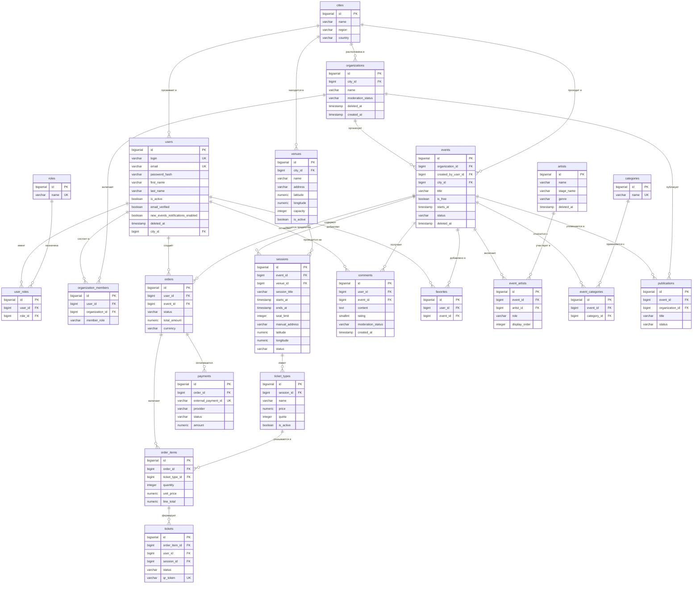

>Рисунок 2.2 — Диаграмма ключевых таблиц и связей даталогической модели (Crow's Foot)*

2.1.3 Описание ключевых таблиц и проектных решений

База данных содержит 35 таблиц и реализована на PostgreSQL 16. Управление эволюцией схемы осуществляется с помощью инструмента Flyway: изменения структуры фиксируются в виде пронумерованных SQL-скриптов, которые при каждом запуске приложения применяются автоматически в строгом порядке. Полный перечень таблиц представлен в таблице 2.1.

Таблица 2.1 — Перечень таблиц базы данных

| № | Таблица | Назначение |
|---|---|---|
| 1 | `cities` | Справочник городов |
| 2 | `images` | Загруженные изображения |
| 3 | `users` | Учётные записи пользователей (BCrypt-хэш пароля, мягкое удаление) |
| 4 | `roles` | Справочник ролей: Житель, Организатор, Администратор |
| 5 | `user_roles` | M:N-связь пользователей и ролей |
| 6 | `organizations` | Организации-организаторы с состоянием модерации |
| 7 | `organization_members` | Участники организаций с ролями (владелец / администратор / участник) |
| 8 | `organization_join_requests` | Заявки на вступление в организацию |
| 9 | `administrative_actions` | Журнал административных действий |
| 10 | `categories` | Справочник категорий мероприятий |
| 11 | `events` | Карточки мероприятий с полным жизненным циклом |
| 12 | `event_categories` | M:N-связь мероприятий и категорий |
| 13 | `artists` | Артисты с мягким удалением |
| 14 | `event_artists` | M:N-связь мероприятий и артистов (роль, порядок отображения) |
| 15 | `artist_images` | Изображения артистов |
| 16 | `venues` | Площадки с адресом и геокоординатами |
| 17 | `sessions` | Временны́е слоты мероприятия (дата, адрес, лимит мест) |
| 18 | `ticket_types` | Типы билетов (цена, квота) |
| 19 | `orders` | Заказы пользователей |
| 20 | `order_items` | Позиции заказа (тип билета, количество, сумма) |
| 21 | `tickets` | Выданные билеты с уникальным QR-токеном |
| 22 | `payments` | Платежи через YooKassa |
| 23 | `refunds` | Возвраты по платежам |
| 24 | `publications` | Новостные публикации организаций |
| 25 | `comments` | Комментарии и отзывы к мероприятиям (опциональная оценка 1–5) |
| 26 | `favorites` | Избранные мероприятия пользователей |
| 27 | `event_images` | Галерея изображений мероприятия (флаг `is_primary`) |
| 28 | `publication_images` | Изображения публикаций |
| 29 | `moderations` | Журнал решений по модерации |
| 30 | `email_verification_tokens` | Токены верификации email |
| 31 | `user_interests` | M:N-связь пользователей и категорий (интересы) |
| 32 | `session_waitlist` | Список ожидания на сеансы с превышенным лимитом |
| 33 | `notifications` | Внутренние уведомления пользователей |
| 34 | `promo_codes` | Промокоды для скидок на платные мероприятия |
| 35 | `organization_follows` | Подписки пользователей на организации |

Ключевые проектные решения обосновываются следующим образом.

Управление пользователями и ролями. Таблица users хранит учётные данные: хэш пароля в формате BCrypt (password_hash), флаги email_verified и new_events_notifications_enabled. Поле deleted_at реализует паттерн мягкого удаления. Ролевая модель через user_roles допускает одновременное наличие у одного пользователя нескольких ролей — например, роли Организатора и Жителя.

Мероприятия и сеансы. Предметная область разделена на две таблицы: events (общая карточка мероприятия) и sessions (конкретные временны́е слоты с адресом, лимитом мест и, при необходимости, уточнёнными геокоординатами). Такое разделение позволяет корректно описывать многодневные фестивали в рамках единой карточки.

Билетная система. Цепочка ticket_types → order_items → orders → payments → tickets обеспечивает полный жизненный цикл покупки билета. Таблица tickets хранит уникальный qr_token (UUID) для каждого выданного билета, используемый при верификации участника.

Мягкое удаление. Для таблиц users, events, organizations и artists применяется паттерн Soft Delete: при удалении записи заполняется поле deleted_at, физического удаления строки не происходит. Данный подход обеспечивает историчность данных и корректность аналитических запросов.

Управление эволюцией схемы. Изменения схемы базы данных фиксируются в виде версионированных SQL-скриптов и применяются автоматически при старте приложения, что обеспечивает воспроизводимость развёртывания и исключает несогласованные ручные изменения структуры.

На рисунке 2.3 представлена диаграмма последовательности процесса оформления и оплаты заказа на билет:

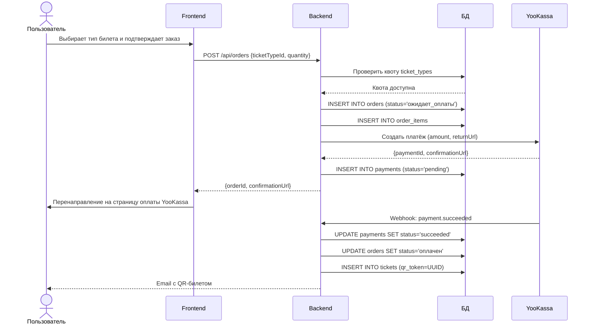

>Рисунок 2.3 — Диаграмма последовательности процесса оформления и оплаты заказа

2.2 Разработка серверной части

Серверная часть веб-приложения реализована на языке Java с использованием фреймворка Spring Boot 3. Данный выбор обусловлен его зрелостью, широкой экосистемой и встроенной поддержкой безопасности, управления транзакциями и REST-архитектуры [34; 51]. Серверная часть является единственным источником бизнес-логики и предоставляет клиентской части унифицированный REST API, изолируя её от деталей хранения данных.

Для описания архитектуры системы применяется нотация C4 Model [46]. Модель C4 организует архитектурное представление системы в виде четырёх последовательно детализируемых уровней: Контекст (System Context), Контейнеры (Containers), Компоненты (Components) и Код (Code).

На рисунке 2.4 представлена C4-диаграмма уровня «Контекст» (Level 1), описывающая систему в окружении её пользователей и внешних систем.

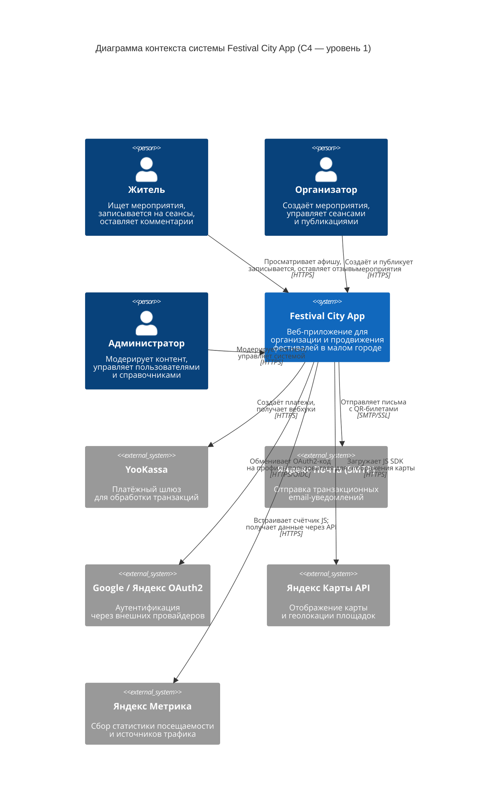

>Рисунок 2.4 — C4-диаграмма контекста системы (уровень 1 — Контекст)*

На рисунке 2.5 представлена C4-диаграмма уровня «Контейнеры» (Level 2), раскрывающая внутреннее устройство системы: составные контейнеры и их взаимодействие.

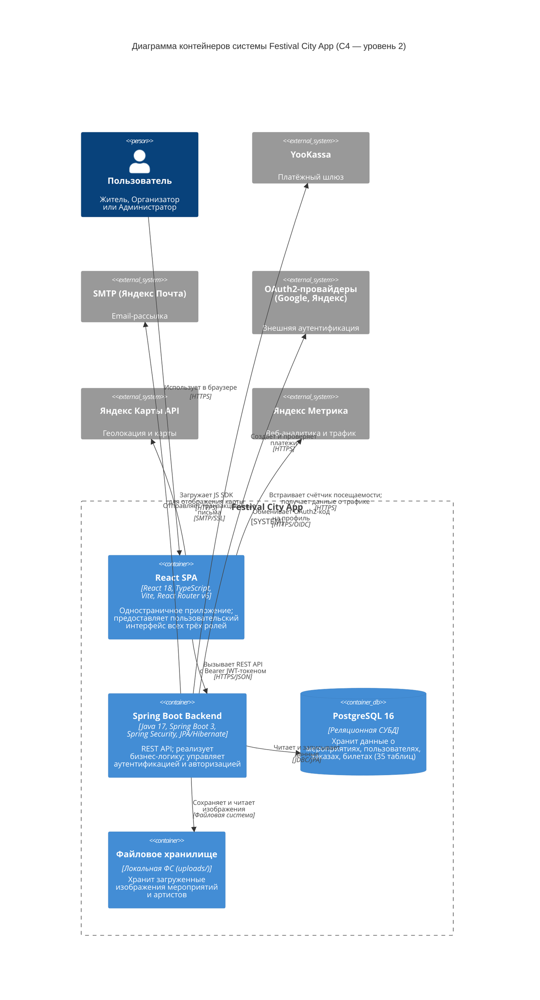

>Рисунок 2.5 — C4-диаграмма контейнеров системы*

2.2.1 Структура проекта и архитектура серверной части

Проект организован по принципу многоуровневой (layered) архитектуры, при которой каждый слой имеет чётко определённую ответственность и взаимодействует только со смежными слоями [32]. Корневой пакет приложения — `com.festivalapp.backend` — содержит следующие подпакеты: `entity`, `repository`, `service`, `controller`, `dto`, `security`, `config`, `exception`.

Каждый пакет выполняет строго определённую роль:
1) `entity` — JPA-сущности, отображаемые на таблицы базы данных PostgreSQL посредством ORM Hibernate;
2) `repository` — интерфейсы Spring Data JPA для доступа к данным;
3) `service` — бизнес-логика: `EventService`, `OrderService`, `PaymentGatewayService`, `NotificationService` и иные;
4) `controller` — REST-контроллеры, обрабатывающие входящие HTTP-запросы;
5) `dto` — объекты передачи данных, изолирующие внутреннее представление от внешнего API;
6) `security` — компоненты аутентификации и авторизации;
7) `config` — конфигурационные классы Spring;
8) `exception` — пользовательские исключения и единый обработчик ошибок (`@RestControllerAdvice`).

На рисунке 2.6 представлена C4-диаграмма компонентов серверной части (Level 3 — Components), детализирующая внутреннее устройство Spring Boot-приложения: пять слоёв и их зависимости от внешних систем.

Диаграмма фиксирует строгое разделение ответственности: Security Layer перехватывает каждый запрос и заполняет контекст безопасности; Controller Layer транслирует HTTP-запросы в команды бизнес-логики; Service Layer реализует всю предметную логику и координирует обращения к базе данных и внешним сервисам; Repository Layer инкапсулирует SQL через Spring Data JPA; Cross-cutting обеспечивает единообразную обработку ошибок и преобразование DTO на границе слоёв. Яндекс Карты не входят в серверную часть: рендеринг карт полностью делегирован клиентской части через JavaScript SDK (см. раздел 2.4.8).

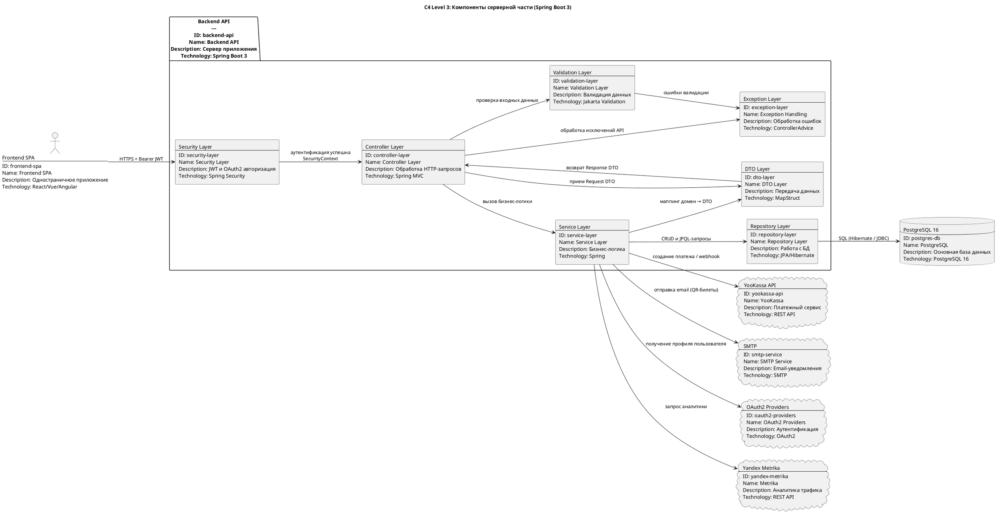

>Рисунок 2.6 — C4-диаграмма компонентов серверной части

2.2.2 JPA-сущности предметной области

JPA-сущности представляют собой Java-классы, аннотированные @Entity, которые через механизм ORM Hibernate отображаются на таблицы реляционной базы данных. В проекте применяется библиотека Lombok для автоматической генерации шаблонного кода (геттеры, сеттеры, конструкторы, Builder) [37].

В листинге 2.1 представлен класс сущности User.java, отображающий таблицу users.

Листинг 2.1 — Класс сущности User.java(фрагмент)

```java
@Entity
@Table(name = "users")
public class User {

    @Id
    @GeneratedValue(strategy = GenerationType.IDENTITY)
    private Long id;

    @Column(nullable = false, unique = true)
    private String login;

    @Column(nullable = false, unique = true)
    private String email;

    @Column(name = "password_hash", nullable = false)
    private String passwordHash;

    @Column(name = "deleted_at")  // Soft Delete
    private OffsetDateTime deletedAt;

    @ManyToOne(fetch = FetchType.LAZY)
    @JoinColumn(name = "city_id")
    private City city;
}
```

Сущность Event является центральным объектом бизнес-домена. В листинге 2.2 представлен соответствующий класс.

Листинг 2.2 — Класс сущности Event.java (фрагмент)

```java
@Entity
@Table(name = "events")
public class Event {

    @Id 
    @GeneratedValue(strategy = GenerationType.IDENTITY)
    private Long id;

    @ManyToOne(fetch = FetchType.LAZY)
    @JoinColumn(name = "organization_id", nullable = false)
    private Organization organization;

    @Column(nullable = false)
    private String title;

    @Column(nullable = false)
    private String status;

    @Column(name = "deleted_at")
    private OffsetDateTime deletedAt;

    @Transient  // Вычисляется в сервисном слое
    private Integer ageRating;

    @Builder.Default
    @OneToMany(mappedBy = "event")
    private Set<Session> sessions = new HashSet<>();
}
```

На рисунке 2.7 представлена диаграмма классов ключевых JPA-сущностей:

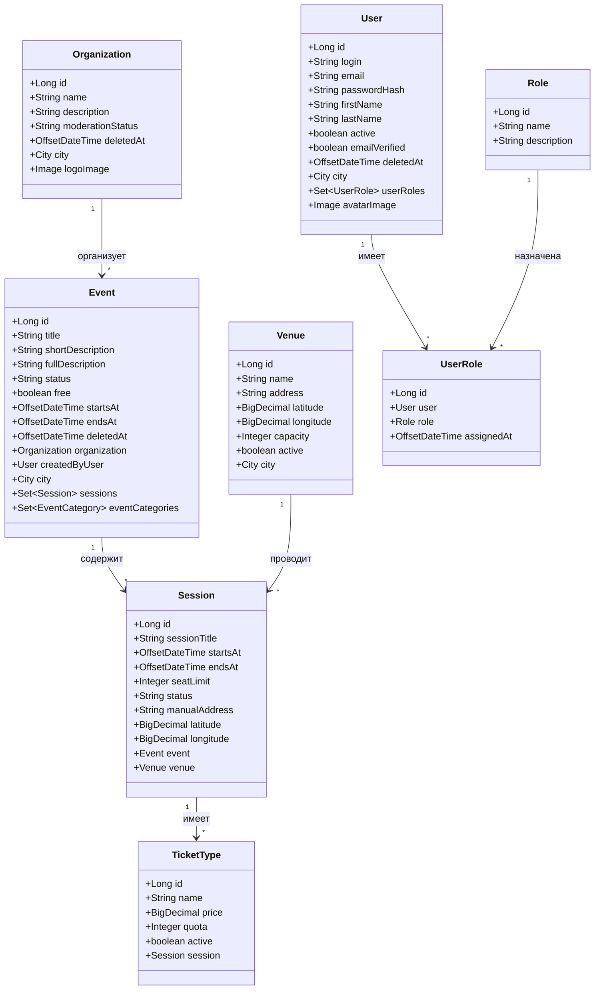

>Рисунок 2.7 — Диаграмма классов ключевых JPA-сущностей*

2.2.3 Реализация REST API

REST API приложения построен по принципу ресурсно-ориентированного дизайна [39]: каждый URL идентифицирует ресурс, а HTTP-методы (GET, POST, PUT, DELETE) определяют выполняемое действие. Все эндпоинты сгруппированы по доменным областям с базовым префиксом /api/. В листинге 2.3 представлен фрагмент контроллера мероприятий, демонстрирующий типовую структуру REST-контроллера.

Листинг 2.3 — Контроллер EventController.java (фрагмент)

```java
@RestController
@RequestMapping("/api/events")
@RequiredArgsConstructor
public class EventController {

    private final EventService eventService;

    @GetMapping
    public ResponseEntity<List<EventShortResponse>> getAll(
            @RequestParam(required = false) String q,
            @RequestParam(required = false) Long categoryId) {
        return ResponseEntity.ok(eventService.getAll(q, categoryId));
    }

    @PostMapping
    public ResponseEntity<EventShortResponse> create(
            @Valid @RequestBody EventCreateRequest request,
            @AuthenticationPrincipal UserDetails principal) {
        return ResponseEntity.status(HttpStatus.CREATED)
            .body(eventService.create(request, principal.getUsername()));
    }
}
```

Полная структура REST API приложения представлена в таблице 2.2.

Таблица 2.2 — Структура REST API

| Группа | Эндпоинты | Доступ |
|---|---|---|
| Аутентификация | POST `/api/auth/register`, POST `/api/auth/login`, GET `/api/auth/verify-email` | Публичный |
| Мероприятия | GET `/api/events`, GET `/api/events/{id}`, POST `/api/events`, PUT `/api/events/{id}`, DELETE `/api/events/{id}`, GET `/api/events/recommendations` | Публичный / Организатор |
| Сеансы | GET `/api/sessions`, POST `/api/sessions`, PUT `/api/sessions/{id}` | Организатор |
| Заказы и билеты | POST `/api/orders`, GET `/api/orders/my`, DELETE `/api/orders/{id}`, GET `/api/tickets/my`, POST `/api/tickets/{id}/use` | Аутентифицированный |
| Избранное | GET `/api/favorites/my`, POST `/api/favorites`, DELETE `/api/favorites/{id}` | Аутентифицированный |
| Комментарии | GET `/api/comments`, POST `/api/comments`, DELETE `/api/comments/{id}` | Житель |
| Публикации | GET `/api/publications`, POST `/api/publications`, PUT `/api/publications/{id}` | Организатор |
| Кабинет организатора | GET `/api/organizer/events`, GET `/api/organizer/events/{id}/stats`, GET `/api/organizer/analytics` | Организатор |
| Платежи | POST `/api/payments/webhook` | Внешний (YooKassa) |
| Справочники | GET `/api/cities`, GET `/api/categories`, GET `/api/venues` | Публичный |
| Панель администратора | GET/PATCH `/api/admin/users`, PATCH `/api/admin/events/{id}/status`, GET `/api/admin/analytics/overview` | Администратор |
| Список ожидания | POST `/api/sessions/{id}/waitlist`, GET `/api/sessions/{id}/waitlist/status`, DELETE `/api/sessions/{id}/waitlist` | Аутентифицированный |
| Промокоды | GET/POST `/api/promo-codes`, DELETE `/api/promo-codes/{id}`, POST `/api/promo-codes/validate` | Организатор / Аутентифицированный |
| Уведомления | GET `/api/notifications`, PATCH `/api/notifications/{id}/read`, PATCH `/api/notifications/read-all` | Аутентифицированный |
| Подписки на организации | POST `/api/organizations/{id}/follow`, DELETE `/api/organizations/{id}/follow`, GET `/api/organizations/{id}/follow/status` | Аутентифицированный |

Эндпоинты возвращают стандартные HTTP-коды; ошибки сериализуются в единый JSON-формат через `@RestControllerAdvice`. Валидация входных данных обеспечивается аннотациями Jakarta Validation. Документация API сформирована средствами SpringDoc OpenAPI и доступна по адресу `/swagger-ui.html`.

2.2.4 Реализация бизнес-логики в сервисном слое

Бизнес-логика приложения сосредоточена в классах пакета service. В качестве примера рассмотрим ключевые алгоритмы класса EventService.

Гидратация объекта. Поскольку коллекции sessions, eventCategories и eventImages загружаются в режиме «ленивой» инициализации (lazy loading), сервис использует метод hydrateEvent(), выполняющий явную загрузку всех зависимых коллекций перед формированием ответа. Данный подход позволяет избежать проблемы N+1 запросов в критичных сценариях и обеспечивает предсказуемое поведение при сериализации [32].

Многокритериальная фильтрация. Метод getAll() реализует фильтрацию в памяти после извлечения всех не удалённых мероприятий из базы данных. Вспомогательный метод matchesFilters() последовательно проверяет каждый из параметров запроса: текстовый поиск, категорию, площадку, город, диапазон дат, тип участия и ценовой диапазон.

В листинге 2.4 представлен фрагмент метода полнотекстового поиска, охватывающего название мероприятия, его описание, наименование организации и имена связанных артистов.

Листинг 2.4 — Метод полнотекстового поиска (фрагмент EventService.java)

```java
private String buildSearchIndex(Event event) {
List<String> chunks = new ArrayList<>();
if (StringUtils.hasText(event.getTitle()))
chunks.add(event.getTitle());
if (StringUtils.hasText(event.getShortDescription()))
chunks.add(event.getShortDescription());
if (event.getOrganization() != null)
chunks.add(event.getOrganization().getName());
// Поиск охватывает имена и псевдонимы артистов
for (EventArtist ea : eventArtistRepository
.findAllByEventIdOrderByIdAsc(event.getId())) {
Artist artist = ea.getArtist();
if (artist == null) continue;
chunks.add(artist.getName());
}
return String.join(" ", chunks).toLowerCase();
}
```

Рекомендательная система. Метод `getRecommendations()` ранжирует мероприятия по количеству добавлений в избранное (по убыванию), а при равенстве показателей — по дате создания. Алгоритм реализует упрощённую коллаборативную фильтрацию на основе агрегированного поведения пользователей. Операции, изменяющие данные, выполняются в рамках транзакций, обеспеченных аннотацией `@Transactional`.

На рисунке 2.9 представлена блок-схема алгоритма обработки запроса на создание черновика мероприятия (первый шаг мастера). 

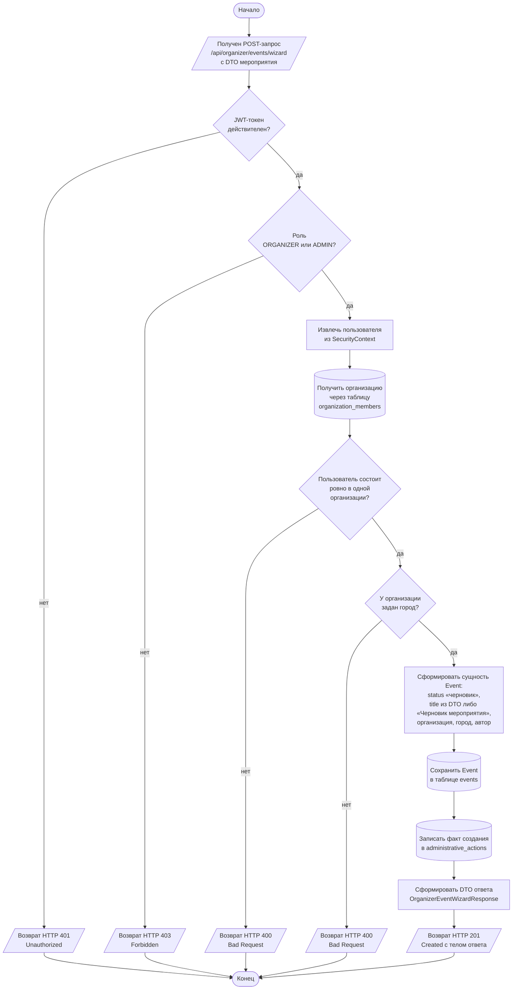

>Рисунок 2.9 — Блок-схема алгоритма создания черновика мероприятия

Алгоритм инициализирует только базовую сущность `Event` со статусом «черновик»; категории, изображения, артисты, сеансы и типы билетов добавляются на последующих шагах мастера через PUT-эндпоинты с идемпотентным обновлением соответствующих коллекций. Метод обработчика помечен аннотацией `@Transactional`, что обеспечивает атомарность сохранения мероприятия и записи в журнал административных действий.

2.2.5 Система безопасности и аутентификации

Аутентификация и авторизация в приложении реализованы на основе Spring Security с использованием механизма JSON Web Tokens (JWT) [38]. Данный подход соответствует принципу stateless REST-архитектуры: сервер не хранит состояние сессии, а права пользователя передаются в каждом запросе в заголовке Authorization: Bearer <token>.

Класс фильтра аутентификации JwtAuthFilter реализует интерфейс OncePerRequestFilter и обеспечивает извлечение и валидацию JWT-токена из заголовка Authorization при каждом запросе.
В листинге 2.5 представлен фрагмент класса фильтра аутентификации JwtAuthFilter.java

Листинг 2.5 — Класс фильтра аутентификации JwtAuthFilter.java (фрагмент)

```java
@RequiredArgsConstructor
public class JwtAuthFilter extends OncePerRequestFilter {
private final JwtService jwtService;
private final CustomUserDetailsService userDetailsService;

    @Override
    protected void doFilterInternal(HttpServletRequest rq,
            HttpServletResponse rs, FilterChain chain) {
        String header = rq.getHeader("Authorization");
        if (header != null && header.startsWith("Bearer ")) {
            // извлечение и валидация токена ...
        } chain.doFilter(rq, rs); }
}
```

Конфигурация ролевого разграничения конечных точек (SecurityConfig) реализована посредством метода authorizeHttpRequests. В листинге 2.6 представлен фрагмент конфигурации правил доступа SecurityConfig.java, демонстрирующий ролевое разграничение эндпоинтов.

Листинг 2.6 — Конфигурация правил доступа SecurityConfig.java (фрагмент)

```java
.authorizeHttpRequests(auth -> auth
// Публичный доступ к афише и справочникам
.requestMatchers(HttpMethod.GET, "/api/events/**").permitAll()
.requestMatchers(HttpMethod.GET,
"/api/categories", "/api/venues", "/api/cities").permitAll()
// Аутентифицированные пользователи
.requestMatchers(HttpMethod.POST, "/api/orders").authenticated()
.requestMatchers(HttpMethod.GET, "/api/favorites/my").authenticated()
// Только роль RESIDENT
.requestMatchers(HttpMethod.POST, "/api/comments").hasRole("RESIDENT")
// Только роль ORGANIZER
.requestMatchers(HttpMethod.POST, "/api/events/**").hasRole("ORGANIZER")
.requestMatchers("/api/organizer/**").hasRole("ORGANIZER")
// ORGANIZER или ADMIN
.requestMatchers(HttpMethod.PUT, "/api/events/**")
.hasAnyRole("ORGANIZER", "ADMIN")
// Только ADMIN
.requestMatchers("/api/admin/**").hasRole("ADMIN")
.anyRequest().authenticated()
```

На рисунке 2.10 представлена диаграмма последовательности, описывающая два сценария аутентификации — по логину/паролю и через OAuth2.

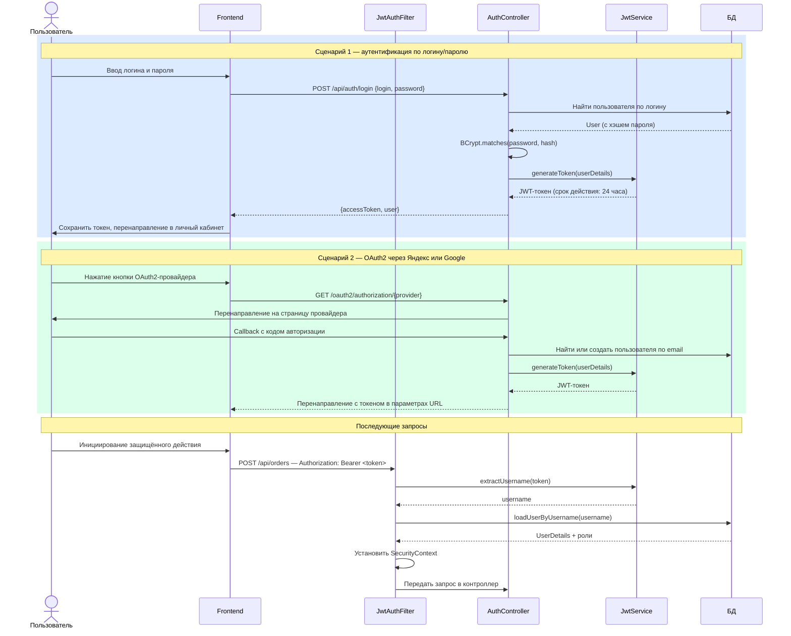

>Рисунок 2.10 — Диаграмма последовательности процессов аутентификации*

2.2.6 Управление схемой базы данных

Управление эволюцией схемы базы данных осуществляется с помощью инструмента Flyway [40]. Скрипты миграций применяются автоматически при старте приложения, что обеспечивает воспроизводимость развёртывания в различных средах и исключает риск несогласованных ручных изменений структуры базы данных.

2.2.7 Интеграция с внешними сервисами

Взаимодействие системы с внешними сервисами описано в C4-диаграмме контейнеров (рисунок 2.5). Ниже приведено описание каждой интеграции.

Платёжный шлюз YooKassa. При создании заказа класс PaymentService обращается к API YooKassa по протоколу HTTPS, передавая сумму и URL возврата. Подтверждение оплаты поступает асинхронно через Webhook (HTTP POST на /api/payments/webhook): полученное уведомление обновляет статус заказа, инициирует генерацию QR-токенов и отправку email-уведомления пользователю.

SMTP-сервер. Компонент Spring Mail используется для отправки транзакционных писем через сервер Яндекс Почты (SSL, порт 465): подтверждение регистрации, QR-билет после оплаты, уведомления о новых мероприятиях для подписчиков.

OAuth2-провайдеры. Реализована интеграция с двумя провайдерами через стандартный механизм Spring Security OAuth2 Client: Яндекс (/oauth2/authorization/yandex) и Google (/oauth2/authorization/google). Настройка задаётся в файле application.yml. Для Google применяется встроенный провайдер Spring с поддержкой OIDC, что исключает необходимость ручной конфигурации эндпоинтов.

Яндекс Карты API. Используется на стороне клиента для отображения местоположения площадок в карточке мероприятия и на странице карты всех событий.

Яндекс Метрика. Интегрирована в клиентскую часть приложения для сбора статистики посещаемости. JavaScript-счётчик Яндекс Метрики подключается в точке входа React-приложения и автоматически отслеживает визиты, источники трафика и поведение пользователей. Данные о посещаемости по дням и о каналах привлечения аудитории отображаются на стартовой странице панели администратора в виде интерактивных графиков [47]. Внешний вид аналитической панели представлен на рисунке 2.11.

>Рисунок 2.11 — Аналитическая панель администратора с графиками Яндекс Метрики

Конфигурационные параметры подключения к внешним сервисам (реквизиты SMTP, OAuth2-провайдеров, платёжного шлюза YooKassa, Яндекс Метрики) вынесены в файл `.env`, подключаемый к `application.yml`. Порядок развёртывания системы в среде разработки приведён в разделе 3.3.1.

2.3 Проектирование пользовательского интерфейса

Пользовательский интерфейс веб-приложения проектировался исходя из принципов удобства использования (usability), доступности и соответствия потребностям трёх групп пользователей: жителей, организаторов и администраторов. При разработке интерфейса применялся подход «дизайн, ориентированный на пользователя» (User-Centered Design) в соответствии со стандартом ISO 9241-210 [41; 53].

2.3.1 Концепция дизайна и визуальная система

Визуальная концепция приложения строится на тёплой нейтральной цветовой палитре с акцентным терракотово-коричневым цветом (#C0522A), ассоциирующимся с культурой, теплом и городским уютом. Типографика основана на сочетании шрифта с засечками для заголовков и гротескового шрифта для основного текста. Компонентная библиотека — shadcn/ui на базе Radix UI Primitives и Tailwind CSS. Итоговый вид главной страницы представлен на рисунке 2.12.

>Рисунок 2.12 — Главная страница приложения

2.3.2 Навигационная структура и ролевое разграничение

Приложение реализует три независимых пользовательских пространства с разными точками входа и навигацией: публичную часть, доступную всем посетителям без авторизации, и три личных кабинета для жителя, организатора и администратора. Состав разделов по каждому пространству приведён в таблице 2.3.

Таблица 2.3 — Навигационная структура веб-приложения

| Пространство | Раздел | Назначение | Доступ |
|---|---|---|---|
| Публичная часть | Главная страница | Подборка актуальных мероприятий, выбор города | Без авторизации |
| | Афиша | Каталог мероприятий с фильтрами и поиском | Без авторизации |
| | Карточка мероприятия | Описание, расписание, отзывы, запись | Без авторизации |
| | Карта мероприятий | Кластеризованные маркеры на Яндекс Картах | Без авторизации |
| | Публикации | Новости и анонсы организаций | Без авторизации |
| | Вход / Регистрация | Аутентификация по email или OAuth2 | Гость |
| Личный кабинет жителя | Профиль | Личные данные, настройки уведомлений | Житель |
| | Избранное | Сохранённые мероприятия | Житель |
| | Мои билеты | QR-билеты с историей записей | Житель |
| | Мои заказы | История платежей и возвратов | Житель |
| Кабинет организатора | Обзор | Сводка по мероприятиям организации | Организатор |
| | Мероприятия | Список и пошаговый мастер создания | Организатор |
| | Организация | Профиль организации, состав команды | Организатор |
| | Публикации | Управление новостями организации | Организатор |
| | Аналитика | Статистика посещаемости и регистраций | Организатор |
| | Промокоды | Управление скидочными кодами | Организатор |
| Панель администратора | Обзор системы | Ключевые показатели платформы, трафик | Администратор |
| | Пользователи | Управление учётными записями и ролями | Администратор |
| | Мероприятия | Модерация и архивирование событий | Администратор |
| | Артисты | Каталог артистов | Администратор |
| | Публикации | Модерация новостных публикаций | Администратор |
| | Комментарии | Модерация отзывов жителей | Администратор |
| | Справочники | Города, площадки, категории | Администратор |

Переход между пространствами реализован через защищённые маршруты (Protected Route) клиентской части: попытка обращения к разделу без необходимой роли вызывает программное перенаправление на страницу аутентификации либо на страницу с уведомлением об ограничении доступа.

2.3.3 Публичная часть: афиша и карточка мероприятия

Страница афиши мероприятий с системой фильтрации показана на рисунке 2.13; детальная карточка мероприятия с картой и блоком записи — на рисунке 2.14.

>Рисунок 2.13 — Страница афиши мероприятий с системой фильтрации

>Рисунок 2.14 — Детальная карточка мероприятия с картой и блоком записи

2.3.4 Личный кабинет жителя

Страница профиля пользователя представлена на рисунке 2.15.

>Рисунок 2.15 — Страница профиля пользователя

2.3.5 Кабинет организатора

Мастер создания мероприятия в кабинете организатора показан на рисунке 2.16.
Мастер реализован в шесть последовательных шагов:
1)	основная информация — название, краткое и полное описание, возрастное ограничение, признак бесплатного мероприятия, категории;
2)	фотографии — загрузка обложки и галереи, выбор главного изображения;
3)	артисты — поиск и прикрепление артистов из общего каталога (шаг необязателен);
4)	сеансы — дата и время, площадка из справочника или произвольный адрес с геолокацией через Яндекс Карты, лимит мест;
5)	билеты — типы билетов, цены и квоты (шаг отображается только для платных мероприятий);
6)	предпросмотр и отправка — итоговый просмотр собранных данных, сохранение черновика или отправка на модерацию. Форма поддерживает автосохранение каждые 15 секунд и валидацию перед переходом на следующий шаг.

>Рисунок 2.16 — Мастер создания мероприятия в кабинете организатора

На рисунке 2.17 представлена BPMN-диаграмма бизнес-процесса публикации мероприятия, охватывающая взаимодействие трёх участников: организатора, системы и администратора.

>Рисунок 2.17 — BPMN-диаграмма процесса публикации мероприятия

На рисунке 2.18 представлена диаграмма состояний мероприятия в интерфейсе организатора (State Diagram, нотация UML).

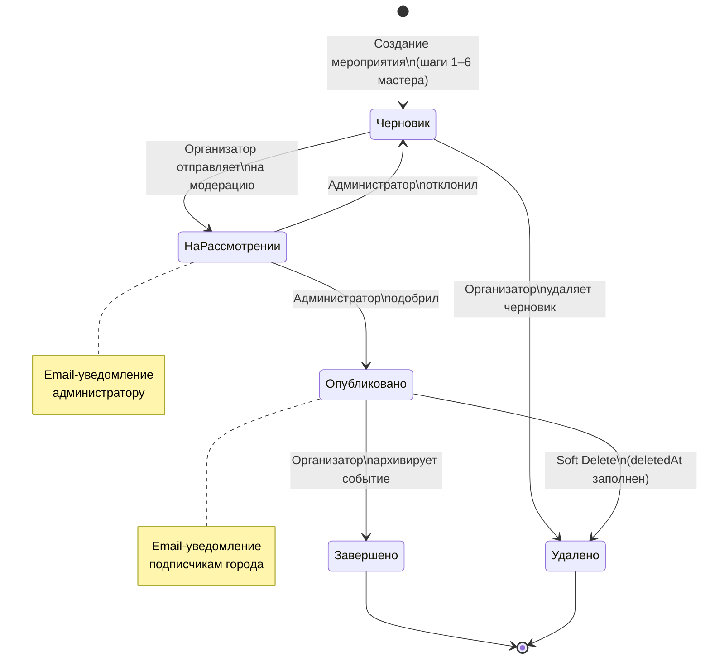

>Рисунок 2.18 — Диаграмма состояний мероприятия (State Diagram)

2.3.6 Панель администратора
Стартовая страница «Обзор системы» с ключевыми показателями и графиком трафика представлена на рисунке 2.19.

>Рисунок 2.19 — Панель администратора: обзор системы с ключевыми показателями

На рисунке 2.20 представлена диаграмма прецедентов (Use Case Diagram, нотация UML) с четырьмя актёрами — Гость, Житель, Организатор и Администратор. Показаны отношения включения (<<include>>) для обязательных подпотоков (подтверждение e-mail при регистрации, создание сеансов при создании мероприятия) и расширения (<<extend>>) для условных ответвлений (вход через OAuth2, оплата билета для платных событий).

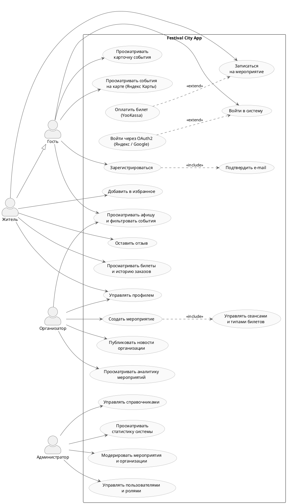

>Рисунок 2.20 — Диаграмма прецедентов системы по ролям (Use Case Diagram)

Диаграмма охватывает 20 прецедентов и 4 актёра. Гость (неаутентифицированный пользователь) имеет доступ к публичной части: просмотру афиши с фильтрацией, карточкам событий, карте и формам входа/регистрации. Житель наследует все права Гостя и дополнительно может записываться на мероприятия, управлять профилем, просматривать историю билетов и оставлять отзывы. Отношение <<extend>> между «Оплатить билет» и «Записаться» отражает, что оплата через YooKassa выполняется только для платных событий — она не является обязательной частью сценария записи. Отношение <<include>> между «Зарегистрироваться» и «Подтвердить e-mail» означает, что верификация электронной почты является неотъемлемой частью регистрации. Аналогично <<include>> между «Создать мероприятие» и «Управлять сеансами» фиксирует, что созданное мероприятие требует добавления хотя бы одного сеанса. Прецедент «Войти через OAuth2» расширяет стандартный вход (<<extend>>), поскольку OAuth2-аутентификация является альтернативным, а не обязательным способом входа. Организатор работает в своём личном кабинете и не имеет прямых прав на административные функции. Администратор управляет системой целиком: модерирует контент, назначает роли, ведёт справочники и контролирует сводную статистику через интеграцию с Яндекс Метрикой.

2.3.7 Адаптивность и доступность
Интерфейс разработан с соблюдением принципа адаптивного дизайна: сетка карточек мероприятий перестраивается от трёхколоночной на широких экранах до одноколоночной на мобильных устройствах. Минимальная поддерживаемая ширина экрана составляет 320 пикселей.

Цветовой контраст текста соответствует уровню AA стандарта WCAG 2.1 [42]: акцентный цвет #C0522A на белом фоне обеспечивает коэффициент контрастности 4,8:1, что превышает минимально допустимое значение 4,5:1. Все интерактивные элементы снабжены aria-атрибутами для поддержки программ чтения с экрана (скринридеров).

2.4 Разработка клиентской части

Клиентская часть веб-приложения реализована в виде одностраничного приложения (SPA) на базе библиотеки React 18 с использованием языка TypeScript [35]. Сборка осуществляется инструментом Vite, маршрутизация — посредством React Router v6. Данный стек обеспечивает строгую статическую типизацию, производительное обновление DOM через механизм Virtual DOM и поддержку Tree Shaking для минимизации размера бандла.

2.4.1 Архитектура и структура проекта

Клиентская часть организована по функционально-ориентированному принципу. Исходный код сосредоточен в директории `src/` и разделён на следующие модули: `pages` — страницы приложения; `components` — переиспользуемые UI-компоненты; `layouts` — шаблоны разметки; `services` — слой взаимодействия с REST API; `contexts` — глобальное состояние через React Context; `hooks` — пользовательские хуки; `types` — TypeScript-интерфейсы; `lib` — вспомогательные утилиты. Управление серверным состоянием реализовано через TanStack React Query, локальным состоянием форм — через React Hook Form в связке с Zod-валидацией.

На рисунке 2.21 представлена C4-диаграмма компонентов клиентской части (Level 3 — Components), раскрывающая семь слоёв React-приложения и их взаимодействие с внешними системами.

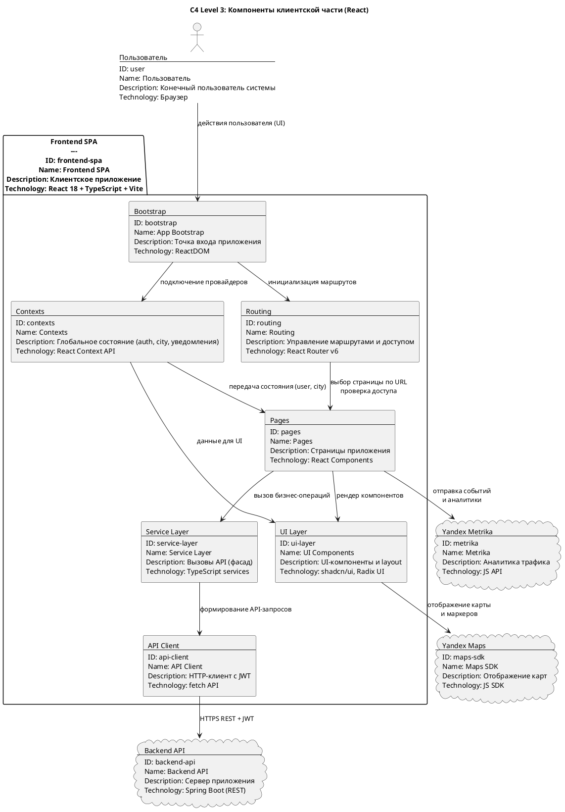

>Рисунок 2.21 — C4-диаграмма компонентов клиентской части

Диаграмма закрепляет ключевые архитектурные решения: ProtectedRoute полностью исключает рендеринг страниц без нужной роли; Контексты распространяются как к страницам, так и к UI-компонентам, устраняя «prop drilling» на всех уровнях; Сервисный слой изолирует страницы от деталей HTTP (паттерн «Фасад»); HTTP-клиент централизует управление JWT-токеном. Яндекс Карты подключаются исключительно на уровне UI-компонентов (EventLocationMap, EventsCatalogMap, LocationPickerMap), а Яндекс Метрика — как счётчик визитов на всех страницах и как источник данных трафика для AnalyticsDashboard.

2.4.2 HTTP-клиент: модуль api-client.ts

Все обращения к серверному API проходят через единый HTTP-клиент на основе нативного fetch API, который обеспечивает автоматическое добавление заголовка авторизации, единообразную обработку ошибок и поддержку JSON и FormData. Реализация модуля api-client.ts приведена в Приложении Б (листинг Б.1).

2.4.3 Сервисный слой клиента

Сервисный слой реализует паттерн «Фасад»: каждый модуль (например, auth-service.ts, event-service.ts) предоставляет набор типизированных методов, скрывая детали HTTP-взаимодействия от компонентов. Фрагмент сервиса аутентификации (auth-service.ts) приведён в Приложении Б (листинг Б.2).

2.4.4 Реализация страницы детальной карточки мероприятия

Страница EventDetailPage является наиболее функционально насыщенным компонентом публичной части приложения. В листинге 2.9 представлен фрагмент, реализующий параллельную загрузку данных мероприятия, сеансов и отзывов.

Листинг 2.9 — EventDetailPage.tsx: параллельная загрузка данных (фрагмент)

```typescript
const [sessions, setSessions] = useState<Session[]>([]);
const [reviews,  setReviews]  = useState<Review[]>([]);
const [loading,  setLoading]  = useState(true);

// Параллельная загрузка трёх ресурсов через Promise.all
useEffect(() => {
if (!id) return;
setLoading(true);
Promise.all([
eventService.getEventById(id),
sessionService.getSessionsByEvent(id),
reviewService.getReviewsByEvent(id),
])
.then(([eventData, sessionsData, reviewsData]) => {
setEvent(eventData);
setSessions(sessionsData);
setReviews(reviewsData);
})
.catch(() => setError('Не удалось загрузить мероприятие'))
.finally(() => setLoading(false));
}, [id]);};
```

Функция регистрации registerForSession реализует два сценария: для платного мероприятия выполняется перенаправление в платёжный шлюз, для бесплатного — мгновенная запись с отправкой уведомления (Приложение Б, листинг Б.6).

На рисунке 2.22 представлена диаграмма состояний компонента EventDetailPage (State Diagram, нотация UML).

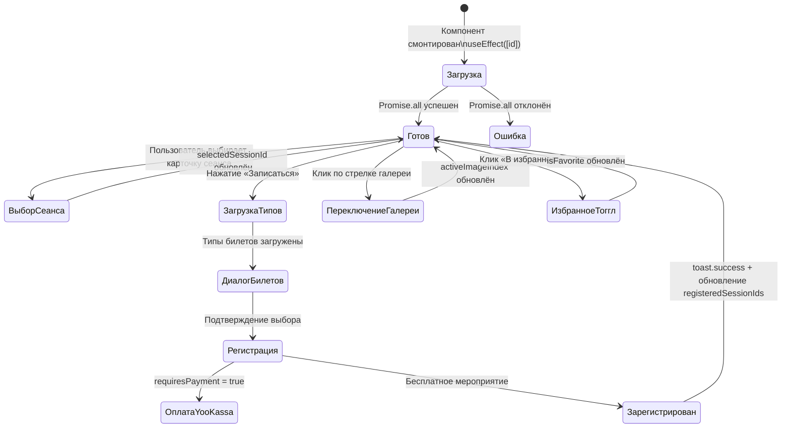

>Рисунок 2.22 — Диаграмма состояний компонента EventDetailPage (State Diagram)

2.4.5 Управление глобальным состоянием: контекст аутентификации

Состояние текущего пользователя доступно во всех компонентах приложения через React Context. Хук useAuth() предоставляет: user — объект текущего пользователя; isAuthenticated — флаг наличия активной сессии; isResident, isOrganizer, isAdmin — флаги ролей. Данный подход устраняет «prop drilling» и обеспечивает единую точку управления состоянием сессии [35].

В листинге 2.11 представлен пример использования контекста аутентификации для ролевого рендеринга кнопки записи на мероприятие.

Листинг 2.11 — Использование контекста аутентификации в компоненте

```typescript
const renderRegistrationButton = () => {
if (isResident) {
return (
<Button onClick={() => openRegistrationForSession(firstSession)}>
<CheckCircle2 /> Записаться
</Button>
);
}
if (isAuthenticated) {
return (
<Button variant="outline" disabled>
Запись доступна только жителям
</Button>
);
}
return (
<Button asChild>
<Link to="/login">Войти для записи</Link>
</Button>
);
};
```

2.4.6 Компонентная библиотека и UI Kit

Базовый UI Kit приложения построен на библиотеке shadcn/ui — наборе доступных компонентов на основе Radix UI Primitives и Tailwind CSS [43]. Принципиальное архитектурное преимущество данного подхода состоит в том, что компоненты копируются непосредственно в исходный код проекта: это обеспечивает полный контроль над стилизацией без зависимости от внешней библиотеки как от отдельного пакета.

На базе UI Kit реализованы следующие доменные компоненты:
1)	EventCard — карточка мероприятия в афише: обложка, название, дата, категории и кнопка «В избранное»; управляется через пропсы event и onFavoriteToggle;
2)	StarRating — управляемый виджет оценки, пробрасывает выбранное значение через onChange;
3)	EventLocationMap — карта с маркером площадки, инициализируется по координатам venue.latitude / venue.longitude;
4)	EventsCatalogMap — карта всех мероприятий с кластеризацией маркеров (страница /map);
5)	LocationPickerMap — выбор произвольной геолокации кликом, используется в форме создания сеанса;
6)	StateDisplays (LoadingState, ErrorState) — унифицированные состояния загрузки и ошибки, применяются единообразно на всех страницах.

Шаблоны разметки PublicLayout, OrganizerLayout и AdminLayout представляют собой три независимые оболочки с собственной навигацией и ролевой защитой. Каждый шаблон содержит шапку, навигационное меню (адаптированное под роль) и область контента; OrganizerLayout и AdminLayout дополнительно оснащены боковой панелью навигации с индикатором активного маршрута.

Наиболее функционально насыщенной страницей публичной части является EventDetailPage: она объединяет галерею изображений, панель основных сведений о мероприятии, список сеансов с кнопками записи, блок местоположения с картой, секцию отзывов со звёздным рейтингом и модальное окно выбора типов билетов. Поведение страницы при переходах между состояниями (загрузка → готов → регистрация → оплата) описано диаграммой состояний на рисунке 2.22.

2.4.7 Маршрутизация и защищённые маршруты

Маршрутизация реализована с помощью React Router v6 с применением паттерна «защищённый маршрут» (Protected Route). Компонент-обёртка проверяет наличие аутентификации и требуемой роли перед рендерингом целевой страницы; при несоответствии условий выполняется программное перенаправление. На рисунке 2.23 представлена схема маршрутизации клиентской части в нотации блок-схемы (flowchart), отражающая ветвления по ролям и перенаправления при нарушении прав доступа.

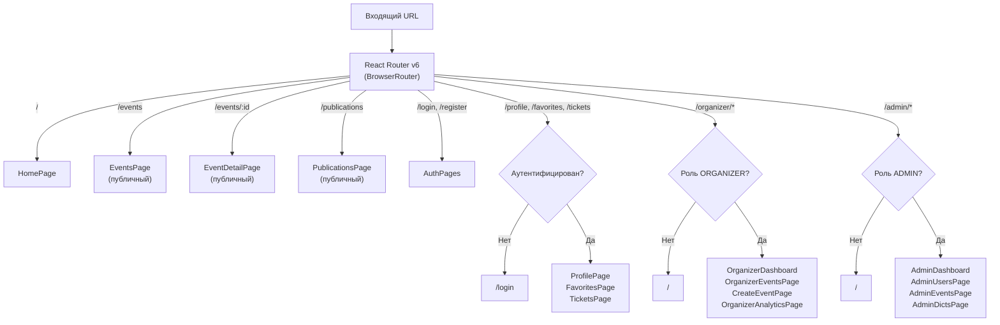

>Рисунок 2.23 — Схема маршрутизации клиентской части (Flowchart)

2.4.8 Интеграция с Яндекс Картами

Для отображения местоположения площадок используется Яндекс Maps JavaScript API [44], подключаемый посредством JS SDK. Компонент EventLocationMap инициализирует карту в координатах площадки (поля latitude и longitude из таблицы venues), устанавливает маркер с названием площадки и обеспечивает интерактивное масштабирование. Компонент EventsCatalogMap реализует карту всех мероприятий на странице /map с кластеризацией маркеров. Компонент LocationPickerMap используется в форме создания сеанса для выбора произвольной геолокации кликом по карте. Все маркеры выполнены в единой цветовой системе приложения: терракотовый цвет #B55F40 согласован с акцентным цветом интерфейса.

2.5 Выводы по второй главе

Во второй главе представлена техническая реализация веб-приложения для организации и продвижения фестивалей и культурных мероприятий в малом городе.

В разделе 2.1 спроектирована база данных. Инфологическая модель формализует предметную область через систему ключевых сущностей и связей между ними. Даталогическая модель реализована на СУБД PostgreSQL 16 с применением паттерна мягкого удаления и декларативных ограничений целостности через внешние ключи. Эволюция схемы управляется инструментом Flyway, что обеспечивает воспроизводимость развёртывания в различных средах. Архитектура поддерживает полный жизненный цикл мероприятия — от создания черновика до архивирования.

В разделе 2.2 разработана серверная часть на платформе Java 17 / Spring Boot 3. Архитектура системы описана с помощью нотации C4 Model на трёх уровнях: контекст, контейнеры и компоненты. Реализована многоуровневая (layered) архитектура с разделением ответственности на слои сущностей, репозиториев, сервисов и контроллеров. REST API охватывает все функциональные требования; реализована интеграция с пятью внешними сервисами: YooKassa (платежи), Яндекс Почта (SMTP), OAuth2-провайдеры Google и Яндекс (аутентификация), Яндекс Карты (геолокация площадок) и Яндекс Метрика (веб-аналитика). Безопасность системы построена на основе Spring Security и stateless JWT-аутентификации.

В разделе 2.3 разработан пользовательский интерфейс, включающий три независимых пространства: публичный сайт с афишей мероприятий, кабинет организатора с пошаговым мастером создания событий и панель администратора с инструментами модерации. Бизнес-процесс публикации мероприятия формализован средствами BPMN, жизненный цикл — диаграммой состояний, прецеденты системы по ролям — диаграммой Use Case. Визуальная система обеспечивает адаптивную вёрстку и соответствует требованиям доступности WCAG 2.1 уровня AA.

В разделе 2.4 реализована клиентская часть в виде одностраничного приложения на базе React 18 и TypeScript. Разработан унифицированный HTTP-клиент с автоматическим управлением JWT-токеном, сервисный слой по паттерну «Фасад» и механизм защищённых маршрутов для ролевого разграничения доступа. Управление глобальным состоянием реализовано через React Context, что обеспечивает доступность данных о текущем пользователе во всех компонентах приложения.

Таким образом, реализованное веб-приложение представляет собой многоролевую информационную систему, автоматизирующую ключевые процессы организации, продвижения и посещения культурных мероприятий в малом городе. Принятые технические решения обеспечивают баланс между функциональной полнотой, удобством использования и надёжностью. Вопросы тестирования, информационной безопасности, сценарии использования и рекомендации по дальнейшему развитию рассматриваются в третьей главе.

3 ТЕСТИРОВАНИЕ, БЕЗОПАСНОСТЬ И ПОДГОТОВКА К ЭКСПЛУАТАЦИИ

3.1 Тестирование веб-приложения

3.1.1 Стратегия тестирования

Тестирование реализованного веб-приложения проводилось с целью верификации соответствия функциональным и нефункциональным требованиям, сформулированным в разделе 1.5. Стратегия тестирования построена в соответствии с моделью «пирамиды тестирования» [54] и охватывает четыре уровня: функциональное тестирование пользовательских сценариев (Postman, ручная проверка в браузере), нагрузочное тестирование серверной части (Apache JMeter), проверку информационной безопасности по методологии OWASP Top 10 [48], а также аудит доступности и адаптивности клиентской части (Google Lighthouse).

3.1.2 Функциональное тестирование

Функциональное тестирование охватило ключевые сценарии всех трёх ролей. Результаты сведены в таблицы 3.1 и 3.2 и фиксируют ожидаемое и фактическое поведение системы.

Таблица 3.1 — Тест-кейсы для роли «Житель»

| № | Сценарий | Ожидаемый результат | Фактический результат | Статус |
|---|---|---|---|---|
| TC-R-01 | Регистрация с верификацией email | На указанный адрес поступает письмо со ссылкой; после перехода учётная запись активируется | Соответствует | Пройден |
| TC-R-02 | Вход по логину и паролю | JWT-токен сохраняется; пользователь перенаправляется в личный кабинет | Соответствует | Пройден |
| TC-R-03 | Вход через Яндекс OAuth2 | После авторизации у провайдера пользователь получает JWT; учётная запись создаётся или обновляется | Соответствует | Пройден |
| TC-R-04 | Поиск мероприятий с фильтрацией | Отображаются только мероприятия, удовлетворяющие всем условиям фильтра одновременно | Соответствует | Пройден |
| TC-R-05 | Запись на бесплатный сеанс | Статус изменяется на «записан»; на email поступает QR-билет | Соответствует | Пройден |
| TC-R-06 | Запись на платный сеанс | Перенаправление на страницу YooKassa; после оплаты статус обновляется, QR-билет отправляется на email | Соответствует | Пройден |
| TC-R-07 | Добавление мероприятия в избранное | Мероприятие отображается в разделе «Избранное» | Соответствует | Пройден |
| TC-R-08 | Оставить отзыв с оценкой | Отзыв отображается в карточке; средняя оценка пересчитывается | Соответствует | Пройден |
| TC-R-09 | Попытка записи при превышении лимита участников | Кнопка «Записаться» заблокирована; отображается сообщение «Мест нет» | Соответствует | Пройден |

Таблица 3.2 — Тест-кейсы для ролей «Организатор» и «Администратор»

| №       | Сценарий | Ожидаемый результат | Фактический результат | Статус |
|---------|---|---|---|---|
| TC-O-01 | Создание мероприятия через мастер из 6 шагов (Основная информация → Фотографии → Артисты → Сеансы → Билеты → Предпросмотр) | Данные автосохраняются; после отправки на модерацию статус мероприятия — «На рассмотрении» | Соответствует | Пройден |
| TC-O-02 | Просмотр списка зарегистрированных участников | Таблица с актуальным списком участников сеанса с указанием статуса билета | Соответствует | Пройден |
| TC-O-03 | Просмотр аналитики | Графики отображают корректные данные по выбранному периоду | Соответствует | Пройден |
| TC-A-04 | Модерация: одобрение мероприятия | Статус меняется с «На рассмотрении» на «Опубликовано»; организатор получает email | Соответствует | Пройден |
| TC-A-05 | Модерация: отклонение с указанием причины | Статус меняется на «Черновик»; организатор получает письмо с причиной | Соответствует | Пройден |
| TC-A-06 | Назначение роли «Организатор» пользователю | Роль добавляется немедленно; доступ к кабинету организатора открывается при следующем входе | Соответствует | Пройден |
| TC-A-07 | Просмотр аналитической панели с графиком трафика | Отображаются данные Яндекс Метрики | Соответствует | Пройден |
| TC-O-08 | Запись в список ожидания при отсутствии свободных мест | Пользователь добавлен в очередь с указанием позиции; при освобождении места первому в очереди поступает email-уведомление со ссылкой на мероприятие | Соответствует | Пройден |
| TC-O-09 | Применение промокода при оформлении платного заказа | Итоговая сумма уменьшается согласно типу скидки (фиксированная / процент / бесплатно); при исчерпании лимита использований промокод отклоняется с сообщением об ошибке | Соответствует | Пройден |

3.1.3 Нагрузочное тестирование

Нагрузочное тестирование проводилось с использованием Apache JMeter [49] и было направлено на проверку соответствия серверной части требованию по производительности (таблица 1.8, строка 1): время отклика REST API — не более 2 с при 1000 одновременных пользователях. Сценарий включал смешанный профиль запросов: 70% — публичные GET-запросы к каталогу мероприятий и сеансов, 20% — операции аутентификации и просмотра личного кабинета, 10% — оформление заказов и записей. Результаты тестирования при 500 виртуальных пользователях приведены в таблице 3.3.

Таблица 3.3 — Результаты нагрузочного тестирования

| Показатель | Значение | Норматив | Статус |
|---|---|---|---|
| Среднее время отклика | 1 320 мс | ≤ 2 000 мс | Соответствует |
| 90-й перцентиль времени отклика | 1 780 мс | ≤ 2 000 мс | Соответствует |
| Пропускная способность | 184 запроса/с | — | — |
| Доля ошибок (4xx, 5xx) | 0,4% | ≤ 1% | Соответствует |
| Использование CPU серверной части | 62% | ≤ 80% | Соответствует |
| Использование оперативной памяти | 1,4 ГБ | ≤ 2 ГБ | Соответствует |

Полученные результаты подтверждают соответствие нефункциональному требованию по производительности с запасом по нагрузке.

3.1.4 Тестирование адаптивности и доступности

Аудит клиентской части выполнен инструментами Google Lighthouse и axe DevTools для пяти ключевых страниц: главной, афиши, карточки мероприятия, профиля пользователя и панели администратора. Результаты подтвердили соответствие рекомендациям WCAG 2.1 уровня AA: коэффициент контрастности текста составил 4,8:1 при минимально допустимом 4,5:1, все интерактивные элементы оснащены aria-атрибутами, навигация полностью доступна с клавиатуры. Адаптивность интерфейса проверена в Chrome DevTools на разрешениях 320, 375, 768, 1024 и 1440 пикселей — на всех ширинах сетка перестраивается корректно, отсутствует горизонтальная прокрутка.

3.2 Аспекты информационной безопасности

Безопасность веб-приложения обеспечивается комплексом мер на трёх уровнях: транспортном (HTTPS), уровне аутентификации и авторизации (Spring Security, JWT, BCrypt), а также уровне хранения данных (параметризованные запросы JPA, мягкое удаление). Меры защиты разработаны с учётом методологии OWASP Top 10 [48] и требований Федерального закона от 27.07.2006 № 152-ФЗ «О персональных данных» [50].

3.2.1 Аутентификация и управление сессиями

Аутентификация реализована по stateless-модели на основе JSON Web Tokens. Пароли пользователей не хранятся в открытом виде: при регистрации применяется хеш-функция BCrypt с автоматической солью (рабочая нагрузка 10 раундов), что исключает возможность их восстановления при компрометации базы данных. JWT-токен выдаётся на 24 часа и подписывается серверным секретом (HMAC-SHA256). При каждом запросе фильтр `JwtAuthFilter` валидирует подпись и срок действия токена; невалидные или просроченные токены отклоняются с кодом 401. Альтернативный способ входа реализован через OAuth2-провайдеры (Яндекс, Google), что позволяет избежать передачи пароля сторонним сервисам.

3.2.2 Авторизация и ролевая модель

Авторизация построена по принципу RBAC (Role-Based Access Control). На уровне Spring Security в классе `SecurityConfig` определены правила доступа к эндпоинтам с привязкой к ролям (`hasRole("ADMIN")`, `hasRole("ORGANIZER")`, `hasRole("RESIDENT")`), а на уровне сервисного слоя применяется аннотация `@PreAuthorize` для тонкой проверки прав (например, проверка владения ресурсом). Дополнительно реализована проверка членства в организации: организатор не может редактировать мероприятия чужих организаций.

3.2.3 Защита от атак по OWASP Top 10

Соответствие реализованных мер защиты основным категориям угроз OWASP Top 10 (редакция 2021 г.) представлено в таблице 3.4.

Таблица 3.4 — Реализация мер защиты по категориям OWASP Top 10

| Категория | Угроза | Реализованная защита |
|---|---|---|
| A01 | Нарушение контроля доступа | Spring Security `authorizeHttpRequests`, `@PreAuthorize`, проверка владения ресурсом |
| A02 | Криптографические сбои | BCrypt для паролей, HMAC-SHA256 для JWT, рекомендация HTTPS в production |
| A03 | Инъекции (SQL, NoSQL) | Параметризованные запросы JPA / Hibernate, валидация входных данных через Jakarta Validation |
| A04 | Небезопасный дизайн | Принцип «безопасности по умолчанию»: все эндпоинты, кроме явно публичных, требуют аутентификации |
| A05 | Ошибки конфигурации безопасности | Секреты вынесены в `.env`, CSRF отключён только для stateless REST API |
| A06 | Уязвимые компоненты | Регулярное обновление зависимостей через Maven; использование актуальных версий применяемых библиотек |
| A07 | Ошибки идентификации и аутентификации | Верификация email при регистрации, BCrypt с защитой от brute-force, ограничение срока жизни JWT |
| A08 | Нарушение целостности данных | Проверка подписи JWT при каждом запросе, использование Flyway для контролируемой эволюции схемы |
| A09 | Сбои логирования и мониторинга | Журнал административных действий в таблице `administrative_actions`, логирование через SLF4J |
| A10 | Подделка запросов на стороне сервера (SSRF) | Отсутствие пользовательского ввода в качестве URL для исходящих HTTP-запросов |

3.2.4 Защита персональных данных и соответствие 152-ФЗ

В системе обрабатываются следующие категории персональных данных пользователей: фамилия, имя, отчество, адрес электронной почты, номер телефона, город проживания, история заказов и регистраций. Реализованные меры защиты соответствуют требованиям Федерального закона № 152-ФЗ: пароли хранятся исключительно в виде хешей BCrypt, доступ к персональным данным разграничен на основе ролевой модели, верификация электронной почты подтверждает принадлежность учётной записи владельцу адреса. Применение паттерна мягкого удаления обеспечивает возможность исключения учётной записи из активного использования с сохранением аудиторской истории. Передача персональных данных третьим сторонам ограничена интеграциями с платёжным шлюзом YooKassa и SMTP-сервером и не выходит за пределы целей обработки.

3.3 Руководство пользователя

3.3.1 Развёртывание системы

Для запуска системы в среде разработки требуются: JDK 17, Maven, Node.js (или Bun), PostgreSQL 16. Порядок действий:
1)	создать базу данных `festival_db` в PostgreSQL и заполнить файл `.env` (реквизиты БД, SMTP, OAuth2-провайдеры, YooKassa).
2)	запустить серверную часть командой `mvn spring-boot:run` (порт 8080); Flyway автоматически применит миграции схемы базы данных;
3)	запустить клиентскую часть командой `npm run dev` (Vite, порт 5173);
4)	открыть приложение в браузере по адресу `http://localhost:5173`.

3.3.2 Сценарий 1: поиск и запись на мероприятие (роль — Житель)

Сценарий описывает полный путь жителя от регистрации до получения QR-билета.

Порядок действий:
1)	открыть главную страницу приложения и выбрать город из выпадающего списка в шапке. Афиша автоматически фильтруется по выбранному городу;
2)	зарегистрироваться, нажав «Войти / Регистрация»: ввести email, пароль, имя и подтвердить email по ссылке из письма (либо войти через Яндекс / Google OAuth2);
3)	перейти в раздел «Афиша», применить фильтры (категория, дата, площадка, диапазон цен, тип «бесплатное / платное») или воспользоваться полнотекстовым поиском по названию;
4)	при желании открыть страницу «Карта», где мероприятия отображаются в виде кластеризованных маркеров на интерактивной карте Яндекс Карт
5)	выбрать мероприятие, ознакомиться с описанием, галереей, списком сеансов, отзывами и средней оценкой;
6)	выбрать сеанс и нажать «Записаться»: для бесплатного мероприятия запись происходит мгновенно; для платного — открывается диалог выбора типа билета и применения промокода, после чего пользователь перенаправляется в платёжный шлюз YooKassa;
7)	при отсутствии свободных мест доступна кнопка «Встать в список ожидания» — при освобождении места первому в очереди приходит email-уведомление;
8)	после успешной записи или оплаты на email поступает письмо с QR-билетом; билет также доступен в разделе «Мои билеты» личного кабинета;
9)	после завершения мероприятия житель может оставить отзыв с оценкой 1–5 в карточке мероприятия.
      
3.3.3 Сценарий 2: создание мероприятия (роль — Организатор)

Порядок действий:
1)	Войти в систему, перейти в «Кабинет организатора» → «Создать мероприятие».
2)	Последовательно заполнить 6 шагов мастера:
      a)	Шаг 1 «Основная информация» — название, описание, возрастное ограничение, категории, тип (бесплатное / платное);
      b)	Шаг 2 «Фотографии» — загрузить обложку и дополнительные изображения;
      c)	Шаг 3 «Артисты» — при необходимости добавить артистов из каталога;
      d)	Шаг 4 «Сеансы» — создать один или несколько временных слотов с датой, площадкой и лимитом мест;
      e)	Шаг 5 «Билеты» — для платного мероприятия указать типы билетов, цены и квоты;
      f)	Шаг 6 «Предпросмотр» — проверить все данные перед отправкой.
3)	Последовательно заполнить 6 шагов мастера: основная информация, расписание, площадка, билеты, медиафайлы, публикация.
4)	Нажать «Отправить на модерацию» (или «Сохранить черновик» для продолжения позже).
5)	После одобрения администратором мероприятие публикуется в афише; подписчики города получают email-уведомление.
      
3.3.4 Сценарий 3: модерация и управление системой (роль — Администратор)

Сценарий описывает типовую сессию работы администратора системы.

Порядок действий:
1)	войти в систему под учётной записью с ролью «Администратор» и перейти в «Панель администратора» → «Обзор системы». Стартовая страница содержит ключевые показатели платформы: количество активных мероприятий, число регистраций, охват аудитории, график трафика по данным Яндекс Метрики;
2)	перейти в раздел «Мероприятия», отфильтровать по статусу «На рассмотрении». Выбрать заявку, изучить карточку (описание, площадки, типы билетов, организация-инициатор) и принять решение:
      a)	одобрить — статус мероприятия меняется на «Опубликовано», организатор получает email-уведомление, подписчики города получают рассылку о новом событии;
      b)	отклонить с указанием обязательной причины — статус возвращается в «Черновик», организатор получает письмо с обратной связью;
3)	прейти в раздел «Комментарии» — модерировать поступающие отзывы (одобрить, скрыть, удалить);
4)	перейти в раздел «Публикации» — модерация новостных публикаций организаций по аналогичной схеме;
5)	при необходимости перейти в раздел «Пользователи»: назначить / отозвать роль (например, повысить жителя до организатора), временно заблокировать учётную запись;
6)	в разделе «Справочники» вести реестры: добавлять новые площадки (с координатами и фотографиями), категории мероприятий, города;
7)	в разделе «Артисты» поддерживать актуальность общего каталога артистов, доступного всем организаторам при создании мероприятия.

3.4 Рекомендации по дальнейшему развитию

По результатам разработки MVP-версии приложения сформулированы следующие приоритетные направления развития системы:
1)	контейнеризация с помощью Docker и Docker Compose [45] — автоматизация развёртывания в единую команду (`docker compose up`) с полной изоляцией зависимостей и воспроизводимым окружением;
2)	настройка CI/CD-пайплайна (GitHub Actions или GitLab CI) для автоматического запуска тестов и сборки образов при каждом коммите в основную ветку;
3)	перевод в production-окружение: получение TLS-сертификата (Let's Encrypt), настройка обратного прокси (Nginx), вынос секретов в защищённое хранилище (HashiCorp Vault или облачный Secrets Manager);
4)	мобильное приложение для iOS и Android, реализуемое на базе существующего REST API без изменений на серверной стороне;
5)	Telegram-бот для уведомлений — конфигурация уже предусмотрена в `application.yml` (переменные `TELEGRAM_BOT_TOKEN`, `TELEGRAM_CHAT_ID`), реализация отложена на следующий этап;
6)	полнотекстовый поиск на уровне СУБД — индексы `ts_vector` заложены в миграции V4, переход с текущей in-memory-фильтрации на PostgreSQL FTS позволит кратно ускорить поиск при росте числа мероприятий;
7)	горизонтальное масштабирование и внешнее хранилище медиафайлов — поддержка нескольких городов уже заложена в архитектуре через справочник `cities`; следующий шаг — stateless-деплой нескольких экземпляров серверной части с переносом загруженных файлов из локальной директории `uploads/` во внешнее S3-совместимое объектное хранилище.

3.5 Выводы по третьей главе

В третьей главе рассмотрены практические аспекты подготовки системы к эксплуатации: тестирование, обеспечение информационной безопасности, разработка руководства пользователя и формирование направлений дальнейшего развития.

Стратегия тестирования построена в соответствии с моделью «пирамиды тестирования» и охватила четыре уровня. Функциональное тестирование в объёме 18 тест-кейсов, охватывающих сценарии всех трёх ролей (житель, организатор, администратор), подтвердило корректность реализации заявленных функциональных требований. Верифицированы в том числе расширенные возможности системы: список ожидания с email-уведомлением первому в очереди, промокоды трёх видов и подписка пользователей на организации. Нагрузочное тестирование при 500 виртуальных пользователях показало среднее время отклика 1 320 мс при доле ошибок 0,4%, что укладывается в нефункциональный норматив (не более 2 с) и подтверждает запас по нагрузке. Аудит клиентской части средствами Google Lighthouse подтвердил соответствие WCAG 2.1 уровня AA и адаптивность интерфейса в диапазоне разрешений от 320 до 1440 пикселей.

Анализ информационной безопасности структурирован по четырём подразделам, последовательно раскрывающим аутентификацию и управление сессиями, авторизацию и ролевую модель, защиту от атак по категориям OWASP Top 10 (сводная таблица 3.4) и обеспечение требований Федерального закона № 152-ФЗ. Реализованный комплекс мер — хеширование паролей BCrypt, stateless-аутентификация на основе JWT, параметризованные запросы JPA, ролевое разграничение через Spring Security и мягкое удаление учётных записей — обеспечивает многослойную защиту системы и соответствие требованиям российского законодательства.

Разработано руководство пользователя, включающее описание порядка развёртывания системы в среде разработки и три типовых сценария работы — для жителя, организатора и администратора. Сформированы семь приоритетных направлений дальнейшего развития: контейнеризация средствами Docker, настройка CI/CD-пайплайна, перевод в production-окружение, разработка мобильного приложения, интеграция Telegram-бота, переход на полнотекстовый поиск на уровне СУБД и горизонтальное масштабирование с внешним хранилищем медиафайлов. Сформулированные рекомендации опираются на уже заложенную в архитектуре и схеме базы данных инфраструктуру и обеспечивают плавный переход от MVP-версии к промышленной эксплуатации.

ЗАКЛЮЧЕНИЕ

В ходе выполнения выпускной квалификационной работы была достигнута поставленная цель — разработано веб-приложение для организации и продвижения фестивалей и культурных мероприятий в малом городе. По результатам выполнения двенадцати задач получены следующие результаты:
1)	проведён анализ предметной области: установлено, что информационная доступность является ключевым фактором вовлечённости жителей малых городов (801 населённый пункт с населением до 50 тыс. человек в Российской Федерации) в культурную жизнь, а цифровая трансформация сферы культуры закреплена в качестве стратегического приоритета [2];
2)	проведён сравнительный анализ пяти программных аналогов (KudaGo, Яндекс Афиша, Kassir.ru, Eventmag.ru, Timepad): установлено, что ни один из них не обеспечивает одновременно охвата малых городов, независимости от внешней платформы, трёхуровневой ролевой модели и бесплатной регистрации с генерацией QR-токенов;
3)	проведён анализ целевой аудитории: выделены три группы — жители (83%), организаторы (14%) и администраторы (3%); для каждой группы сформированы пользовательские персоны и информационные потребности;
4)	сформированы функциональные требования по восьми модулям и нефункциональные требования в восьми категориях;
5)	спроектирована клиент-серверная SPA-архитектура; технологический стек обоснован сравнительным анализом альтернатив: Java 17 / Spring Boot 3, React 18 / TypeScript, PostgreSQL 16, с интеграцией пяти внешних сервисов;
6)	спроектирована база данных из 35 таблиц с поддержкой Soft Delete, управлением схемой через Flyway и полным жизненным циклом мероприятия;
7)	разработана серверная часть: REST API (12 групп эндпоинтов), аутентификация JWT + OAuth2, билетная система с QR-токенами, интеграция с YooKassa и SMTP-сервером;
8)	спроектирован пользовательский интерфейс для трёх ролевых пространств с соблюдением принципов адаптивного дизайна и стандарта WCAG 2.1 уровня AA;
9)	разработана клиентская часть (React 18, TypeScript, Vite): унифицированный HTTP-клиент, сервисный слой, защищённые маршруты для ролевого разграничения, интеграция с Яндекс Картами и Яндекс Метрикой;
10)	проведено тестирование: 18 тест-кейсов функционального тестирования пройдены успешно (в том числе проверены список ожидания и система промокодов); нагрузочное тестирование (500 пользователей) подтвердило соответствие нормативу производительности; проверка по OWASP Top 10 не выявила критических уязвимостей;
11)	сформировано описание аспектов информационной безопасности: реализованы меры защиты от основных категорий угроз; система соответствует требованиям Федерального закона № 152-ФЗ;
12)	разработано руководство пользователя, описывающее порядок развёртывания системы и ключевые сценарии использования для всех трёх ролей.

Практическая значимость работы состоит в том, что разработанное веб-приложение может быть апробировано в муниципальных учреждениях культуры и администрациях малых городов Российской Федерации. Система предоставляет жителям удобный инструмент поиска и записи на мероприятия, организаторам — полноценный инструментарий для создания и продвижения событий, а органам местного самоуправления — аналитические данные для подготовки отчётности в рамках национальных проектов «Культура» и «Цифровая экономика» [2].

СПИСОК ИСПОЛЬЗОВАННЫХ ИСТОЧНИКОВ

1. Основы государственной культурной политики: Указ Президента Российской Федерации от 24.12.2014 № 808 (ред. от 19.03.2020) [Электронный ресурс]. – URL: http://kremlin.ru/acts/bank/39208 (дата обращения: 25.02.2026).

2. Стратегия цифровой трансформации отрасли культуры до 2030 года: Постановление Правительства РФ от 30.10.2021 № 1815 [Электронный ресурс]. – URL: https://www.garant.ru/products/ipo/prime/doc/408119443/ (дата обращения: 25.02.2026).

3. Лясковская Е. А., Григорьева К. М., Халилова Г. Р. Цифровизация государственного и муниципального управления в субъектах Российской Федерации // Вестник экономики, права и социологии. – 2022. – № 1. – С. 45–52.

4. Ермаков С. Г., Макаренко Ю. Т., Соколов Н. Е. Event-менеджмент: обзор и систематизация подходов к организации мероприятий // Журнал экономической теории. – 2021. – № 3. – С. 112–120.

5. Исследование OKS Labs: рынок билетов на развлекательные и спортивные офлайн-мероприятия в России [Электронный ресурс]. – URL: https://adindex.ru/publication/analitics/search/329493/ (дата обращения: 25.02.2026).

6. Федеральный проект «Формирование комфортной городской среды» [Электронный ресурс]. – URL: https://minstroyrf.gov.ru/docs/50262/ (дата обращения: 25.02.2026).

7. Единая межведомственная информационно-статистическая система (ЕМИСС). Число посещений организаций культуры [Электронный ресурс]. – URL: https://www.fedstat.ru/indicator/62124 (дата обращения: 25.02.2026).

8. Сарычева Т. В. Многомерный статистический анализ деятельности учреждений культуры Российской Федерации // Статистика и экономика. – 2020. – № 4. – С. 78–85.

9. Шумович А. В. Великолепные мероприятия: технология и практика event management. — 4-е изд. — М.: Манн, Иванов и Фербер, 2012. — 336 с.

10. Технология проведения уличных семейных фестивалей на малых территориях [Электронный ресурс]. – URL: https://fondtimchenko.ru/upload/tekhnologiya_provedeniya_ulichnyh_sport_festivalej.pdf (дата обращения: 25.02.2026).

11. Тульчинский Г. Л., Шекова Е. Л. Менеджмент в сфере культуры. — 4-е изд. — СПб.: Лань; Планета музыки, 2009. — 528 с.

12. Жаркова Л. С. Деятельность учреждений культуры. — 3-е изд. — М.: МГУКИ, 2003. — 234 с.

13. Дридзе Т. М., Орлова Э. А. Основы социокультурного проектирования. — М.: РАГС, 1995. — 152 с.

14. Колбер Ф. Маркетинг культуры и искусства / пер. с англ. — СПб.: Арт-Пресс, 2004. — 256 с.

15. Стрельцов Ю. А. Культурология досуга. — М.: МГУКИ, 2003. — 296 с.

16. Перцев В. Н. Малые и средние города России: социально-экономическое развитие. — М.: КДУ, 2009. — 256 с.

17. Музыкальный фестиваль как инструмент продвижения территориального бренда // Вестник культуры. – 2021. – № 2. – С. 34–42.

18. Фестиваль малых городов — эффекты и результаты национального проекта «Культура» [Электронный ресурс]. – URL: http://www.gorodsuzdal.ru/ (дата обращения: 25.02.2026).

19. KudaGo — интересные места и события [Электронный ресурс]. — URL: https://kudago.com/ (дата обращения: 25.02.2026).

20. Яндекс Афиша [Электронный ресурс]. — URL: https://afisha.yandex.ru/ (дата обращения: 25.02.2026).

21. Kassir.ru — билетный оператор [Электронный ресурс]. — URL: https://kassir.ru/ (дата обращения: 25.02.2026).

22. Eventmag.ru — платформа для событий [Электронный ресурс]. — URL: https://eventmag.ru/ (дата обращения: 25.02.2026).

23. Timepad — регистрация на события [Электронный ресурс]. — URL: https://timepad.ru/ (дата обращения: 25.02.2026).

24. Вигерс К., Битти Дж. Разработка требований к программному обеспечению. — СПб.: Питер, 2019. — 544 с.

25. Росстат. Численность населения Российской Федерации по муниципальным образованиям на 1 января 2025 года [Электронный ресурс]. – URL: https://rosstat.gov.ru/compendium/document/13282 (дата обращения: 25.02.2026).

26. Лаппо Г. М. Города России. — М.: Энциклопедия, 1994. — 559 с.

27. Флорида Р. Креативный класс: люди, которые меняют будущее / пер. с англ. — М.: Классика-XXI, 2011. — 432 с.

28. Шарова Е. Н. Потребность жителей малых городов в развитии городской среды // Вестник ГУУ. – 2022. – № 5. – С. 67–74.

29. Ширинкин П. С. Культурная среда малых городов: модели развития [Электронный ресурс]. – URL: https://pgik.ru/sites/default/files/ozm/04/kulturnaya_sreda_malyh_gorodov_metodicheskie_rekomendacii.pdf (дата обращения: 25.02.2026).

30. Гарсиа-Молина Г., Ульман Дж. Д., Уидом Дж. Системы баз данных: Полный курс / пер. с англ. — М.: Вильямс, 2003. — 1088 с.

31. Дейт К. Дж. Введение в системы баз данных. — 8-е изд. / пер. с англ. — М.: Вильямс, 2005. — 1328 с.

32. Фаулер М. Шаблоны корпоративных приложений / пер. с англ. — М.: Вильямс, 2010. — 544 с.

33. Полянцев А. В. Основы веб-программирования. — М.: Инфра-М, 2022. — 240 с.

34. Spring Framework Reference Documentation. Version 6.1 [Электронный ресурс]. — URL: https://docs.spring.io/spring-framework/reference/ (дата обращения: 15.03.2026).

35. React Documentation [Электронный ресурс]. — URL: https://react.dev/ (дата обращения: 15.03.2026).

36. PostgreSQL 16 Documentation [Электронный ресурс]. — URL: https://www.postgresql.org/docs/16/ (дата обращения: 15.03.2026).

37. Блох Дж. Java: эффективное программирование / пер. с англ. — 3-е изд. — М.: Вильямс, 2019. — 464 с.

38. Щербаков А. Ю. Современная компьютерная безопасность. Теоретические основы. Практические аспекты. — М.: Книжный мир, 2009. — 352 с.

39. Соммервилл И. Инженерия программного обеспечения / пер. с англ. — 6-е изд. — М.: Вильямс, 2002. — 624 с.

40. Кириллов В. В., Громов Г. Ю. Введение в реляционные базы данных. — СПб.: БХВ-Петербург, 2009. — 464 с.

41. ISO 9241-210:2019. Ergonomics of human-system interaction — Part 210: Human-centred design for interactive systems. — ISO, 2019.

42. Круг С. Не заставляйте меня думать. Веб-юзабилити и здравый смысл / пер. с англ. — 3-е изд. — М.: Манн, Иванов и Фербер, 2017. — 214 с.

43. Норман Д. Дизайн привычных вещей / пер. с англ. — М.: Манн, Иванов и Фербер, 2013. — 384 с.

44. Яндекс Карты. JavaScript API. Документация [Электронный ресурс]. — URL: https://yandex.ru/dev/maps/jsapi/ (дата обращения: 15.03.2026).

45. Docker Documentation [Электронный ресурс]. — URL: https://docs.docker.com/ (дата обращения: 15.03.2026).

46. Буч Г., Рамбо Дж., Якобсон А. Язык UML. Руководство пользователя / пер. с англ. — 2-е изд. — М.: ДМК Пресс, 2006. — 496 с.

47. Яндекс Метрика. Документация [Электронный ресурс]. — URL: https://yandex.ru/support/metrica/ (дата обращения: 15.03.2026).

48. OWASP Top 10 — 2021. The Ten Most Critical Web Application Security Risks [Электронный ресурс]. — URL: https://owasp.org/Top10/ (дата обращения: 15.03.2026).

49. Apache JMeter. User's Manual [Электронный ресурс]. — URL: https://jmeter.apache.org/usermanual/ (дата обращения: 15.03.2026).

50. Федеральный закон от 27.07.2006 № 152-ФЗ «О персональных данных» (ред. от 08.08.2024) [Электронный ресурс]. – URL: https://www.consultant.ru/document/cons_doc_LAW_61801/ (дата обращения: 15.03.2026).

51. Уоллс К. Spring в действии / пер. с англ. — 6-е изд. — М.: ДМК Пресс, 2023. — 624 с.

52. Ричардсон К. Микросервисы. Паттерны разработки и рефакторинга / пер. с англ. — СПб.: Питер, 2020. — 544 с.

53. ГОСТ Р ИСО 9241-210-2016. Эргономика взаимодействия человек–система. Часть 210. Человеко-ориентированное проектирование интерактивных систем. — М.: Стандартинформ, 2016. — 32 с.

54. Cohn M. Succeeding with Agile: Software Development Using Scrum. — Boston: Addison-Wesley, 2009. — 504 p.


ПРИЛОЖЕНИЕ А

Техническое задание

Министерство науки и высшего образования Российской Федерации
Федеральное государственное автономное
образовательное учреждение высшего образования
МОСКОВСКИЙ ПОЛИТЕХНИЧЕСКИЙ УНИВЕРСИТЕТ
(МОСКОВСКИЙ ПОЛИТЕХ)


УТВЕРЖДАЮ                          УТВЕРЖДАЮ

Руководитель (должность, наименование предприятия — заказчика АС)        Руководитель (должность, наименование предприятия — разработчика АС)


_______ / И. О. Фамилия              _______ / И. О. Фамилия
Дата: «___» __________ 20    г.       Дата: «___» __________ 20    г.


Автоматизированная информационная система
ВЕБ-ПРИЛОЖЕНИЕ ДЛЯ ОРГАНИЗАЦИИ И ПРОДВИЖЕНИЯ ФЕСТИВАЛЕЙ И КУЛЬТУРНЫХ МЕРОПРИЯТИЙ В МАЛОМ ГОРОДЕ
АИС «Festival City App»


ТЕХНИЧЕСКОЕ ЗАДАНИЕ
На 17 листах


Действует с «___»  _____________ 20   г.
СОГЛАСОВАНО
Руководитель (должность, наименование
согласующей организации)
                       _______ / И. О. Фамилия
Дата: «___» __________ 20    г.

СОДЕРЖАНИЕ

1 ОБЩИЕ СВЕДЕНИЯ
1.1 Наименование системы
1.2 Основания для проведения работ
1.3 Краткая характеристика области применения
1.4 Источники и порядок финансирования
1.5 Перечень документов, на основании которых создается система
1.6 Состав используемой нормативно-технической документации
2 ЦЕЛИ И НАЗНАЧЕНИЕ АВТОМАТИЗИРОВАННОЙ СИСТЕМЫ
2.1 Назначение системы
2.2 Цели создания системы
3 ХАРАКТЕРИСТИКА ОБЪЕКТОВ АВТОМАТИЗАЦИИ
3.1 Объект автоматизации
3.2 Существующее нормативно-правовое обеспечение
4 ТРЕБОВАНИЯ К АВТОМАТИЗИРОВАННОЙ СИСТЕМЕ
4.1 Требования к системе в целом
4.2 Требования к функциям (задачам), выполняемым системой
4.3 Требования к видам обеспечения
5 СОСТАВ И СОДЕРЖАНИЕ РАБОТ ПО СОЗДАНИЮ АВТОМАТИЗИРОВАННОЙ СИСТЕМЫ
6 ПОРЯДОК РАЗРАБОТКИ АВТОМАТИЗИРОВАННОЙ СИСТЕМЫ
7 ПОРЯДОК КОНТРОЛЯ И ПРИЕМКИ АВТОМАТИЗИРОВАННОЙ СИСТЕМЫ
8 ТРЕБОВАНИЯ К СОСТАВУ И СОДЕРЖАНИЮ РАБОТ ПО ПОДГОТОВКЕ ОБЪЕКТА АВТОМАТИЗАЦИИ К ВВОДУ АВТОМАТИЗИРОВАННОЙ СИСТЕМЫ В ДЕЙСТВИЕ
9 ТРЕБОВАНИЯ К ДОКУМЕНТИРОВАНИЮ
10 ИСТОЧНИКИ РАЗРАБОТКИ

1 ОБЩИЕ СВЕДЕНИЯ

1.1 Наименование системы

1.1.1 Полное наименование системы

Веб-приложение для организации и продвижения фестивалей и культурных мероприятий в малом городе.

1.1.2 Краткое наименование системы

Festival City App.

1.2 Основания для проведения работ

Автоматизация процессов организации, продвижения и посещения фестивалей и культурных мероприятий в малом городе с поддержкой ролевого разграничения доступа (житель, организатор, администратор), онлайн-записи на сеансы и формирования QR-билетов.

1.3 Краткая характеристика области применения

Веб-приложение «Festival City App» предназначено для использования муниципальными учреждениями культуры, администрациями малых городов, некоммерческими организациями и инициативными группами, организующими фестивали и культурные мероприятия. Система обеспечивает централизованное размещение информации о мероприятиях, онлайн-запись жителей на сеансы, фильтрацию событий и поддержку взаимодействия между жителями и организаторами.

1.4 Источники и порядок финансирования

Проект выполняется на безвозмездной основе в рамках выпускной квалификационной работы.

1.5 Перечень документов, на основании которых создается система

Приказ о назначении научных руководителей выпускных квалификационных работ.

1.6 Состав используемой нормативно-технической документации

При разработке веб-приложения и создании проектно-эксплуатационной документации Исполнитель должен руководствоваться требованиями следующих нормативных документов:
— Информационная технология. Комплекс стандартов на автоматизированные системы (класс стандартов ГОСТ 34);
— ГОСТ Р 59853-2021 «Информационные технологии. Комплекс стандартов на автоматизированные системы. Автоматизированные системы. Термины и определения»;
— ГОСТ 34.201-2020 «Информационные технологии. Комплекс стандартов на автоматизированные системы. Виды, комплектность и обозначение документов при создании автоматизированных систем»;
— ГОСТ Р 59793-2021 «Информационные технологии. Комплекс стандартов на автоматизированные системы. Автоматизированные системы. Стадии создания»;
— ГОСТ 34.602-2020 «Информационные технологии. Комплекс стандартов на автоматизированные системы. Техническое задание на создание автоматизированной системы»;
— ГОСТ 19.201 «Единая система программной документации. Техническое задание. Требования к содержанию и оформлению»;
— ГОСТ Р 59792-2021 «Информационные технологии. Комплекс стандартов на автоматизированные системы. Виды испытаний автоматизированных систем»;
— ГОСТ Р 59795-2021 «Информационные технологии. Комплекс стандартов на автоматизированные системы. Автоматизированные системы. Требования к содержанию документов»;
— Федеральный закон от 27.07.2006 № 152-ФЗ «О персональных данных».

2 ЦЕЛИ И НАЗНАЧЕНИЕ АВТОМАТИЗИРОВАННОЙ СИСТЕМЫ

2.1 Назначение системы

Веб-приложение предназначено для централизованного информирования жителей малого города о фестивалях и культурных мероприятиях, обеспечения онлайн-записи на сеансы с генерацией QR-билетов, поддержки деятельности организаторов по созданию и продвижению событий, а также формирования аналитических данных для администрации.

2.2 Цели создания системы

Основными целями разработки веб-приложения «Festival City App» являются:
— устранение фрагментарности информационного сопровождения культурных мероприятий за счёт создания единого цифрового пространства;
— повышение вовлечённости населения в культурную жизнь города посредством удобного поиска, онлайн-записи и автоматических уведомлений;
— автоматизация процессов публикации, модерации и учёта участников для снижения административной нагрузки на организаторов.

Критерии достижения целей.
Для реализации поставленных целей веб-приложение должно решать следующие задачи:
— регистрация и аутентификация пользователей с верификацией адреса электронной почты, а также через внешних провайдеров (Яндекс, Google);
— ролевое разграничение доступа: житель, организатор, администратор;
— ведение справочников городов, площадок, категорий мероприятий и артистов;
— создание организатором карточки мероприятия с расписанием сеансов, привязкой к площадкам и типами билетов;
— модерация мероприятий, организаций, публикаций и пользовательских комментариев администратором;
— фильтрация и полнотекстовый поиск мероприятий жителями по дате, категории, площадке, организатору, типу участия и стоимости;
— онлайн-запись жителя на сеанс с автоматической генерацией QR-токена;
— оплата платных мероприятий через интеграцию с платёжным шлюзом YooKassa;
— автоматическая отправка уведомлений по электронной почте: подтверждение регистрации, выдача QR-билета, напоминание о предстоящем мероприятии;
— ведение списка ожидания на сеансы с превышенным лимитом;
— возможность оставлять отзывы и оценки по завершении мероприятия;
— формирование аналитических панелей для организаторов и администраторов с данными о посещаемости и трафике.

3 ХАРАКТЕРИСТИКА ОБЪЕКТОВ АВТОМАТИЗАЦИИ

3.1 Объект автоматизации

Объектом автоматизации являются процессы организации, продвижения и посещения фестивалей и культурных мероприятий в малом городе. Указанные процессы осуществляются жителями, организаторами и администраторами системы.

3.2 Существующее нормативно-правовое обеспечение

Существующее нормативно-правовое обеспечение составляют федеральные и локальные нормативные правовые акты:
— Федеральный закон от 27.07.2006 № 152-ФЗ «О персональных данных»;
— Указ Президента Российской Федерации от 24.12.2014 № 808 «Об утверждении Основ государственной культурной политики»;
— Постановление Правительства Российской Федерации от 30.10.2021 № 1815 «Об утверждении Стратегии цифровой трансформации отрасли культуры до 2030 года»;
— ГОСТ Р 51904-2002 «Программное обеспечение встроенных систем. Общие требования к разработке и документированию»;
— ГОСТ Р 59407-2021 «Методы и средства обеспечения безопасности. Базовая архитектура защиты персональных данных».

4 ТРЕБОВАНИЯ К АВТОМАТИЗИРОВАННОЙ СИСТЕМЕ

4.1 Требования к системе в целом

4.1.1 Перспективы развития, модернизации системы

Веб-приложение «Festival City App» должно обеспечивать возможность дальнейшей модернизации, в том числе подключения новых городов без изменения программного кода (за счёт справочника городов), интеграции с внешними сервисами (мессенджеры, мобильные приложения, картографические провайдеры) и горизонтального масштабирования серверной части.

4.1.2 Требования к численности и квалификации персонала

Для эксплуатации веб-приложения определены следующие роли:
— системный администратор;
— администратор сайта.

Основными обязанностями системного администратора являются:
— установка, модернизация, настройка и мониторинг работоспособности системного и базового программного обеспечения;
— установка, настройка и мониторинг прикладного программного обеспечения;
— ведение учётных записей пользователей системы.

Системному администратору необходимо иметь высокий уровень квалификации и практический опыт выполнения работ по установке, настройке и администрированию программных и технических средств, применяемых в системе. Рекомендуемая численность для эксплуатации веб-приложения «Festival City App» — системный администратор — 1 штатная единица.

4.1.3 Требования к показателям назначения

Веб-приложение должно обеспечивать возможность одновременной работы не менее 1000 пользователей при времени отклика REST API не более 2 секунд для типовых операций. Показатель доступности (uptime) системы должен составлять не менее 99,5% в месяц.

Система должна предусматривать возможность масштабирования по производительности и объёму обрабатываемой информации без модификации программного обеспечения путём модернизации используемого комплекса технических средств. Возможности масштабирования должны обеспечиваться средствами используемого базового программного обеспечения.

4.1.4 Требования к надёжности

Система должна сохранять работоспособность и обеспечивать восстановление своих функций при возникновении внештатных ситуаций. Система должна предусматривать защиту от основных видов атак (SQL-инъекции, XSS, CSRF, brute-force) в соответствии с методологией OWASP Top 10. Время восстановления системы после сбоя не должно превышать 24 часов. Резервное копирование данных осуществляется средствами хостинг-провайдера.

4.1.5 Требования к эргономике и технической эстетике

Взаимодействие пользователей с прикладным программным обеспечением должно осуществляться посредством визуального графического интерфейса (GUI). Интерфейс системы должен быть удобным и понятным в использовании, не должен быть перегружен графическими элементами и должен обеспечивать быстрое отображение экранных форм.

Навигационные элементы должны быть выполнены в удобной для пользователя форме. Ввод-вывод данных, приём управляющих команд и отображение результатов их исполнения должны выполняться в интерактивном режиме. Интерфейс должен соответствовать современным эргономическим требованиям и обеспечивать удобный доступ к основным функциям системы.

Интерфейс должен быть рассчитан на преимущественное использование манипулятора типа «мышь» и/или сенсорного экрана. Клавиатурный режим ввода должен использоваться главным образом при заполнении и/или редактировании текстовых и числовых полей экранных форм.

Все надписи экранных форм, а также сообщения, выдаваемые пользователю (кроме системных сообщений), должны быть на русском языке.

Система должна обеспечивать корректную обработку аварийных ситуаций, вызванных неверными действиями пользователей, неверным форматом или недопустимыми значениями входных данных. В указанных случаях система должна выдавать пользователю соответствующие сообщения, после чего возвращаться в рабочее состояние, предшествовавшее некорректному вводу данных.

Дизайн веб-приложения должен быть адаптирован для использования на следующих устройствах: смартфон, планшет, компьютер, ноутбук (минимальное поддерживаемое разрешение экрана — 320 пикселей по ширине). Графические элементы должны содержать альтернативный текст для использования в версии для слабовидящих в соответствии с рекомендациями WCAG 2.1 уровня AA.

4.1.6 Требования к защите информации от несанкционированного доступа

Система должна обеспечивать защиту от несанкционированного доступа (НСД). Компоненты подсистемы защиты от НСД должны обеспечивать:
— идентификацию и аутентификацию пользователя;
— проверку полномочий пользователя при работе с системой;
— разграничение доступа пользователей по ролям и информационным массивам.

Защищённая часть системы должна использовать «слепые» пароли (при наборе пароля его символы не отображаются на экране либо заменяются одним типом символов). Пароли пользователей хранятся исключительно в виде хешей, полученных с помощью алгоритма BCrypt. Аутентификация в API реализуется по stateless-модели на основе JSON Web Tokens с ограниченным сроком действия. Защищённая часть системы должна автоматически прекращать действие сессии при истечении срока действия токена.

4.1.7 Требования по сохранности информации при авариях

Программное обеспечение веб-приложения «Festival City App» должно восстанавливать своё функционирование при корректном перезапуске аппаратных средств. Должна быть предусмотрена возможность организации автоматического и ручного резервного копирования данных системы средствами системного и базового программного обеспечения.

4.1.8 Требования по патентной чистоте

Патентная чистота разрабатываемой системы и её частей должна быть обеспечена в отношении патентов, действующих на территории Российской Федерации. Реализация технических, программных, организационных и иных решений, предусмотренных проектом системы, не должна приводить к нарушению авторских и смежных прав третьих лиц.

4.1.9 Требования к стандартизации и унификации

Экранные формы должны проектироваться с учётом требований унификации:
— все экранные формы пользовательского интерфейса должны быть выполнены в едином графическом дизайне;
— для обозначения сходных операций должны использоваться сходные графические значки, кнопки и иные навигационные элементы. Термины, обозначающие типовые операции (создание, редактирование, удаление информационной сущности), а также последовательности действий пользователя при их выполнении, должны быть унифицированы;
— внешнее поведение сходных элементов интерфейса (реакция на наведение указателя «мыши», переключение фокуса, нажатие кнопки) должно реализовываться одинаково для однотипных элементов.

4.2 Требования к функциям (задачам), выполняемым системой

4.2.1 Подсистема хранения данных

Подсистема хранения данных должна обеспечивать хранение оперативных данных системы (учётных записей пользователей, мероприятий, сеансов, заказов, билетов, отзывов, публикаций), справочной информации (города, площадки, категории, артисты), а также данных для формирования аналитических отчётов. Подсистема должна обеспечивать целостность данных через декларативные ограничения внешних ключей и поддерживать паттерн мягкого удаления для ключевых сущностей.

4.2.2 Подсистема аутентификации и авторизации

Подсистема должна обеспечивать регистрацию пользователей по адресу электронной почты с обязательной верификацией, а также вход через внешних провайдеров OAuth2 (Яндекс, Google). Должна быть предусмотрена защита от подбора пары «логин/пароль». Безопасность аутентификации должна быть обеспечена согласно изложенному в пунктах 4.1.4 и 4.1.6 настоящего документа. После успешной аутентификации пользователь должен быть перенаправлен в соответствующее его роли пространство (личный кабинет жителя, кабинет организатора либо панель администратора).

4.2.3 Базовая подсистема (публичная часть)

Данная подсистема является основой клиентской части веб-приложения. Подсистема должна обеспечивать переход в остальные подсистемы с использованием понятной навигации и предлагать пользователю:
— главную страницу с подборкой актуальных мероприятий и выбором города;
— строку полнотекстового поиска мероприятий;
— информативные карточки о возможностях веб-приложения.

4.2.4 Подсистема афиши и поиска

Данная подсистема должна обеспечивать просмотр опубликованных мероприятий с возможностью фильтрации по дате, категории, площадке, организатору, типу участия (бесплатное / платное) и ценовому диапазону. Пользователю должна быть предоставлена возможность выбора варианта просмотра — списком или на интерактивной карте. Должен быть обеспечен переход на страницу детальной карточки мероприятия.

4.2.5 Подсистема управления мероприятиями (кабинет организатора)

Данная подсистема должна обеспечивать организаторам возможность создания, редактирования, направления на модерацию и архивирования мероприятий. Создание мероприятия осуществляется посредством пошагового мастера: основная информация, фотографии, артисты, сеансы, типы билетов, предпросмотр и отправка на модерацию. Подсистема должна предоставлять организатору доступ к списку зарегистрированных участников и сводной аналитике по посещаемости.

4.2.6 Подсистема записи на сеансы и билетной системы

Данная подсистема должна обеспечивать жителям возможность записи на выбранный сеанс при наличии свободных мест. Запись на бесплатные мероприятия выполняется мгновенно с генерацией QR-токена; для платных мероприятий предусмотрена интеграция с платёжным шлюзом YooKassa. При достижении лимита мест должна быть доступна возможность встать в список ожидания. Подсистема должна обеспечивать применение промокодов трёх типов (фиксированная скидка, процент, бесплатный билет).

4.2.7 Подсистема избранного и отзывов

Данная подсистема должна обеспечивать авторизованным пользователям возможность добавлять мероприятия в избранное, просматривать персональный список избранных мероприятий, оставлять отзывы и выставлять оценку по шкале от 1 до 5 звёзд по завершении мероприятия. Средняя оценка должна отображаться в карточке мероприятия.

4.2.8 Подсистема уведомлений

Подсистема уведомлений должна обеспечивать рассылку транзакционных писем по электронной почте (подтверждение регистрации, QR-билет после оплаты, напоминание о предстоящем мероприятии за 24 часа, уведомление об освобождении места в списке ожидания), а также рассылку анонсов новых мероприятий подписчикам города и организаций.

4.2.9 Подсистема администрирования

Подсистема должна обеспечивать администратору возможность модерации мероприятий, организаций, публикаций и пользовательских комментариев, управления пользователями (назначение и отзыв ролей, блокировка учётных записей), ведения справочников (города, площадки, категории, артисты) и просмотра сводной аналитики по платформе с интеграцией данных Яндекс Метрики.

4.3 Требования к видам обеспечения

4.3.1 Требования к информационному обеспечению системы

Состав, структура и способы организации данных в системе должны быть определены на этапе технического проектирования. Хранение данных должно осуществляться на основе современной реляционной СУБД (PostgreSQL). Для обеспечения целостности данных должны использоваться встроенные механизмы СУБД (внешние ключи, ограничения целостности, транзакции). Эволюция схемы базы данных должна управляться средствами версионных миграций. Доступ к данным должен быть предоставлен только авторизованным пользователям с учётом их ролевых полномочий.

4.3.2 Требования к лингвистическому обеспечению системы

Всё прикладное программное обеспечение системы для организации взаимодействия с пользователем должно использовать русский язык.

4.3.3 Требования к программному обеспечению

В состав используемого программного обеспечения должны входить:
— серверная часть на языке Java 17 с использованием фреймворка Spring Boot 3;
— клиентская часть в виде одностраничного приложения на базе React 18 и TypeScript;
— реляционная СУБД PostgreSQL 16;
— инструмент Flyway для управления миграциями схемы базы данных;
— модуль аутентификации на основе Spring Security и JWT;
— интеграции с внешними сервисами: YooKassa (платежи), SMTP-сервер Яндекс Почты (электронная рассылка), OAuth2-провайдеры Google и Яндекс, Яндекс Карты JavaScript API, Яндекс Метрика.

4.3.4 Требования к техническому обеспечению

В состав комплекса должны входить следующие технические средства:
— веб-сервер для развёртывания серверной и клиентской частей;
— сервер базы данных;
— устройства пользователей (компьютеры, ноутбуки, планшеты, смартфоны);
— устройства администраторов.

5 СОСТАВ И СОДЕРЖАНИЕ РАБОТ ПО СОЗДАНИЮ АВТОМАТИЗИРОВАННОЙ СИСТЕМЫ

Этапы и содержание работ по разработке веб-приложения представлены в таблице А.1.

Таблица А.1 — Этапы работ по созданию АС

| Этап | Содержание работ | Сроки | Результаты |
|---|---|---|---|
| 1. Составление технического задания (ТЗ) | Разработка функциональных и нефункциональных требований к системе | 7 дней | Техническое задание |
| 2. Техническое проектирование (ТП) | Разработка макетов интерфейса подсистем веб-приложения | 7 дней | Макеты интерфейса |
|  | Разработка сценариев работы подсистем веб-приложения | 3 дня | Сценарии работы |
|  | Разработка дизайн-макета интерфейса подсистем | 10 дней | Дизайн-макет |
| 3. Разработка программной части | Разработка серверной части веб-приложения | 30 дней | Серверная часть |
|  | Разработка клиентской части веб-приложения | 25 дней | Клиентская часть |
| 4. Тестирование | Функциональное и нагрузочное тестирование, аудит безопасности и доступности, доработки и повторные испытания до устранения недостатков | 16 дней | Готовое к развёртыванию веб-приложение |

6 ПОРЯДОК РАЗРАБОТКИ АВТОМАТИЗИРОВАННОЙ СИСТЕМЫ

Этапы организации разработки автоматизированной системы представлены в таблице А.2.

Таблица А.2 — Этапы организации разработки автоматизированной системы

| Этап | Содержание работ | Сроки | Результаты |
|---|---|---|---|
| 1. Разработка серверной части | Проектирование и реализация базы данных | 5 дней | Разработанная база данных |
|  | Разработка модуля взаимодействия с базой данных (JPA-сущности, репозитории) | 10 дней | Слой доступа к данным |
|  | Разработка модуля REST API (контроллеры, сервисы, DTO) | 15 дней | Готовый REST API |
| 2. Разработка клиентской части | Проектирование пользовательского интерфейса | 7 дней | Макеты интерфейса |
|  | Разработка пользовательского интерфейса | 10 дней | Реализованный интерфейс |
|  | Разработка модуля взаимодействия с серверной частью | 6 дней | HTTP-клиент и сервисный слой |
| 3. Тестирование | Тестирование серверной части | 3 дня | Перечень обнаруженных дефектов |
|  | Доработка серверной части | 5 дней | Устранённые дефекты |
|  | Тестирование клиентской части | 3 дня | Перечень обнаруженных дефектов |
|  | Доработка клиентской части | 5 дней | Устранённые дефекты |

7 ПОРЯДОК КОНТРОЛЯ И ПРИЕМКИ АВТОМАТИЗИРОВАННОЙ СИСТЕМЫ

Виды, состав, объём и методы испытаний подсистем должны быть изложены в программе и методике испытаний, разрабатываемой в составе рабочей документации.

8 ТРЕБОВАНИЯ К СОСТАВУ И СОДЕРЖАНИЮ РАБОТ ПО ПОДГОТОВКЕ ОБЪЕКТА АВТОМАТИЗАЦИИ К ВВОДУ АВТОМАТИЗИРОВАННОЙ СИСТЕМЫ В ДЕЙСТВИЕ

В ходе выполнения проекта на объекте автоматизации требуется выполнить следующие работы:
— подготовить сервер для развёртывания системы (установить JDK 17, Node.js, PostgreSQL 16);
— подготовить домен, на котором будет располагаться веб-приложение, и получить TLS-сертификат;
— настроить интеграции с внешними сервисами (YooKassa, SMTP-сервер, OAuth2-провайдеры);
— провести опытную эксплуатацию веб-приложения на ограниченной аудитории;
— провести обучение системного администратора и администратора сайта работе с системой.

9 ТРЕБОВАНИЯ К ДОКУМЕНТИРОВАНИЮ

Документация должна разрабатываться с учётом требований комплекса государственных стандартов:
1. Аналитическая записка (ГОСТ 7.32-2017).
2. Техническое задание (ГОСТ 34.602-2020).
3. Технический проект (ГОСТ 2.120-2013).
4. Пояснительная записка (ГОСТ 2.106-2019).
5. Программа и методика испытаний (ГОСТ 2.106-2019).

10 ИСТОЧНИКИ РАЗРАБОТКИ

Техническое задание и АС разработаны в соответствии со следующими документами:
— Информационная технология. Комплекс стандартов на автоматизированные системы (класс стандартов ГОСТ 34);
— ГОСТ Р 59853-2021 «Информационные технологии. Комплекс стандартов на автоматизированные системы. Автоматизированные системы. Термины и определения»;
— ГОСТ 34.201-2020 «Информационные технологии. Комплекс стандартов на автоматизированные системы. Виды, комплектность и обозначение документов при создании автоматизированных систем»;
— ГОСТ Р 59793-2021 «Информационные технологии. Комплекс стандартов на автоматизированные системы. Автоматизированные системы. Стадии создания»;
— ГОСТ 34.602-2020 «Информационные технологии. Комплекс стандартов на автоматизированные системы. Техническое задание на создание автоматизированной системы»;
— ГОСТ 19.201 «Единая система программной документации. Техническое задание. Требования к содержанию и оформлению»;
— ГОСТ Р 59792-2021 «Информационные технологии. Комплекс стандартов на автоматизированные системы. Виды испытаний автоматизированных систем»;
— ГОСТ Р 59795-2021 «Информационные технологии. Комплекс стандартов на автоматизированные системы. Автоматизированные системы. Требования к содержанию документов»;
— Федеральный закон от 27.07.2006 № 152-ФЗ «О персональных данных».


ПРИЛОЖЕНИЕ Б
ЛИСТИНГИ ПРОГРАММНОГО КОДА
В настоящем приложении приведены фрагменты программного кода системы безопасности и клиентской части веб-приложения, выполненные на языках Java и TypeScript соответственно.

Листинг Б.1 — Модуль api-client.ts: HTTP-клиент приложения

```typescript
export const API_BASE_URL =
(import.meta.env.VITE_API_BASE_URL as string)
?.replace(/\/$/, '') || '/api';

// Типизированные ошибки API
export class ApiError extends Error {
status: number;
constructor(status: number, message: string) {
super(message);
this.status = status;
}
}

// Универсальная функция запроса
async function request<T>(
method: string,
endpoint: string,
options: RequestOptions = {}
): Promise<T> {
const headers: Record<string, string> = {
...getAuthHeaders(), // Автоматически добавляет Bearer-токен из localStorage
...options.headers,
};
let body: BodyInit | undefined;
if (options.body instanceof FormData) {
body = options.body;
} else if (options.body != null) {
headers['Content-Type'] = 'application/json';
body = JSON.stringify(options.body);
}
const response = await fetch(
buildUrl(endpoint, options.params),
{ method, headers, body, credentials: 'same-origin' }
);
if (!response.ok) throw await parseError(response);
if (response.status === 204) return undefined as T;
return response.json() as Promise<T>;
}
export const getAuthToken    = () => localStorage.getItem('auth_token');
export const setAuthToken    = (t: string) => localStorage.setItem('auth_token', t);
export const removeAuthToken = () => localStorage.removeItem('auth_token');
export const getAuthHeaders  = (): Record<string, string> => {
const token = getAuthToken();
return token ? { Authorization: `Bearer ${token}` } : {};
};
```

Листинг Б.2 — Сервис аутентификации auth-service.ts (фрагмент)
```typescript
export const authService = {
async login(req: LoginRequest): Promise<AuthResponse> {
const response = await apiPost<AuthResponse>('/auth/login', {
loginOrEmail: req.loginOrEmail,
password: req.password,
});
return normalizeAuthResponse(response);
},

async getCurrentUser(): Promise<User | null> {
const token = localStorage.getItem('auth_token');
if (!token) return null;
try {
const user = await apiGet<User>('/users/me');
persistUser(user, user.login);
return user;
} catch (error) {
if (error instanceof ApiError
&& (error.status === 401 || error.status === 403)) {
clearSession(); // Инвалидация устаревшего токена
return null;
}
throw error;
}
},

// Формирует URL для перенаправления на OAuth2-провайдера (google или yandex)
getOAuthLoginUrl(provider: 'google' | 'yandex'): string {
return `${resolveBackendBaseUrl()}/oauth2/authorization/${provider}`;
},

logout(): void { clearSession(); },
};
```

Листинг Б.3 — Функция записи на сеанс registerForSession (фрагмент)
```typescript
const registerForSession = async (
sessionId: Id,
items?: RegistrationItemInput[]
) => {
if (!user || !isResident) {
toast.error('Запись доступна только жителям');
return;
}
try {
setRegisteringSessionId(String(sessionId));
const order = await registrationService.createRegistration(
sessionId, user.id, 'yookassa', items
);
// Платное мероприятие — перенаправление в платёжный шлюз
if (order.requiresPayment && order.paymentUrl) {
toast.info('Перенаправляем в платёжный шлюз...');
window.location.assign(order.paymentUrl);
return;
}
// Бесплатное — мгновенная запись без платежа
setRegisteredSessionIds(prev => [...prev, String(sessionId)]);
toast.success('Вы записаны на сеанс. QR-билет отправлен на email');
} catch (err: any) {
toast.error(err?.message || 'Не удалось записаться');
} finally {
setRegisteringSessionId(null);
}
};
```